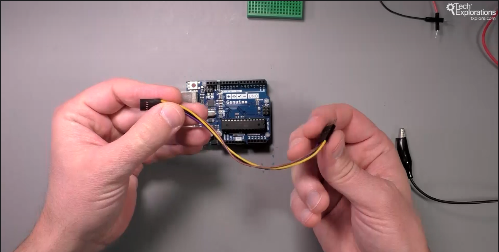
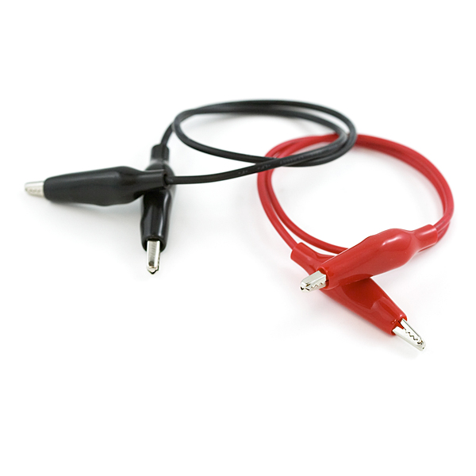
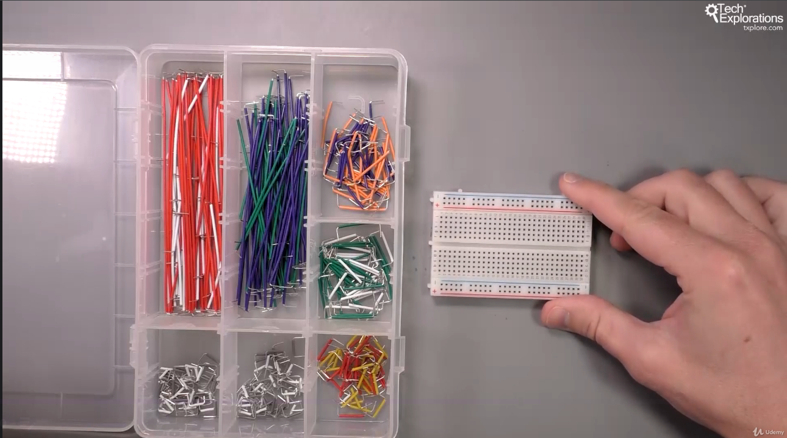

<h1>Fire</h1>

<h2><u>Jumper wires</u></h2>

- male - male
- male - female (4 alaturate) (la Arduino vin separat)
- female - female

<h2><u>Crocodili</u></h2>

<h2><u>wires precuted (flat wires)</u></h2>

