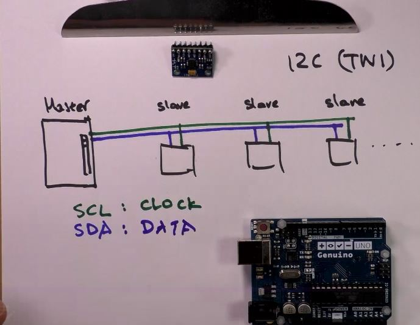
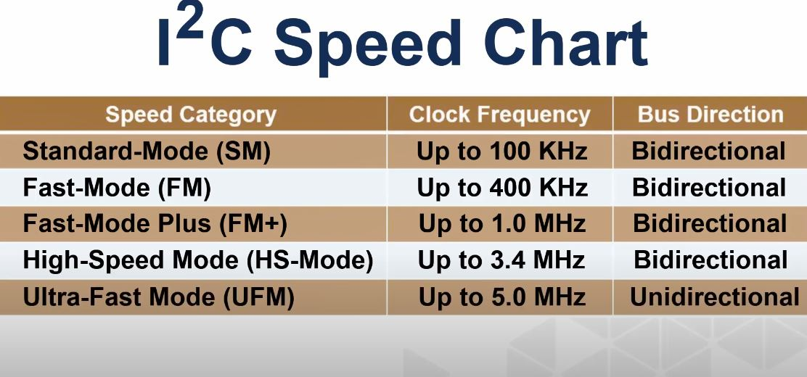
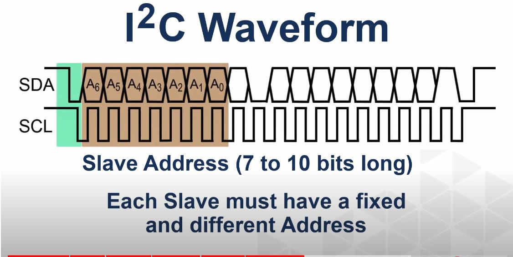
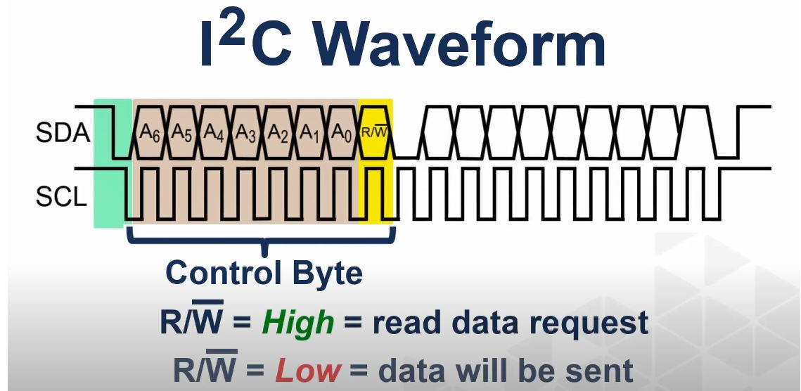
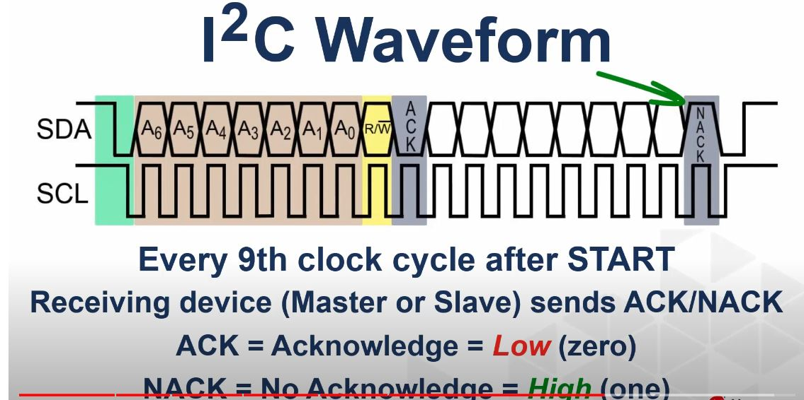
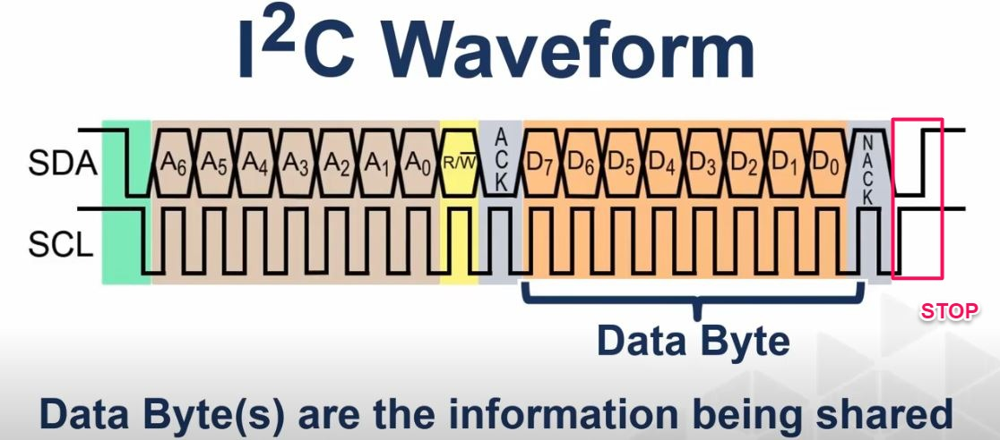

<h1>I2C</h1>

I2C (TWI) - Inter-Integrated Circuit | Two Wire Interface

- conexiune rapida, ce permite conectarea dispozitivelor in lant (127 dispozitive maxim)
- viteza - 100 KHz

bidirectional = poate scrie catre slave si poate citit de la slave

informatia poate curge intr-o singura directie pe rand. half-duplex

SCL (serial Clock)
SDA (serial data)
GND

data = biti de comanda, citire de senzori, registri, etc.

<h2>Viteza scriere/citire:</h2>

primele 3 sunt cele mai usor de integrat

<h2>Forma Semnal:</h2>

(~ handshake protocol)

