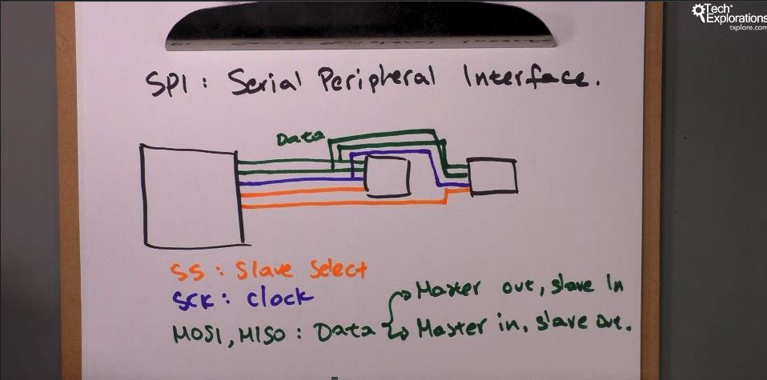
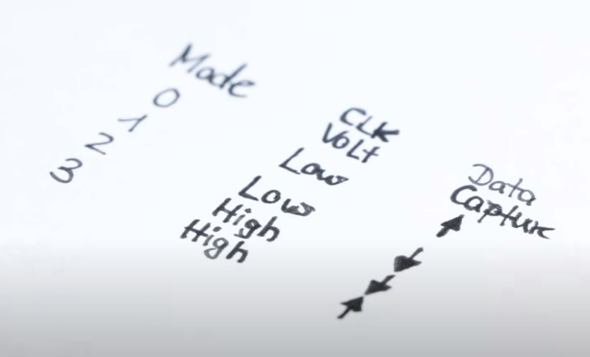

<h1>SPI</h1>

SPI = Serial Peripherical Interface

- conexiune foarte rapida full-duplex in acelasi timp intre 2 dispozitive
- Viteza 4 MHz

pini:
SS - Slave Select (Digital pin Arduino) - porni sau opri slave, pt a comunica cu acesta sau il opreste pt a comunica cu altul
MOSI, MISO - Data (Master Out, Slave In | Master Im, Slave Out)
CLK - Clock

La Arduino:
13 - CLK
12 - MISO
11 (PWD) - MOSI
10 (PWD) - SS (orice pin D0 -> D10 ; A0 -> A5, pt SS)

Moduri de setare pt comunicare in anumite moduri.