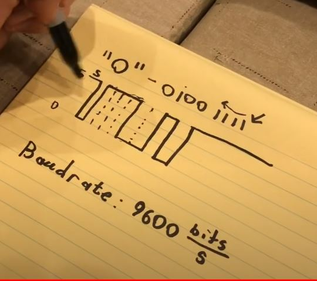

<h1>UART</h1>

UART = universal asyncron receiver transmiter

(Arduino Mega -> are mai multe interfete UART)

pini:
- GND
- Tx (Transmision)
- Rx (Receive)

Arduino Tx -> Rx Laptop
Rx <- Tx laptop

semnal digital ( intre 0 si 5V)

"O" - 01001111 ( se incepe de la dreapta)

Baudrate= refresh rate a micro controlerului