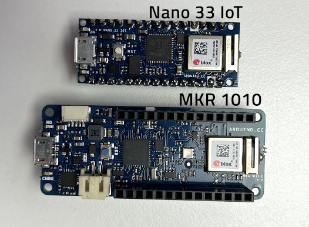
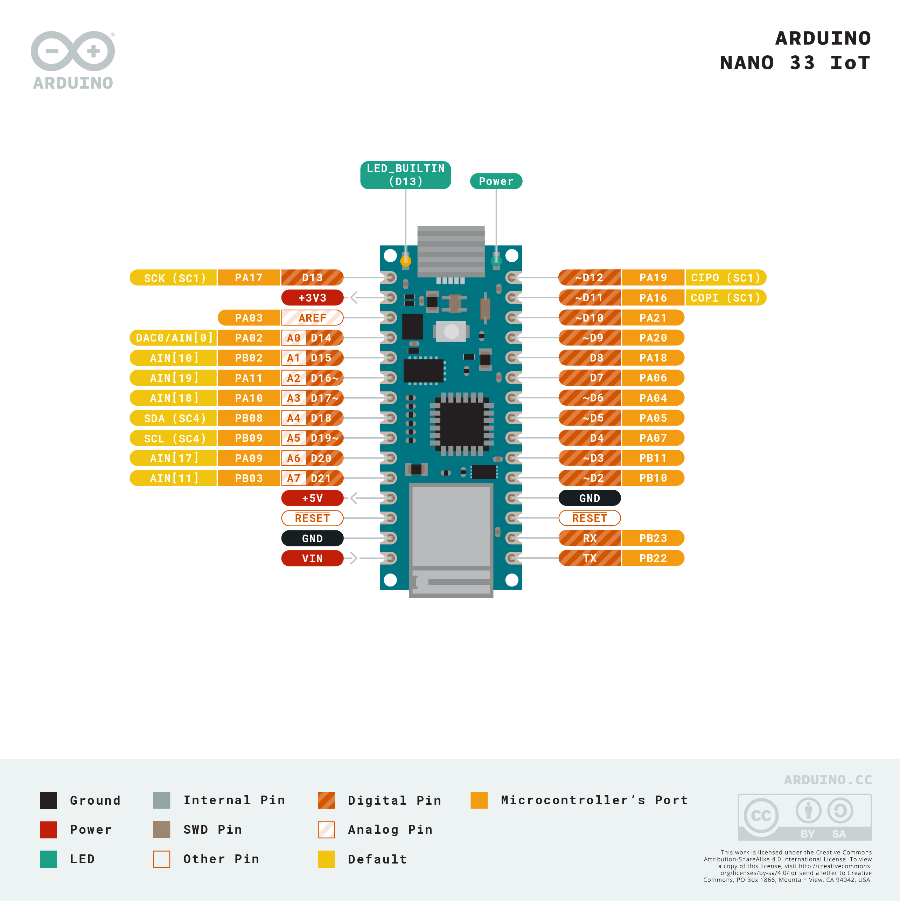

<h1>Arduino Nano - familie</h1>

<h3><u>Arduino Nano BLE</u></h3>

- BLE = Bluetooth low energy

<h3><u>Arduino Nano RP2040</u></h3>

- controller de la Rasberry Pi
- poate fi programat din Arduino IDE

<h3><u>Arduino Nano 33 BL Sense</u></h3>

- are senzor aditional (senzor inertial 9 axe)(pt miscare/accelratie)

<h3><u>Arduino Nano 33 IoT</u></h3>

- e mai mic decat MKR 1010
- nu are conector I2C & conector baterie

- microprocesor ARM 32bit
- functioneaza pe 3.3V