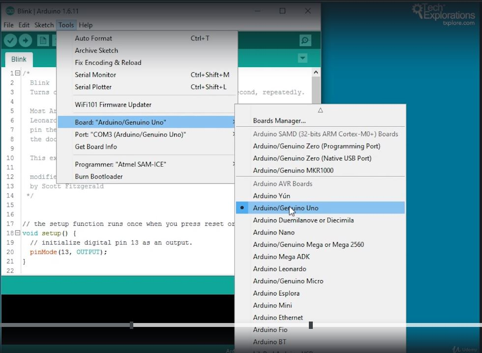
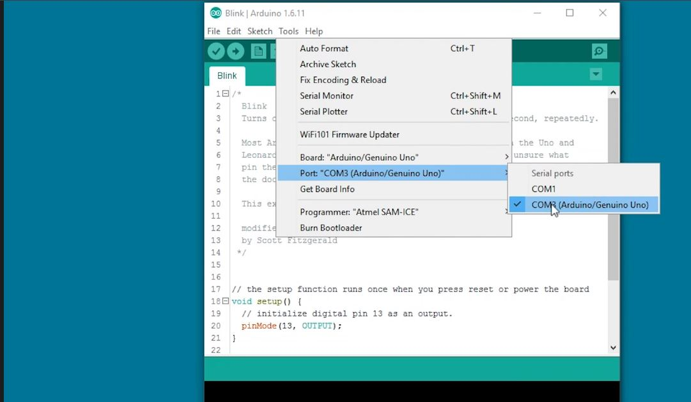
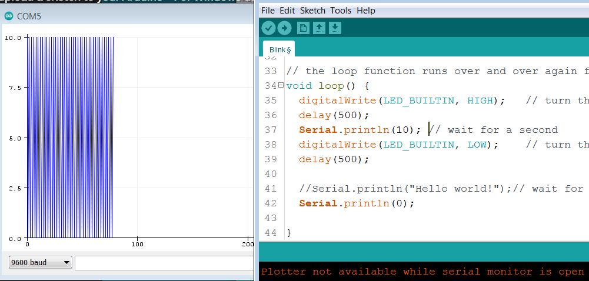

<h1>Arduino IDE</h1>

1. Setat IDE pt placa (pt versiune sub 2.0)



Ales placa folosita



Ales portul folosit.

2. Obtiuni IDE
   - serial monitor
     - mesaje de la Arduino la PC (debug, informatii de la un senzor)

   - serial plotter
     - cifre de la Arduino la PC (sub forma de grafic : valoare - timp)
	 


```
	void setup() {
	  // initialize digital pin LED_BUILTIN as an output.
	  pinMode(LED_BUILTIN, OUTPUT);

	  Serial.begin(9600);  // bps - baund rate
	}

	void loop() {
	  digitalWrite(LED_BUILTIN, HIGH);   // turn the LED on (HIGH is the voltage level)
	  delay(500);
	  Serial.println(10); 
	  digitalWrite(LED_BUILTIN, LOW);    // turn the LED off by making the voltage LOW
	  delay(500);

	  //Serial.println("Hello world!");// wait for a second
	  Serial.println(0);
	}
```

<h2><u>Transmis valoare de la PC la Arduino</u></h2>

(invers)

<i>Serial.read()</i>


<b>Returns</b>

The first byte of incoming serial data available (or -1 if no data is available). Data type: int.


<b>Example Code</b>

```
int incomingByte = 0; // for incoming serial data

void setup() {
  Serial.begin(9600); // opens serial port, sets data rate to 9600 bps
}

void loop() {
  // send data only when you receive data:
  if (Serial.available() > 0) {
    // read the incoming byte:
    incomingByte = Serial.read();

    // say what you got:
    Serial.print("I received: ");
    Serial.println(incomingByte, DEC);
  }
}
```