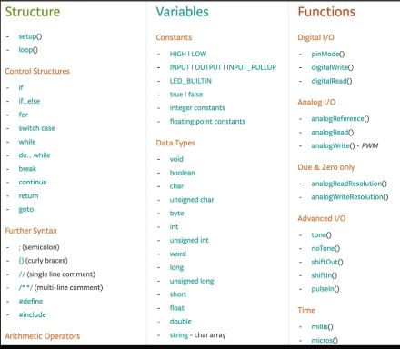

<h1>Arduino Programare - Introducere</h1>



Arduino e construit pe C++

c++ compiler

<hr />

```
void setup(){ // ruleaza o singura data

}

void loop(){ // ruleaza repetitiv infinit

}
```


sunt obligatorii minim, nu accepta argumente

`Serial.begin()` -> require un singur parametru: baund rate
Aceste valori determina viteza de raspuns al Arduino
9600 B/s (uzual)


`Serial` = o clasa / colectie de functii (bult-in)

`Serial.println(" ")` // print " " cu newline
`Serial.print("<word>")` // print <word>

Selectat:
Tools / Board: Arduino Uno
tools / Port -> Arduino dispozitiv

In Serial Monitor:
Se selecteza si acolo baund rate

`millis()` // numar de milisecunde de cand sketchul ruleaza / de cand are alimentare
// va relua de la zero dupa aprox 50 de zile
delay(1000) -> delay pt 1000 ms / 1s

Daca resetezi placa reincepe sa ruleze codul de la inceput cu tot cu setup

