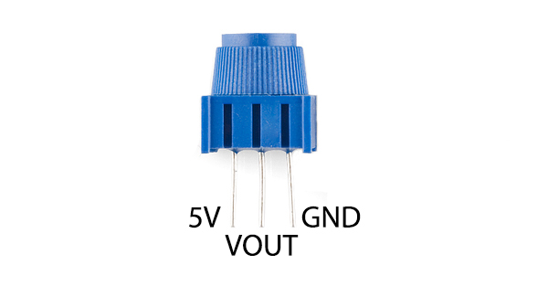

<h1>Analog input - Potentiometru</h1>

analog input - pulse width modulation (PWM)

<h2>Schema pini:</h2>

<h2>Diagrama potentiometru:</h2>

in interiorul potentiometrului - este un rezistor care isi schimba valoarea

<h2>Schema:</h2>

- mijloc - galben -> A0 (Analog in)
- dreapta - rosu -> 5V
- stanga - negru -> GND

`valoare = analogRead(A0);` // afisat cu `Serial.println();`

