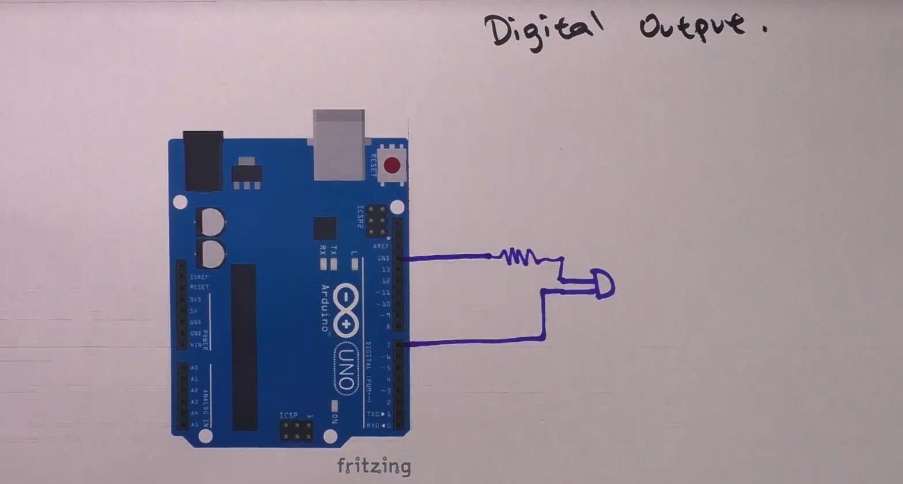

<h1>GPIO digital</h1>

<h2>Output</h2>

0 sau 1 - digital

1 | 0
5V | 0V
in realitate: 3.5V - 5V | 0 - 3 V
High | Low

poti folosi orice pin ca digital input

<h2>Input</h2>

cand butonul nu-i apasat = valoare hanging / floating
solutie : resistor pull up/down la citire valoare buton (digital in)