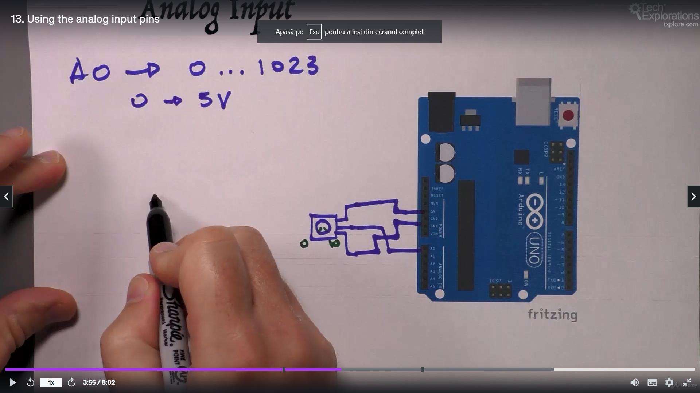

<h1>GPIO analog</h1>

<h2>Output</h2>

mai multe valori - analog

Pulse Width Modulation (PWM) - media dintre 5|0 V (schimbata rapid)
led care e On/off foarte rapid -> are intensitate mai mica
pni digitali cu ~

0 - LED=off
255 - LED=ON

<h2>Input</h2>

A0->A5

potentiometru
Arduino va putea primii intre 0 -> 5V, si il va converti in 0 -> 1023

Digital Analog Input output = GPIO