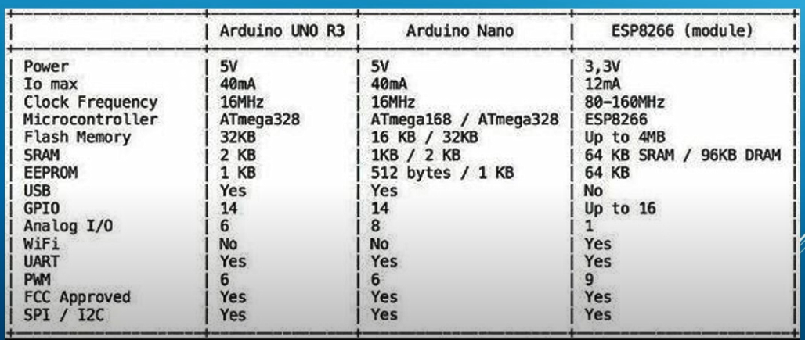

<h1>Despre placa ESP8266</h1>

- foarte ieftin
- board mini (cat Arduino PRO Mini)
- wi-fi integrat
- 32 bit microcontroller
- 18 MHz -> 160 MHz
- 32 KB RAM
- 4MB flash memorie

<b>Comunicatii serial</b>
- <a href="../../Comunicatii Serial/I2C.md">I2C</a>
- <a href="../../Comunicatii Serial/UART.md">UART</a>
- <a href="../../Comunicatii Serial/SPI.md">SPI</a>

- 17 GPIO

- poate folosi arduino IDE
- poate folosi C++, MicroPython, ESP8266 Basic (foarte versatil)

- este foarte limitat in ce consta Analog input / Analog output 
- are dificultati in functionare, fara un regulator in care mentine tensiunea constant