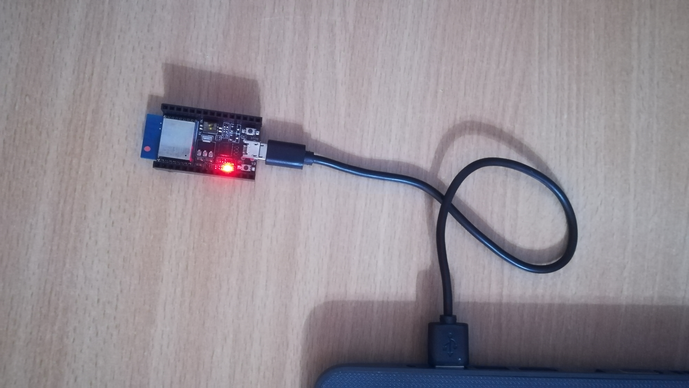

<h1>Hello world - Example</h1>

# Hello world
---

## Table of content

- For [Ubuntu](#ubuntu-directly)
- For [Ubuntu on VirtualBox](#ubuntu-vBox)

<br />
<h1 id="ubuntu-directly">Ubuntu</h1>
This is the part with instruction about how to build, flash and display the program if you are running ubuntu os. It will print **hello world** on the console, once it is uploded to the board.

**Step 1**<br>
Login with your credentials, and then start the terminal.<br>


**Step 2**<br>
Change the directory to esp, with:
```
	cd ~/esp
```

**Step 3**<br>
Copy the example with hello world, and then go inside it.
```
	cp -r $IDF_PATH/examples/get-started/hello_world .
	cd hello_world/
````

**Step 4**<br>
Connect the board to PC.<br>
[poza cu placa - PC]

**Step 5**<br>
We need to figure it out which port the board is using.<br>
For that type:<br>
```
	dmesg | grep tty
```

Then look up for the *CP210x converter* device.<br>
For me that doesn't have any other external USB, it's **ttyUSB0**.

**Step 6**<br>
Type:<br>
```
	make menuconfig
```

Then go to *Serial flasher config*/ *Default serial port*.
In my case I will gonna use the default one, which is **/dev/ttyUSB0**.<br>
Hit OK once.<br>
Then select *Save* / *OK* / *Exit*.<br>
And after the configuration has been saved, Select *Exit* twice.

**Step 7**<br>
Add your username to the dialout group:<br>
```
	sudo adduser cristishor dialout
```

Then you need to reboot the PC with `sudo reboot`.

**Step 8**<br>
After login change the directory back to:<br>
```
	cd ~/esp/hello_world
```

Then you can build with:<br>
```
	make all
```

**Step 9**<br>
For installing the program into the board, type:
```
	make flash
```

**Step 10**<br>
For displaying what the board prints, run:<br>
```
	make monitor
```

When you want to stop the printing on the console, just hold `ctrl + ]` hotkey.


<h1 id="ubuntu-vBox">Ubuntu VirtualBox</h1>
This is the part with instruction about how to build, flash and display the program if you are running ubuntu on VirtualBox. It will print **hello world** on the console, once it is uploded to the board.

**Step 1**<br>
Run Oracle virtualBox, and then start the virtual machine, in the *Headless Start* state.<br>


**Step 2**<br>
Ater it is starting up, enter your credentials.

**Step 3**<br>
Change the directory to esp, with:<br>

	cd ~/esp

**Step 4**<br>
Copy the example with hello world, and then go inside it.<br>

	cp -r $IDF_PATH/examples/get-started/hello_world .
	cd hello_world/

**Step 5**<br>
Open a Putty connection with the VM.

**Step 6**<br> 
Connect the board to PC.<br>


**Step 7**<br>
We need to figure it out which port the board is using.<br>
For that type:<br>
```
	dmesg | grep tty
```

Then look up for the *CP210x converter* device.<br>
For me that doesn't have any other external USB, it's **ttyUSB0**.

**Step 8**<br>
Type:<br>
```
	make menuconfig
```

Then go to *Serial flasher config*/ *Default serial port*.<br>
In my case I will gonna use the default one, which is **/dev/ttyUSB0**.<br>
Hit *OK* once.<br>
Then select *Save* / *OK* / *Exit*.<br>
And after the configuration has been saved, Select *Exit* twice.

**Step 9**<br>
Add your username to the dialout group:<br>
```
	sudo adduser cristishor dialout
```

**Step 10**<br>
Now, you can build with:<br>
```
	make all
```

**Step 11**<br>
For installing the program into the board, type:<br>
```
	make flash
```

**Step 12**<br>
For displaying what the board prints, run:<br>
```
	make monitor
```

When you want to stop the printing on the console, just hold `ctrl + ]` hotkey.