<h1>Ubuntu OS directly</h1>

Ubuntu installation & configure, directly on PC / Laptop

<h2 id="top">Chapters</h2>
1. <a href="#burn">Burn Ubuntu on a DVD bootable</a><br>
2. <a href="#ubuntu">Ubuntu installation</a><br>
3. <a href="#firewall">Firewall configuration</a><br>
4. <a href="#toolchain">Install & configure the toolchain</a>

<h1 id="burn">Prerequites</h1>

Before we start to install the OS, we need a couple of things first: to downoad it, and to write it on a DVD. There may be also to make a USB bootable, but for this tutorial I will cover only by CD (DVD). At least for now.<br>

**Step 1**<br>
Download ubuntu desktop from [here](https://ubuntu.com/download/desktop).<br>
This is what I installed: <i>Ubuntu 20.04.2.0 LTS</i>

**Step 2**<br>
In the *Downloads* folder, right click on the Ubuntu iso image, and select *Properties*. Then on the *General* tab, click on the *Change* button, and then select *Windows Disc Image Burner* or *Windows Explorer*.<br>
Click *Ok* once, and then *Apply*, with *OK* once more.<br>
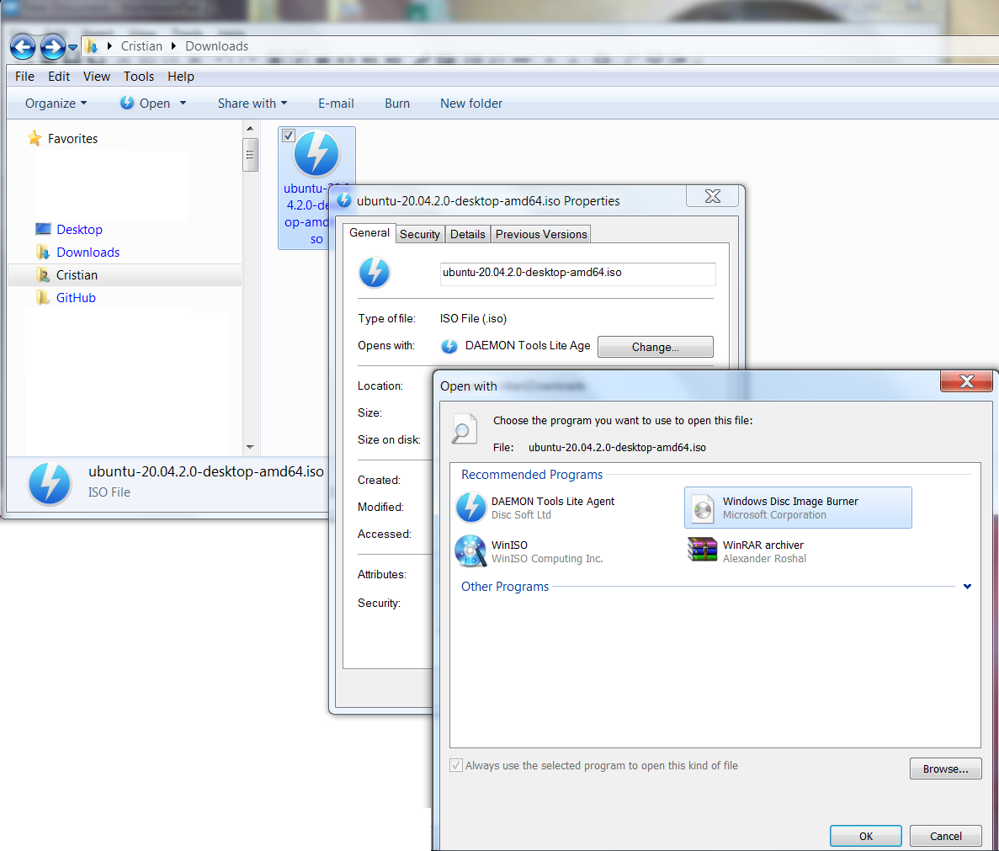

**Step 3**<br>
Insert the DVD in the PC where you want to install Ubuntu.

**Step 4**<br>
Right click again on the ubuntu image, but this time choose *Burn disc image*. After that Select your *DVD disc drive*, and also check on *Verify disc after burning*. And then  hit Burn.<br>
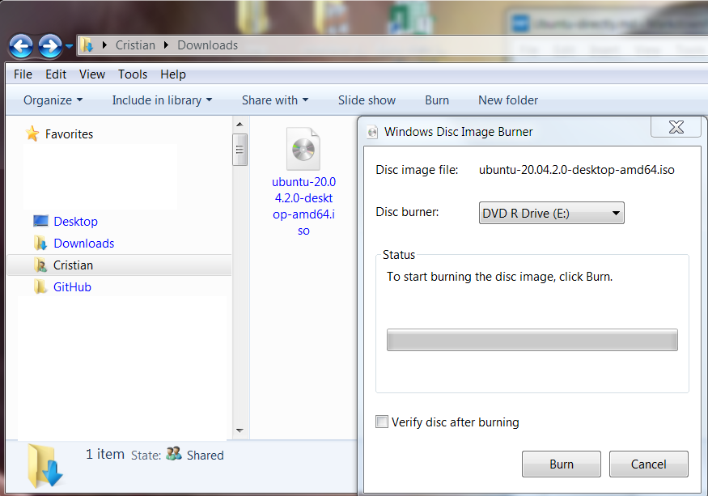

**Step 5**<br>
After the writing the DVD has completed succesefully, hit Close button, and inserting on the computer where you want to install it.

**Step 6**<br>
In order to boot from the DVD, instead of the hard drive, we need to go to BIOS and make a few changes there.<br>
In order to do that restart or turn on your computer. In the very begining press multimple times key *F2*. You should see a blue window like this one, in a short while.<br>
Go to *Boot* tab, and then select *Boot Device Priority*. For that use arrows to navigate through menu, and to make selection press *Enter* key.<br>
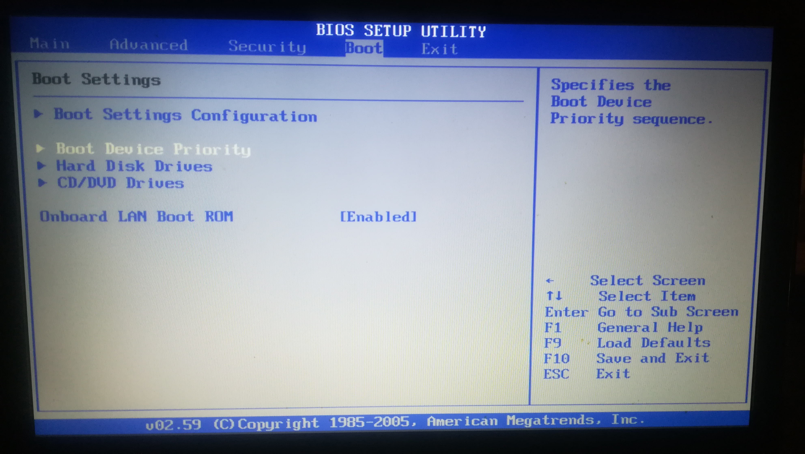

**Step 7**<br>
In the next window, give to your *CD/DVD reader* a greater priority than *SATA hardrive*. In this example I put the *DVD reader* into the first place, and *SATA hardrive* anywhere after it. To change position use *+* or *-*.<br>
After all is set, press *F10* key for save and exit, and then *Enter* key for *OK*.<br>
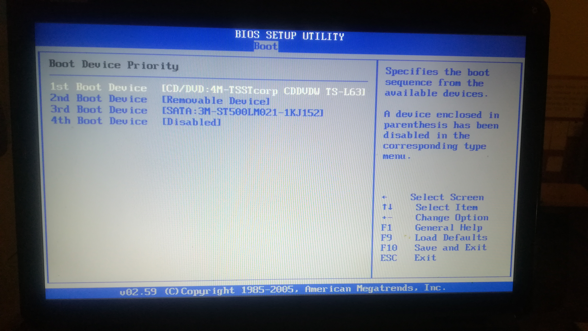 


<h1 id="ubuntu">Installation</h1>

**Step 1**<br>
In the first step Ubuntu it loads, it will checkthe integrity of the DVD. You can skp it if you want, but I highly recommended it, for making sure that we do not encounter other errors later on.<br>
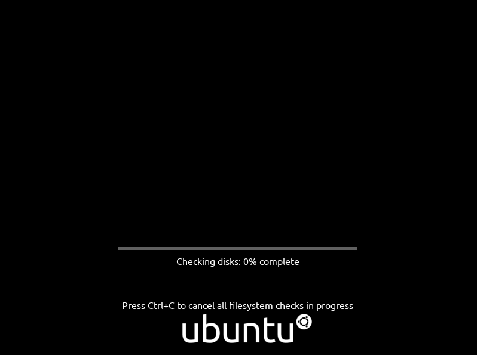

**Step 2**<br>
Select your language, and then choose to *Install Ubuntu*. In my case I will choose *English*.<br>
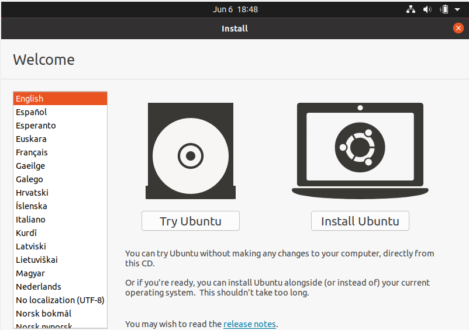

**Step 3**<br>
Live the layout of keyboard as default with both English (US). This is the default keyboard layout for myself. Later on you can add another one as you want.<br>
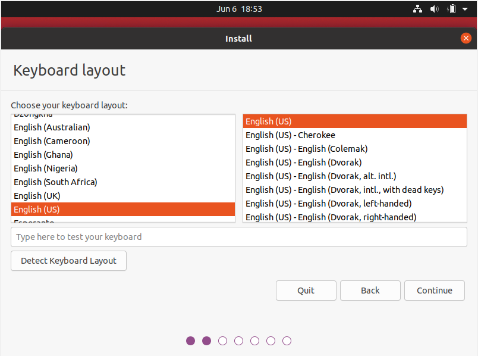

**Step 4**<br>
If you not connected the computer with a internet acces through LAN, it will ask you to connect through wireless.<br>
If you encounter this window, check in *Connect to this network*, and then select your Wi-fi and press *Connect* button, and then enter your password.<br>
Then hit *Continue*.<br>
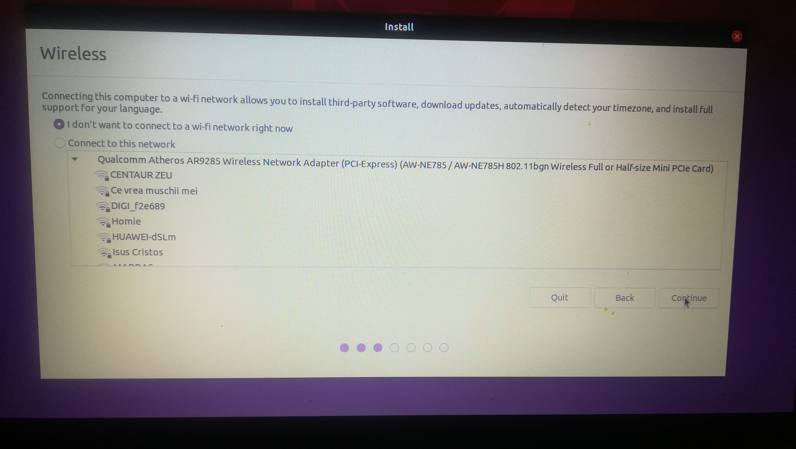

**Step 5**<br>
Live it as default: choose *Normal installation*, and the options of *Download updates* with *Install third-party software and Wi-Fi hardware and additional media formats*.<br>
Hit again *Continue* button.<br>
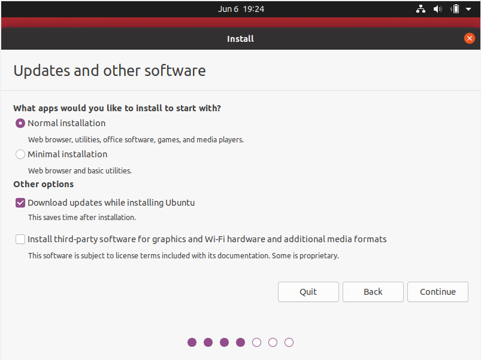

**Step 6**<br>
If you have already installed Ubuntu before, this window may appear.<br>
In this case I will erase everything and I will start over, by selecting *Erase disk and install Ubuntu*. Then press *Install Now*, and on the prompt choose *Continue*.<br>
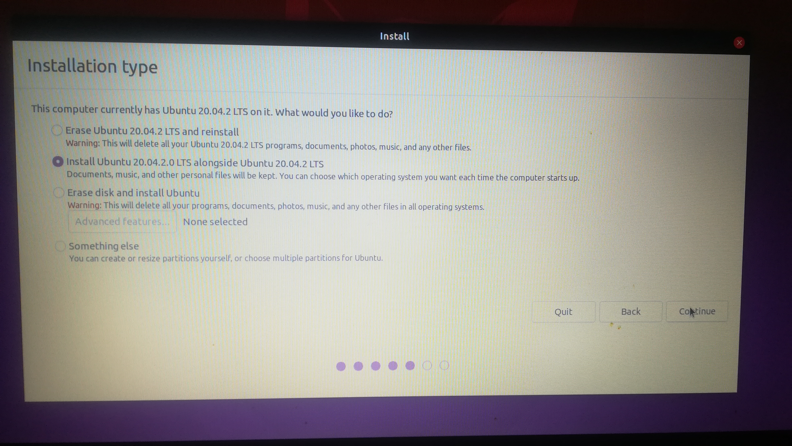

**Step 7**<br>
Choose your time zone by typing your city, and then choose from the suggested list, or clicking on the map. I am from Bucharest, so I will press *Continue*.<br>
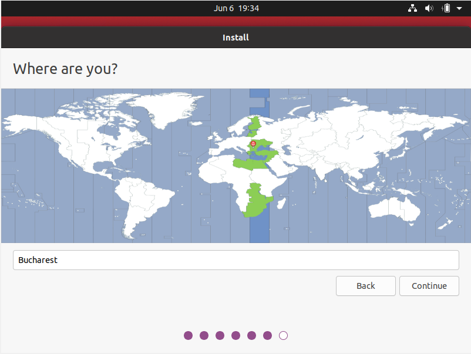

**Step 8**<br>
Then choose a *name* for the computer, a *computer's name* (how is this device seen by others), and a *username* and a *password*. I make my choice as you can see. Also I checked in *Log in automatically*, as I get bored to enter by so many times the password on Ubuntu, but you are free to pick up the other choice.<br>
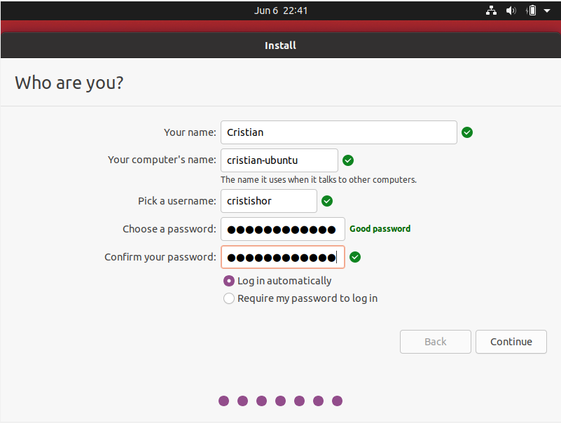

**Step 9**<br>
After installation is finished, press *Restart Now*.<br>
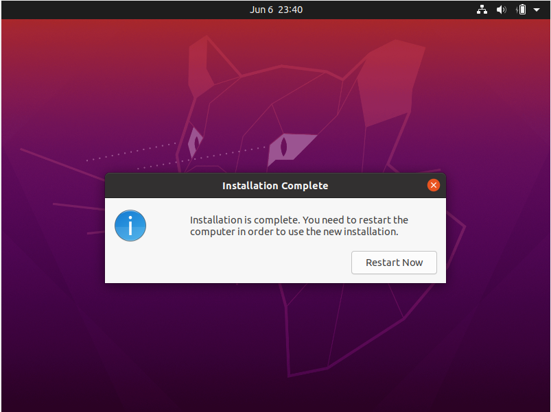

**Step 10**<br>
Remove the *DVD/CD*, put the try back, and press *Enter* key for continue.<br>
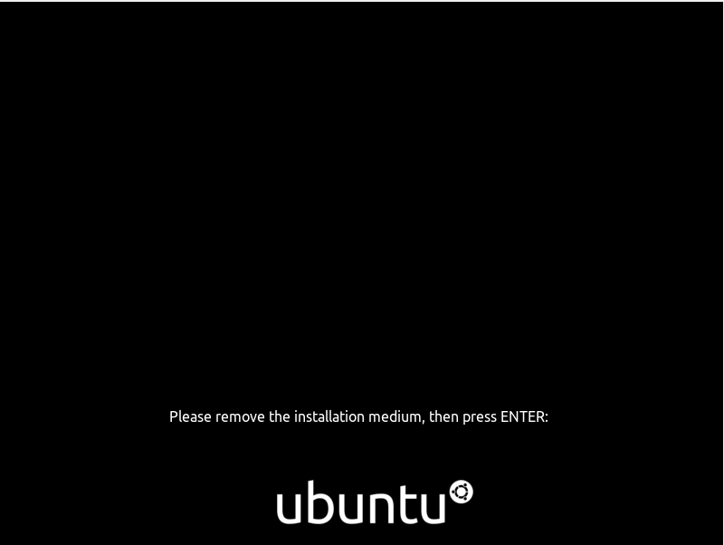

**Step 11**<br>
Next connect your accounts. I will connect this time only the *Ubuntu Single Sign-On Account*, as I already have it. If you want to make one too, go to [ubuntu account](https://login.ubuntu.com/+login) on any device. On Keyring password, setup the same key as *Ubuntu admin*. <br>
Hit the *Next* green button.<br>
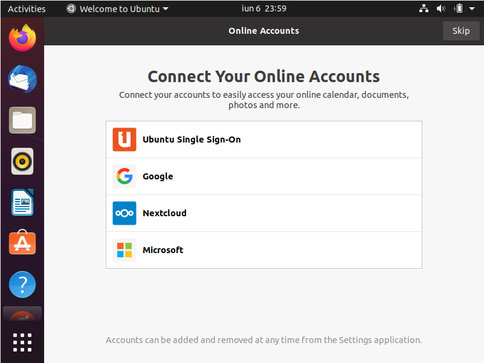

**Step 12**<br>
Livepatch give you the ability to update your OS, without the necesity to restart. For set it up, all you need to do is just press *Set Up Livepatch*, enter your credentials, and then Click *Continue* when it pop up a message that alert you the need of having an Ubuntu one account.<br>
Enter once more your password for *Ubuntu Single Sign-On account*, and then choose a password for the Livepatch.<br>
A message text should appear that *You're all set*.<br>
Click *Next* green to continue.<br>
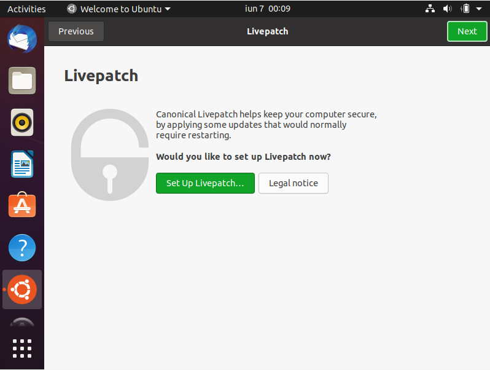

**Step 13**<br>
I choosed not sending informations, but you are free to do so.<br>
I checked *No, don't send system info*. Then Click *Next*.<br>
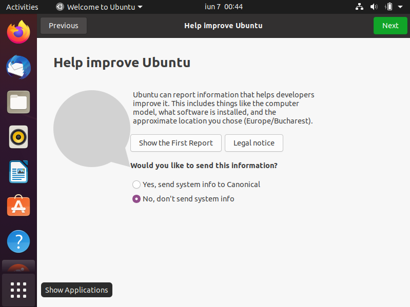

**Step 14**<br>
You can skip the activation of Location, as it's not needed for this setup. I will do the same<br>
Hit *Next*.<br>
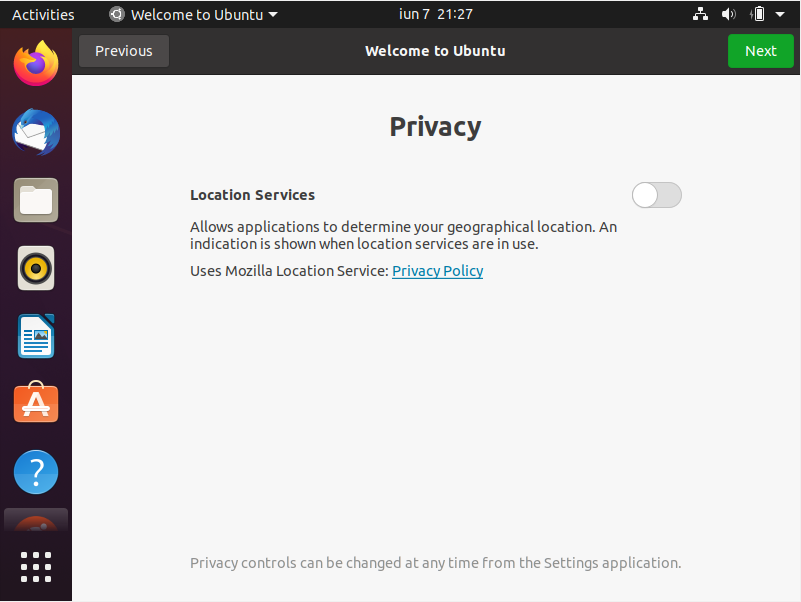

**Step 15**<br>
We will skip the installation of the apps, by clicking on *Done*.<br>
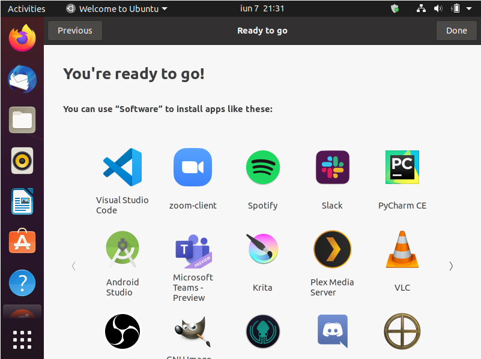

**Step 16**<br>
click on the 9 dots icon, and on the search bar type in `software`, and then click on the second application, *Software Update*.<br>
Then if it detect something, click on *Install Now*, followed by your credentials.<br>
Then Restart your computer with *Restart Now*, or just click *Ok*, depending of the buttons you have.<br>
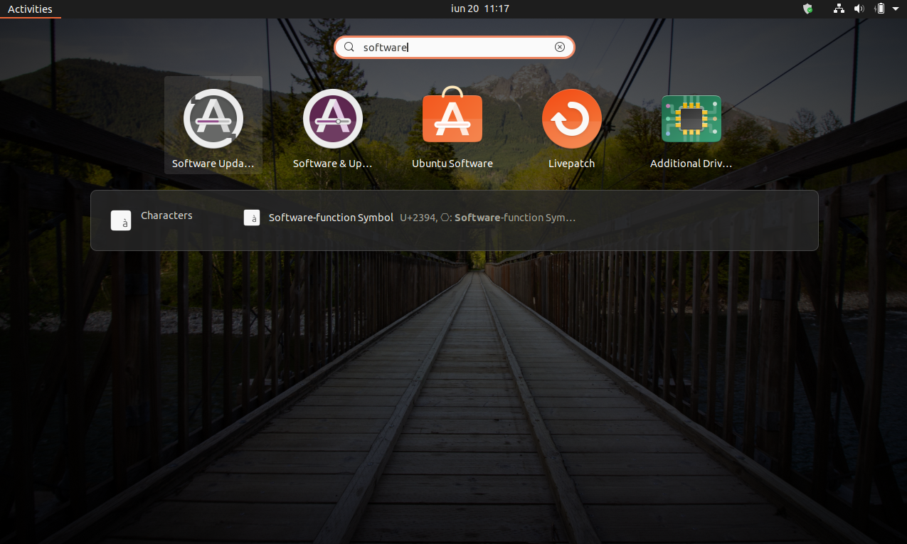

<strong id="firewall">Step 17</strong><br>
Ubuntu doesn't required an antivirus like Windows. But I highly recommended to setup the firewall for it.<br>
To do this, press again on the 9 dots icon, but thi time search for `ubuntu`, and then click on the *Ubuntu Software* icon.<br>
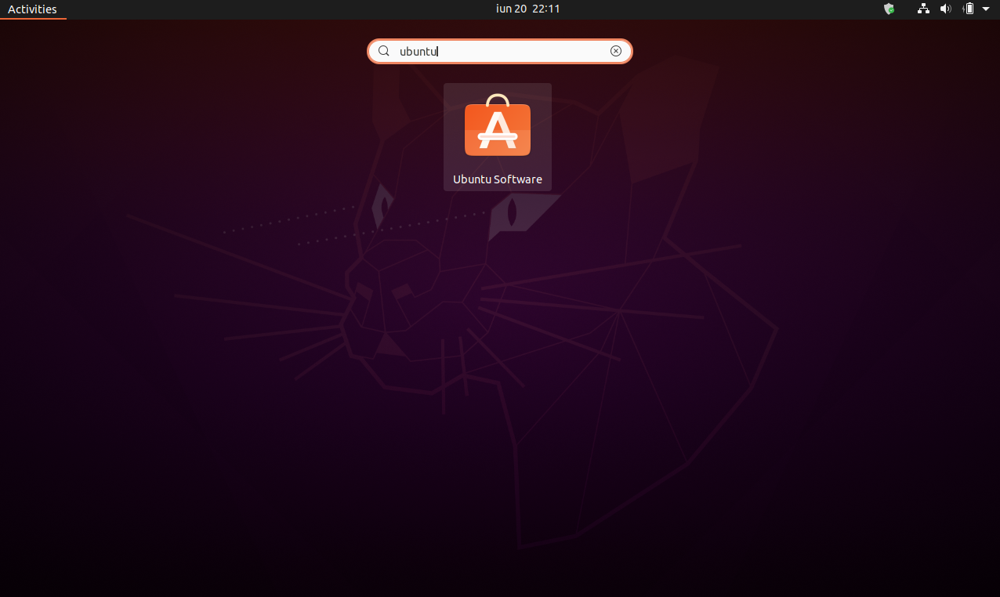

**Step 18**<br>
After it's loading, press on the *magnifier icon* in the top left corner of the window, and search for `gufw`.<br>
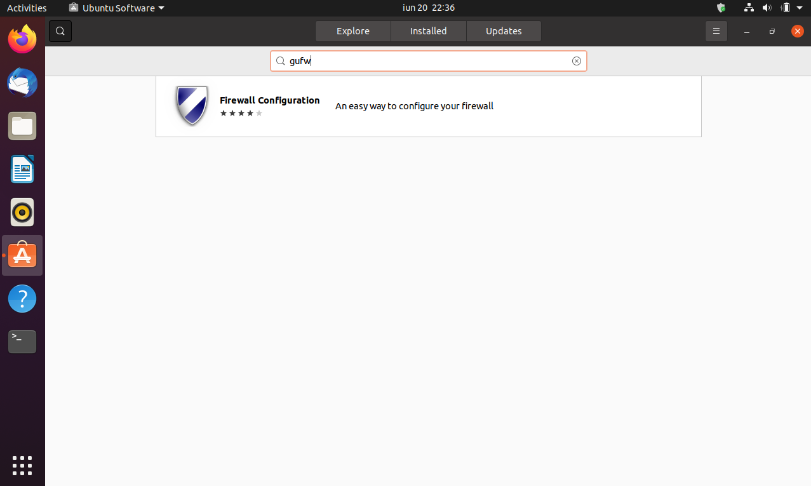

**Step 19**<br>
Click on the *Firewall Configuration* application, to get in. And then press *Install* green button, to install it.<br>
Enter your credentials, when it asks you to.<br>
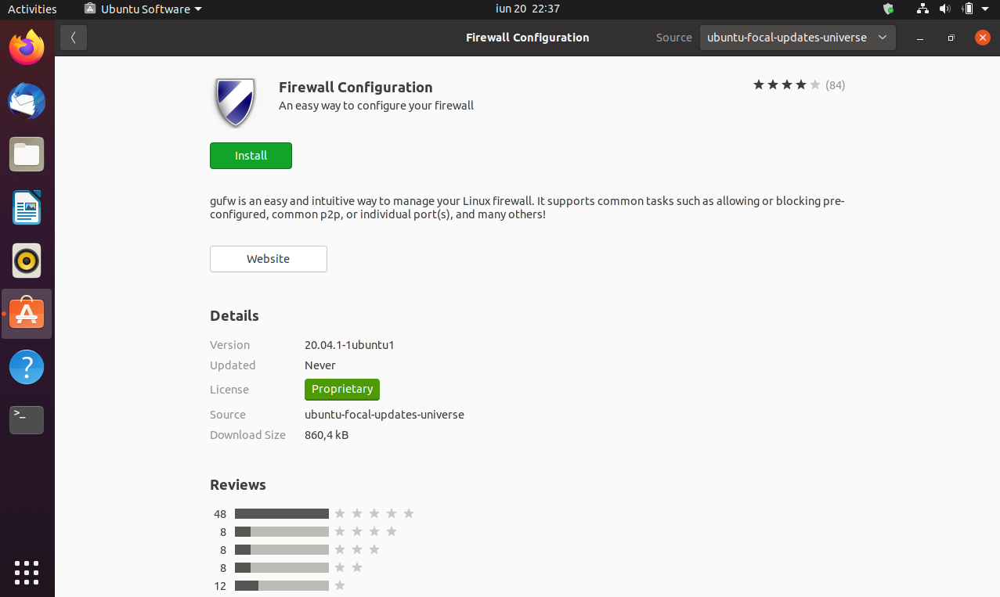

**Step 20**<br>
After it's installed, click *x* to close the *Ubuntu Software* window.<br>
Hit again the 9 dots icon, and then search for `gufw` again to find the application.<br>
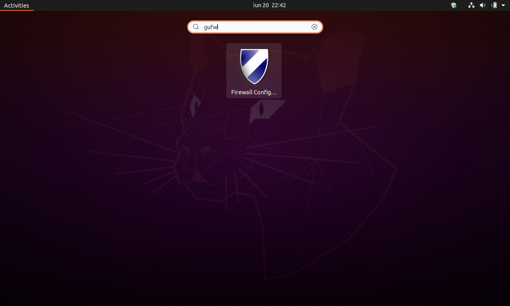

**Step 21**<br>
After open it, all you need to do is to change it's *Status* to on, and make sure that *Incoming* it's set up to *Deny*. This is the default configuration.<br>
After that you can close the window by pressing the *x* button.<br>
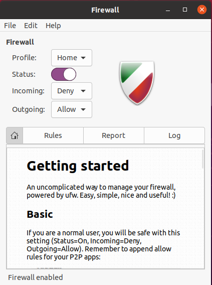


<h1 id="toolchain">Install & Configuring the toolchain</h1>

Now it's time to install the develompent environment for ESP8266 board.

**Step 1**<br>
Click again on the 9 dots icon or press *windows key* on your keyboaard, and then search for the `terminal`. Then right click on it and then *Add to Favorites*, as we will use it a while.<br>
Then left click on it to open it. Alternatively you can launch it with the `ctrl + alt + t` hotkey.<br>
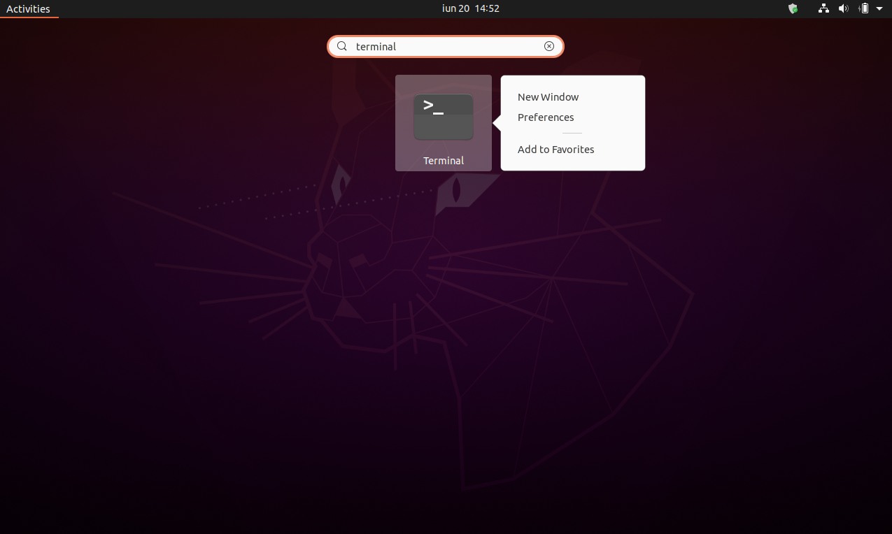

**Step 2**<br>
Run:
```
	sudo apt-get install gcc git wget make libncurses-dev flex bison gperf python3 python3-serial
```
Enter your credentials, and then type `y` for yes.

**Step 3**<br>
Download the toolchain with:
```
	sudo wget https://dl.espressif.com/dl/xtensa-lx106-elf-gcc8_4_0-esp-2020r3-linux-amd64.tar.gz
```
**Step 4**<br>
Create *esp* directory, and go inside it.
```
	mkdir -p ~/esp
	cd ~/esp
```
**Step 5**<br>
Extract the archive to *esp* folder.
```
	tar -xzf ~/xtensa-lx106-elf-gcc8_4_0-esp-2020r3-linux-amd64.tar.gz
```
**Step 6**<br>
Next download *ESP8266_RTOS_SDK*.
```
	git clone --recursive https://github.com/espressif/ESP8266_RTOS_SDK.git
```
**Step 7**<br>
Edit the *.profile* file, which is one level up.
```
	nano ../.profile
```
At the end of the file we add:
```
	export PATH="$PATH:$HOME/esp/xtensa-lx106-elf/bin"
	export IDF_PATH="$HOME/esp/ESP8266_RTOS_SDK"
```
Then save the file with *ctrl + O*. And exit with *ctrl + x*.

**Step 8**<br>
Type `printenv PATH` to see if it's installed corectly. If it's Ok, it should give you a long link, else a short error.

**Step 9**<br>
Type `sudo reboot` for restarting the PC.<br>
After login re-open the *Terminal* console from the taskbar, where we just saved.<br>
Then type `printenv IDF_PATH`. It should print a short link, instead of nothing.

**Step 10**<br>
For making pip works, run:<br>
```
	sudo apt-get install -y python3-pip
```

Enter your credentils when it asked to.

**Step 11**<br>
Install python dependency by:
```
	python3 -m pip install --user -r $IDF_PATH/requirements.txt
```
**Step 12**<br>
For the build setup, run:
```
	sudo apt-get install python-is-python3
```
That's it. All you need to do now, it's to pick up an example, and build it.