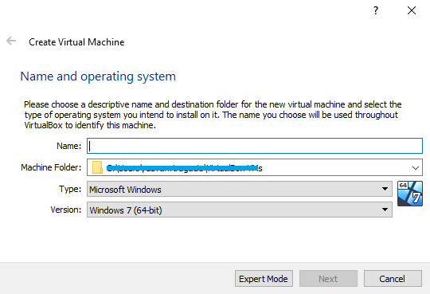

<h1>Ubuntu OS virtualBox</h1>

<h2 id="top">Chapters</h2>
1. <a href="#download">Download stage</a><br>
2. <a href="#vbox">Install Oracle Virtual Box</a><br>
3. <a href="#vm">Setup virtual machine</a><br>
4. <a href="#ubuntu">Ubuntu Installation</a><br>
5. <a href="#ssh">SSH tunneling - obtional 1</a><br>
6. <a href="#shared">Shared folder - obtional 2</a><br>
7. <a href="#build">Installing build tools</a><br>
8. <a href="#kernel">Kernel installation</a><br>
9. <a href="#env">Setup of the environment</a>

<h1 id="download">Downloading</h1>

Well, first of all let's download [Oracle Virtual Box](https://www.virtualbox.org/wiki/Downloads). In my case I will use Widows host option.

Then download Ubuntu or Linux. Both Virtual Box and Ubuntu, should be free, so there it would not be any problem with the license stuff. In this example I will use [Ubuntu Server 20.04.2 LTS](https://releases.ubuntu.com/20.04.2/ubuntu-20.04.2-live-server-amd64.iso), but you are free to use [any Ubuntu version](https://ubuntu.com/download/server) you want.

<h1 id="vbox">Prerequites</h1>

Now it's time to install and configure Virtual Box.
The process it's quite simple, but for the sake of it, I will put all the necessary details.

**Step 1**<br>
Run the installation of the virtual box. Click next.<br>


**Step 2**<br>
Choose to take all options, and also pick the location where you want to install Virtual Box. I recommend you to install virtual box on the computer at least, and the OS on the hard drive. Also it's a best practice to use underline or dash instead white spaces.<br>


**Step 3**<br>
On next step I choosed to uncheck the shorcut of Quick launch Bar, but you can checked up if you want.<br>


**Step 4**<br>
Next step it's pretty step forward. All you have to to is to press *yes*,<br>


**Step 5**<br>
and then press *install*.<br>


**Step 6**<br>
After the installation occured, press *Finish*, with the Start option checked, as we continue the setup, in the next chapter.<br>


<h1 id="vm">Setup virtual image</h1>

Now it's time to create a virtual machine with ubuntu os machine we downloaded early.

**Step 1**<br>
Click *New* button, for creating a new disk image.<br>


**Step 2**<br>
Select a name for the image (*I choosed Ubuntu Server 20 LTS*), the location on the hard drive or external hard drive; For type choose *Linux*, and for version choose *Ubuntu (64 bit)*.<br>


**Step 3**<br>
In the next window choose the RAM Memory. More that you allocate, faster guest macine will run. However you should keep some memory also for host machine.
In this example I will choose 3100 (3GB), as I think it's more than enough, that we will not have the GUI part of the Linux.<br>


**Step 4**<br>
Select to *create a virtual hard disk now*. This will be the virtual image of the operating system.<br>


**Step 5**<br>
And then choose virtualBox disk Image.<br>


**Step 6**<br>
Always choose Dinamically allocated, as it save you hard disk space, which is not used by the guest os.<br>


**Step 7**<br>
And finally, choose a limit of hard drive for ubuntu. This can be as higher as you want. You can change later the location of the image, but you can't choose to upgrade this limmit later.<br>
I will choose 50 GB, as is more than enough for this tutorial or any tools and installation there.<br>


**Step 8**<br>
Now, go to setings for the image we just created..<br>


**Step 9**<br>
Under the Storage section, in the Controller: IDE section, with the Host drive E selected..<br>


**Step 10**<br>
Choose to change the disc with the ubuntu image we just downloaded before. This will mount the image, so that installation can begin.<br>
After that press *OK* button, for saving the settings.<br>


**Step 11**<br>
Then we can start the *Ubuntu Server 20 LTS*, in *Detachable Start* state.<br>


<h1 id="ubuntu">Installation</h1>

**Step 12**<br>
The actual installation begins. We are prompted to select our language. I will choose English for myself.<br>


**Step 13**<br>
On next screen we can choose the layout of the keyboard. I will live it as it is.


**Step 14**<br>
We don't need network connection between this computer and other computer, so we will skeep this step.<br>


**Step 15**<br>
We will skip also the settings for proxy server.<br>


**Step 16**<br>
Hit next when it asking for ubuntu archive mirror.<br>


**Step 17**<br>
On the next screen we are asked if we want to use ubuntu on one disc or more. I will live it as default.<br>


**Step 18**<br>
This is just a Summary of the installation. Hit *Done* for next, and on the prompt with confirmation of destructive action, choose *Continue*.<br>


**Step 19**<br>
Choose a name for the *user name* of this OS, a *name for this "computer"*, a *username* and a *password*. It's a good habbit to fill up al the inputs here.<br>


**Step 20**<br>
Check in option for *install OpenSSH server*, and hit *Done*.<br>


**Step 21**<br>
Here you can install extra options feature. We can install them later, so we will skip this as well.<br>


**Step 22**<br>
After installing everything, press *Reboot Now*.<br> 


You may get error for removing optical drive. Hit enter anyway, for continue.

**Step 23**<br>
Then login with your credentials.<br>


<h2 id="ssh">Obtional 1 - copy-paste capability</h2>

This section is for accessing VM with SSH from the host OS. This is the only way if you want to use copy-paste between host and the guest.<br><br>

Press Machine/ ACPI Shutdown, if your virtual machine it's still running. This is the shut down for it.<br>


**Step 1**<br>
Go again in Settings for this image, but this time on Network section. NAT adappter should be checked in. Click on the Advanced to expand the settings.<br>


**Step 2**<br>
Then press *Port Forwarding*. Click on plus icon to add a new rule for the tunnel. And then choose some name and values. As you can see I chosed port 2222 for host, and port 22 for guest. I choosed them as they are not so common ports allocated by other services.<br>


Hit *OK* button twice for saving the settings.

**Step 3**<br>
Restart virtual machine by *Start/Headless Start*.

**Step 4**<br>
Download PuTTY from [here](https://www.chiark.greenend.org.uk/~sgtatham/putty/latest.html). I have Windows 64 bit version, so I will use  [putty-64bit-0.75-installer.msi](https://the.earth.li/~sgtatham/putty/latest/w64/putty-64bit-0.75-installer.msi). Installed it by going fast through the installation process. All I did here, is just checked in the desktop shorcut for it.

**Step 5**<br>
Start the PuTTY. And setup a new connection, but adding *localhost* on Host Name *2222* for the host port of local machine, and save this connection as *Ubuntu vBox*.<br>


**Step 6**<br>
Open the connection with PuTTY. It may pop out a Security Alert window, but we trust the virtual machine we just installed, so we will accept it.<br>
If it crush, just restart the PuTTY.<br>


**Step 7**<br>
Just login with your credentials, and you are good to go.


<h2 id="shared">Obtional 2 - shared folder</h2>

If you want to have more control over virtual machine, like a shared folder, this will show you & me, the know-how. You need *VirtualBox Guest Additions* installation for this option.

**Step 1**<br>
Open Putty if you set it up on the previous step, or directly on the console type:
```
	sudo add-apt-repository multiverse -y
	sudo apt install virtualbox-guest-dkms virtualbox-guest-x11 -y
```

**Step 2**<br>
Then reinstall the terminal, and restart the virtual machine.
```
	sudo apt-get install gnome-terminal -y
	sudo reboot
```

Exit Putty, and after VM restarted itself, connect again.

**Step 3**<br>
For having displaying only the console, wihout the new GUI interface that appears after previous step, for keeping the speed of the machine, run this command in the console:<br>
```
	sudo systemctl set-default multi-user.target
```
<br>Put your password if it asked for it.

**Step 4**<br>
Type ```exit``` on PuTTY first if is openedcd, and then *Show* with *ACPI Shutdown* next on guest machine.<br>


**Step 5**<br>
Go to settings for the selected virtual image.<br>


**Step 6**<br>
Select section *Shared Folders*, and "*+*" icon. Select the folder you want, and then check *Auto-mount*.


**Step 7**<br>
Start the virtual machine in the *Detachable State*, and log in with your credentials.<br>
Then type ```df -h```<br>


<br><br>As you can see, the selected folder *Github*, can be seen on the virtual machine under the name *sf_Github*.

**Step 8**<br>
Adding the user to the vboxsf group, and then restart the VM:
```
	sudo adduser cristishor vboxsf
	sudo reboot
```
<br>where *cristishor* it's my user.

Now you can change the folder:
```
	cd /media/sf_Github
```
<br>or your *sf_folder*.

**Step 9**<br>
Now, type ```ls --all```, and you should see all folders and files.


<h1 id="kernel">Configuring</h1>

## Kernel installation
Before we proceed, we need to configuring the usb adapter. In a normal situation this would be done automatically, but in this situation we access the board thorough virtual box.

**Step 1**<br>
Plug in the usb adapter ( usb - micro-usb) to connect the board and the PC.<br>


**Step 2**<br>
Right click on the usb icon, on the bellow taskbar of the virtual machine window.<br>


**Step 3**<br>
Then you can select the device. It should be something like *UART Bridge Controller*.


**Step 4**<br>
If you want to setup it automatically on the next encounter,<br>
Click on the *USB Settings...* (see picture from above). Next from the *USB* section, click on the *"+" usb icon*, and select the device. In my case is *Silicon Labs CP2102N USB to UART Bridge Controller*. And then press *OK*.<br>


**Step 5**<br>
Type ```lsusb```. If it display your connected device, you completed kernel installation successfully.


<h1 id="build">Installing build tools</h1>

Now it's time to install and configure what we need for developement in ESP8266.

**Step 1**<br>
Run this command:<br>
```
	sudo apt-get install gcc git wget make libncurses-dev flex bison gperf python3 python3-serial
```

Put your password if it asked for it. And press *y*, for accepting installed these packages.


<h2 id="env">Setup of Environment</h2>

**Step 1**<br>
Download the arhive depending on the OS bit verssion of Linux you installed.<br>
For 64-bit Linux use: [https://dl.espressif.com/dl/xtensa-lx106-elf-gcc8_4_0-esp-2020r3-linux-amd64.tar.gz](https://dl.espressif.com/dl/xtensa-lx106-elf-gcc8_4_0-esp-2020r3-linux-amd64.tar.gz)<br>
For 32-bit Linux use: [https://dl.espressif.com/dl/xtensa-lx106-elf-gcc8_4_0-esp-2020r3-linux-i686.tar.gz](https://dl.espressif.com/dl/xtensa-lx106-elf-gcc8_4_0-esp-2020r3-linux-i686.tar.gz)

It is convenient use Putty tunnel for this.<br>
In my case, I will use the 64 bit verssion, by downloaded it with:<br>
```
	wget https://dl.espressif.com/dl/xtensa-lx106-elf-gcc8_4_0-esp-2020r3-linux-amd64.tar.gz
```

**Step 2**<br>
Create *esp* directory, and go inside it.<br>
```
mkdir -p ~/esp
cd ~/esp
```

**Step 3**<br>
Extract the archive to *esp* folder.<br>
```
tar -xzf ~/xtensa-lx106-elf-gcc8_4_0-esp-2020r3-linux-amd64.tar.gz
```

**Step 4**<br>
Next download *ESP8266_RTOS_SDK*.<br>
```
git clone --recursive https://github.com/espressif/ESP8266_RTOS_SDK.git
```

**Step 5**<br>
Edit the *.profile* file, which is one level up.<br>
```
nano ../.profile
```
<br><br>At the end of the file we add:<br>
```
export PATH="$PATH:$HOME/esp/xtensa-lx106-elf/bin"
export IDF_PATH="$HOME/esp/ESP8266_RTOS_SDK"
```
<br><br>Then save the file with *ctrl + O*. And exit with *ctrl + x*.

**Step 6**<br>
Type ```printenv PATH``` to see if it's installed corectly. If it's Ok, it should give you a long link, else a short error.<br>

**Step 7**<br>
Type ```exit``` on PuTTY, and then login again. Then ```printenv IDF_PATH``` should be able to print the link to *ESP8266_RTOS_SDK* folder.

**Step 8**<br>
Run ```sudo apt-get install -y python3-pip``` for making pip works.

**Step 9**<br>
Install python dependency by:<br>
```
python3 -m pip install --user -r $IDF_PATH/requirements.txt
```

**Step 10**<br>
For the build setup, run:<br>
```
	sudo apt-get install python-is-python3
```

That's it. All you need to do now, it's to pick up an example, and build it.