<h1>10.Conexiune ssh - domeniu (platit)</h1>

In acest exemplu am folosit domeniul de la [dynadot](https://www.dynadot.com/), care suporta acest tip de conexiune la self-hosting.

> [!TIP]
> Documenteaza-te daca websiteul tau suporta aceasta obtiune, de self-hosting ... inainte sa platesti

<h2 id="top">Chapters</h2>
1. <a href="#remove-duckdns">Dezinstalat DuckDNS</a><br>
2. <a href="#config-dynadot">Configurat dynadot</a><br>
3. <a href="#serviciu-ddns-go">instalat serviciu DDNS</a><br>
4. <a href="#ssh-domeniu-public">Testare SSH extern prin domeniu</a><br>

<br><br>

<h2 id="remove-duckdns">Cap. 1 - Dezinstalat DuckDNS</h2>

Acest capitol este destinat, daca ai instalat deja scriptul de la *DuckDNS*, iar acum vrei sa treci la un domeniu platit.

<br>

<h3>Cap. 1.1 - Remove Cron Job</h3>

**Step 1**<br>
Ne logam la *Raspberry Pi* cu *KiTTY*

**Step 2**<br>
Deschidem fisierul de configuratie cron job

```
crontab -e
```

**Step 3**<br>
mers la sfarsitul fisierului (cu *sageata jos*), si vom gasi o linie asemanatoare cu aceasta

<br>

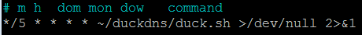

Stergem toata aceasta linie

`Ctrl` + `o` si apoi `enter` pt a salva fisierul.<br>
Apoi `ctrl` + `x` pentru a iesi din editor

<br>

<h3>Cap. 1.2 - Sters scriptul duckDNS</h3>

**Step 1**<br>
Mers la home directory

```
cd ~
```

**Step 2**<br>
Folderul ce contine scriptul este de regula *duckdns*, asa cum putem vedea acum si daca tastam `ls`<br>
Cu aceasta comanda vom sterge folderul *duckdns* impreuna cu ce contine acesta:

```
rm -r duckdns
```

> [!IMPORTANT]
> Nu scoatem SSH de la port forwarding de la DUCK-DNS, caci vom avea nevoie in continuare de acesta.

<br>

<h2 id="config-dynadot">Cap. 2 - Configurat dynadot</h2>

Nu sunt sigur daca orice platforma de hosting suporta conectarea la *Raspberry Pi*, dar m-am documentat si stiu ca [Dynadot](https://www.dynadot.com/) este o obtiune buna.

**Step 1**<br>
Creaaza un cont si achizitioneaza un domeniu. (eu am unul deja)<br>
Sau doar logheaza-te.

**Step 2**<br>
Mers la *My Domains / Name Servers* si dezactiveaza-le pe cele care le folosesti deja - daca este cazul.

> [!NOTE]
> La final ar trebui sa vezi ca niciuna nu este in folosinta.
> 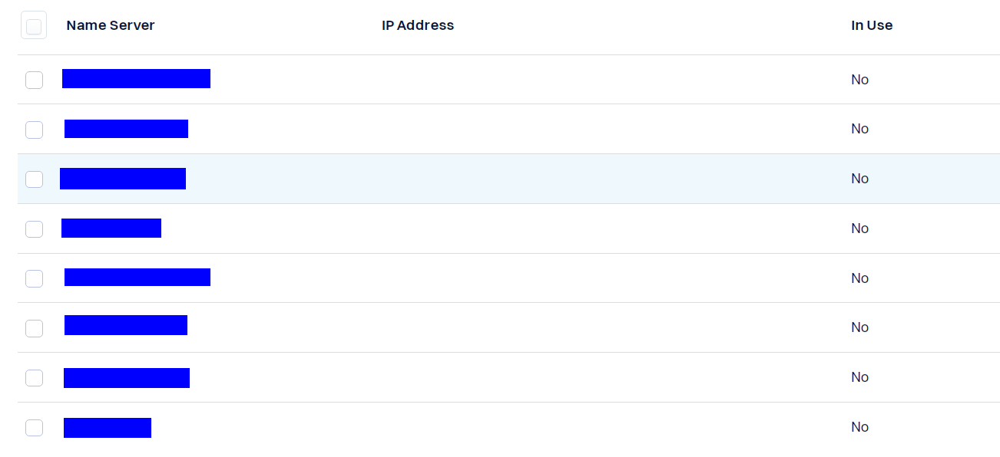

**Step 3**<br>
Din *My Domains / Manage Domains* selectam domeniul dorit prin bifa.

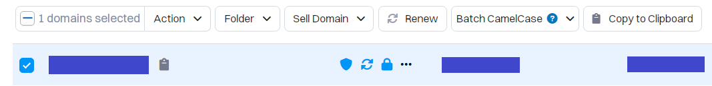

Din meniul deschis, apasam pe *Actions*, iar din meniul derulant selectam **DNS Settings**.

**Step 4**<br>
La *Domain Record* dam pe **Add Record**, seletam tipul sa fie **A**, iar la campul liber trecem:

```
127.0.0.1
```

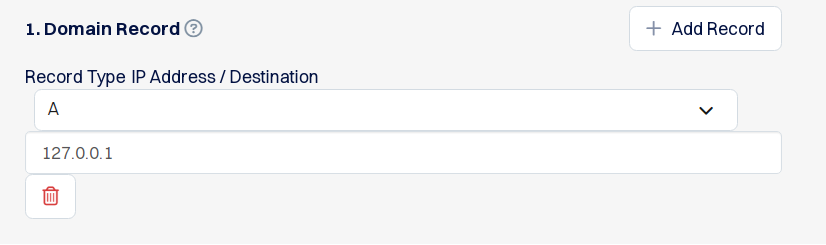

In esenta IP-ul de localhost.

> [NOTE]
> Dynamic DNS Client va actualiza acest IP, cu Ip-ul nostru public.

> [!CAUTION]
> Daca pui un record gol, iti va da eroare !
> Asdar in acest caz, trebuie sa avem unul singur.<br>
> 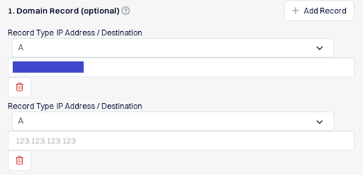

**Step 5**<br>
La *Subdomain Records (obtional)*, apasam pe **Add Record**, apoi:

- tip - `A`
- sudomeniu - `www`
- IP - `127.0.0.1`

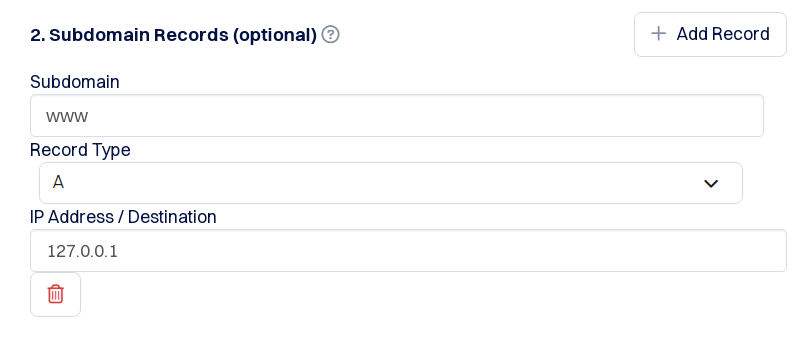

> [!NOTE]
> Pentru adaugat subdomenii, se procedeaza la fel.<br>
> Deasemenea IP-ul va fi actualizat automat ulterior. 

**Step 6**<br>
derulam in partea de jos, iar apoi activam **Dynamic DNS**.

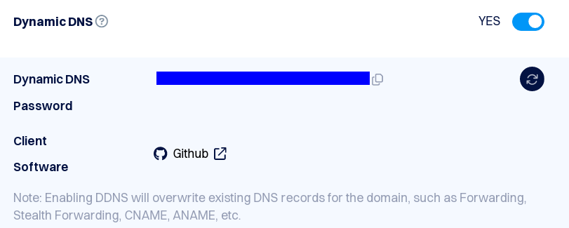

Si copiem undeva (notepad), tokenul de la *Dynamic DNS*.

Iar la final dam pe **Save Settings**.

> [NOTE]
> Aici e posibil sa te puna sa generezi o parola...

<br>

<h2 id="serviciu-ddns-go">Cap. 3 - instalat serviciu DDNS</h2>

Pentru update IP public vom folosi serviciul [DDNS-GO](https://github.com/jeessy2/ddns-go/blob/master/README_EN.md#ddns-go) pus la dispozitie.

**Step 1**<br>
Descarcat serviciul direct pe Raspberry Pi:

- Pentru 64-bit Raspberry Pi OS :

```
wget https://github.com/jeessy2/ddns-go/releases/download/v6.3.0/ddns-go_6.3.0_linux_arm64.tar.gz
```

- Pentru 32-bit Raspberry Pi OS:

```
wget https://github.com/jeessy2/ddns-go/releases/download/v6.3.0/ddns-go_6.3.0_linux_armv7.tar.gz
```

**Step 2**<br>
Extragem archiva

```
tar -zxvf ddns-go_6.3.0_linux_arm64.tar.gz
```

**Step 3**<br>
Executat acest fisier executabil, pentru pornit serviciul DDNS

```
sudo ./ddns-go
```

Deobicei listen la portul 9876, dar oricum vei vedea acest lucru in terminal.

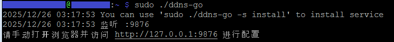

**Step 4**<br>
De pe calculator deschidem acest link in browser:

```
http://<your_pi_local_ip>:9876
```

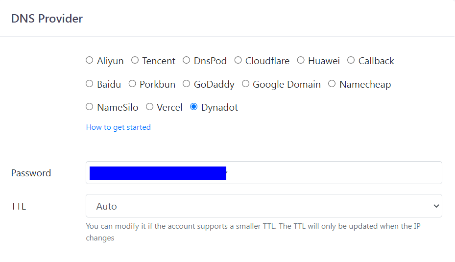

Selectam :

- *DNS Provider* - **Dynadot**
- *Password* - punem parola salvata de la *Dynadot* de la ***Step 2.6***

<br>

**Step 5**<br>
La *IPv4*, selectam metoda **By api**<br>
iar la *Domains* punem

```
exemplu.com
www.exemplu.com
```

actualizand domeniul dupa caz.

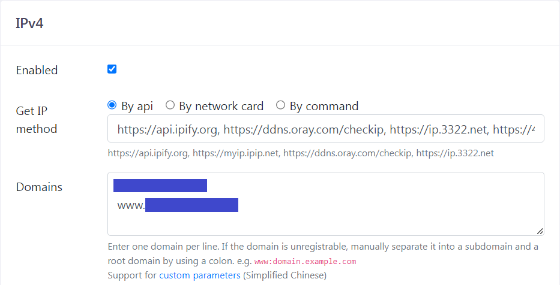

**Step 6**<br>

> [!WARNING] 
> Foarte important !<br>
> Debifam *IPv6*<br>
> Mie mi-a dat eroare acesta

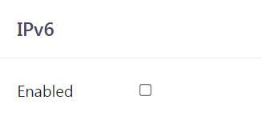

**Step 7**<br>
Iar la finalul paginii, apasam pe **Save**

**Step 8**<br>
Mergem pe *Logs* din partea de sus dreapta, iar daca arata ca domeniile s-au actualizat cu succes, am terminat cu aceasta etapa.

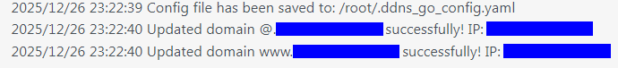

Pentru iesire, apasam **OK**.

<br>

<h3>Cap 3.1 - Mutat DDNS-Go in folder dedicat</h3>

Este recomandat sa tinem aceste fisiere *ddns-go* intr-un folder de sistem dedicat precum */usr/local/bin*.<br>

**Step 1**<br>
Creaza un nou folder

```
sudo mkdir /usr/local/bin/ddns-go
```

**Step 2**<br>
Mutam toate fisierele acolo<br>
Am mutat si arhiva ca sa pot vedea versiunea mai usor.

```
sudo mv ddns-go ddns-go_6.3.0_linux_arm64.tar.gz LICENSE README_EN.md README.md /usr/local/bin/ddns-go/
```

<br>

<h3>Cap 3.2 - Facut serviciu automat</h3>

Acest setup asigura ca *DDNS-GO* ramane un serviciu persistent, care va porni automat de fiecare data cand *Raspberry Pi* va reporni.

**Step 1**<br>
Creat un nou *service file* prin:

```
sudo nano /etc/systemd/system/ddns-go.service
```

**Step 2**<br>
Iar inauntru adaugam:

```ini
[Unit]
Description=DDNS-GO Service
After=network.target

[Service]
Type=simple
WorkingDirectory=/usr/local/bin/ddns-go
ExecStart=/usr/local/bin/ddns-go/ddns-go
Restart=on-failure

[Install]
WantedBy=multi-user.target
```

Salvam fisierul prin `Ctrl` + `o`, urmat de `Enter`. Iar apoi iesim prin `Ctrl` + `x`.

**Step 3**<br>
Repornim *systemd daemon* pentr a recunoaste noul serviciu:

```
sudo systemctl daemon-reload
```

**Step 4**<br>
Activam serviciul pentru a porni automat la bootare

```
sudo systemctl enable ddns-go.service
```

**Step 5**<br>
Pornim serviciul creat

```
sudo systemctl start ddns-go.service
```

**Step 6**<br>
Verificam statusul lui

```
sudo systemctl status ddns-go.service
```

Daca totul a decurs bine ar trebui sa arate: **active (running)**

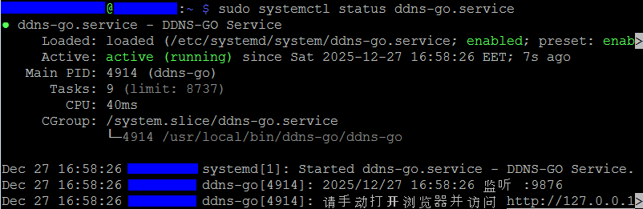

Pentru a iesi din aceasta vizualizare, apasa `q` (Q)

<br>

> [!IMPORTANT] 
> Daca intampini erori la pasul precedent, sau scrie **Failed**, atunci poti folosi
>
>```
>journalctl -u ddns-go.service -n 50
>```
>
>pentru a te ajuta la debugging.<br>
> - `50` - numarul de linii de eroare dorit

> [!NOTE]
> Pentru restart serviciu automat ai:
>```
>sudo systemctl restart ddns-go.service
>```

<br>

<h2 id="ssh-domeniu-public">Cap. 4 - Testare SSH extern prin domeniu</h2>

> [!NOTE]
> Repetam testarea prin internetul de pe telefon, dar pt domeniu de aceasta data.

> [!TIP]
> pt simplitate putem edita setarea `Raspberry Pi - extern 1`

**Step 2**<br>
Deschidem din nou *KiTTY*


la *Hostname* se trece `<username>@<domeniu>`

adica username = `pi` ; iar domeniul = `example.com`

La port trecem portul extern ales la atunci cand am creat port forward la <a href="8.Conexiune ssh - externa prin duckDNS.md">8.Conexiune ssh - externa prin duckDNS</a>

ii dam un nume sugestiv precum `Raspberry Pi 4 - extern1` si apoi dam *Save*

**Step 3**<br>
Mergem la *Connection/SSH/Auth*


si apoi selectam cheia ssh (*.PPK*), dupa care ne intoarcem la categoria *session* si dam *Save*

> [!IMPORTANT] 
> daca incercam sa ne conectam direct ca si pana acum nu va functiona din cauza ca nu ne putem conecta din *Local Network*
> De aceea in continuare vom face hotspot / thetering de pe telefon.

**Step 4**<br>
Conectam telefonul la PC, cu un cablu de date (nu doar de incarcare)

**Step 5**<br>
Apoi ne intreaba daca vrem sa accesam datele de pe telefon. Eu am dat *Refuz* dar nu prea conteaza ce alegem la acest popup.


**Step 6**<br>
Apoi derulam de sus de la telefon, extindem ce scrie la *Sistem android*, si apoi apasam pe acesta.


**Step 7**<br>
Se va deschide obtiunile de *Setari USB*


iar aici selectam **Tethering prin USB**, dupa care dam `<` (inapoi)

**Step 8**<br>
Ce mai ramane de facut este sa activam datele mobile din telefon, prin meniul rapid de deasupra.

**Step 9**<br>
E posibil sa apara o fereastra din-aceasta pe PC,


dar alegem *Home network*, dupa care *Close*.<br>
Inchidem deasemenea fereastra cu *Autoplay*. Nu ne intereseaza.

**Step 10**<br>
Ne deconectam de la cele 2 conexiuni active de internet (eu sunt conectam si cu Wifi si cu cablu, pe PC-ul meu vechi), prin deconectarea de la Wifi, plus scos cablu LAN.


> [!NOTE]
> Eu am dat refresh la conexiune (coltul dreapta-sus din imagine) pana ce am ramas cu internetul de pe telefon

**Step 11**<br>
Din *KiTTY* dam acum pe *Start*<br>
Ni se va afisa un mesaj din-acesta, la care dam *Accept*


Introducem *passphrase* ... si ne-am logat cu succes in Raspberry Pi, de pe IP public (extern)

> [!NOTE]
> dupa ce am setat corect actualizarea IP-ului public, si port forwarding pt SSH, are nevoie de cateva minute ca domeniul sa se propage pe internet, pana la operatorul de telefonie mobila.<br>
> sunt destul de multe setari, dar daca ai testat ca mine de pe telefon prin *Rasp Controller* IP-ul public s-ar putea sa aiba nevoie de cateva minute pt propagare.