<h1>11.Setup webserver website</h1>

In acest exemplu, vom seta LAMP: Linux, Apache, MySql / Mariadb, PHP.

<h2 id="top">Chapters</h2>
1. <a href="#instalat-apache">Instalat Apache</a><br>
2. <a href="#setare-permisiuni-apache">Setare permisiuni Apache</a><br>
3. <a href="#instalat-mariadb">Instalare baza de date MariaDB</a><br>
4. <a href="#instalat-phpmyadmin">Instalare phpMyAdmin</a><br>
5. <a href="#apache-virtual-host">Creat Apache Virtual Host</a><br>
6. <a href="#port-forward">Activat Port Forwarding</a><br>
7. <a href="#https-ssl">Configurat SSL pentru HTTPS</a><br>
8. <a href="#dezinstalare">Dezisntalare totala</a><br>

<br><br>

<h2 id="instalat-apache">Cap. 1 - Instalat Apache</h2>

**Step 1**<br>
Actualizam Raspberry Pi

```
sudo apt-get update
```

**Step 2**<br>
Instalam serverul apache

```
sudo apt-get install apache2 -y
```

**Step 3**<br>
instalam modulul php pt apache, pt interpretat pagini web *php*.

```
sudo apt install libapache2-mod-php
```

iar cand ne intreaba apasam `y`

<h2 id="setare-permisiuni-apache">Cap. 2 - Setare permisiuni Apache</h2>

În Linux, permisiunile sunt critice pentru securitate: nu vrei ca orice utilizator sau program să poată șterge sau modifica site-ul.

**Step 1**<br>
Rulam urmatoarea comanda

```
sudo chown -R pi:www-data /var/www/html
```

> [!TIP]
> Se poate rula de oriunde.

> [!NOTE]
> - `chown` - vine de la *Change Owner*
> - `-R` - *Recursive* (se aplica folderului si tuturor fisierelor din interior)
> - `pi` - te face pe tine proprietar. Astfel poti edita fisierele prin *FTP* sau terminal 
> - `:www-data` - Acesta este grupul utilizat de serverul Apache. Punandu-l aici, ii dai si lui Apache dreptul sa vada fisierele

**Step 2**<br>
Restartam serverul Apache

```
sudo systemctl restart apache2
```

> [!NOTE]
> Pe sistemele vechi se foloseste `sudo /etc/init.d/apache2 restart`

**Step 3**<br>
In caz de erori putem verifica de ce nu a mers prin:

```
sudo systemctl status apache2
```

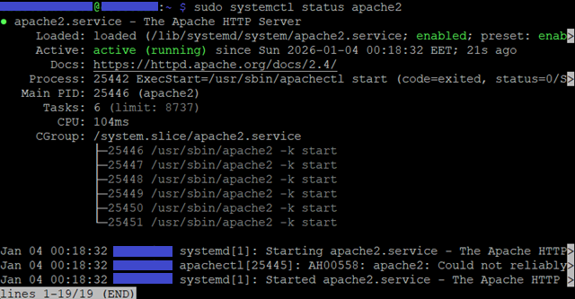

<br>

<h2 id="instalat-mariadb">Cap. 3 - Instalare baza de date MariaDB</h2>

*MariaDB* este "fratele" mai modern si mai performant al lui *MySQL*.

**Step 1**<br>
Rulam aceasta comanda

```
sudo apt install mariadb-server php-mysql -y
```

> [!NOTE]
> - `mariadb-server` - baza de date *Mariadb*
> - `php-mysql` - este "conectorul". Fara acest pachet, *PHP*-ul nu ar putea comunica cu baza de date *MariDB*

**Step 2**<br>
Pentru securitate, vom sterge utilizatorii anonimi si baza de date test

```
sudo mysql_secure_installation
```

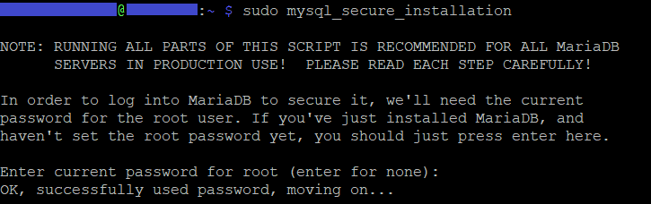

introducem parola de root, atunci cand ne intreaba,

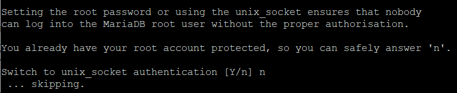

la *unix socket authentification*, eu am dat `n` de la nu

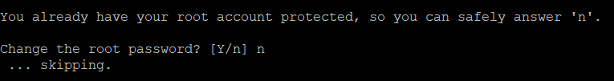

nu schimbam parola de root, asa ca am ales `n`

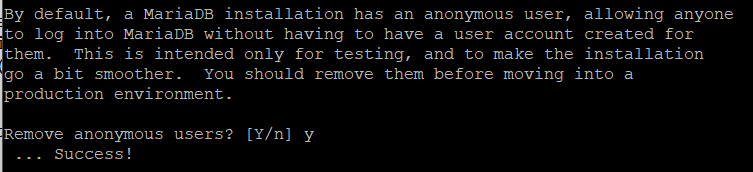

stergem utilizatorii anonimi, asa ca alegem `y`

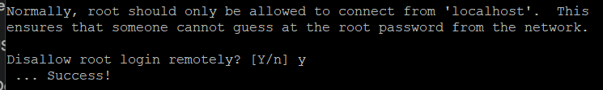

pastam protectia de conexiune doar prin localhost la baza de date.<br>
de accea alegem `y`

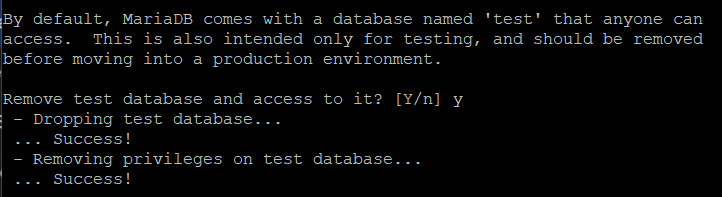

stergem baza de date *test*, asa ca alegem `y`

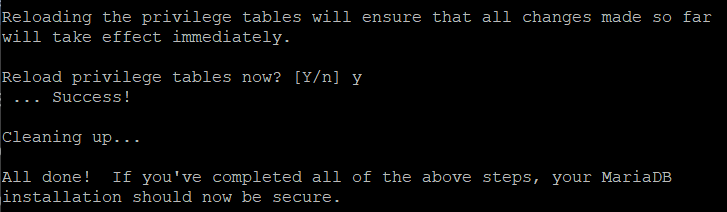

iar la reload privilegii, am ales `y`

**Step 3**<br>
Cream un nou user pentru baza de date.<br>
De aceea tastam:

```
sudo mysql
```

iar in interfata consola (`>`) intoducem :

```sql
CREATE USER `admin`@`localhost` IDENTIFIED BY 'Pasword#3';
```

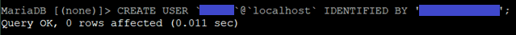

> [!NOTE]
> Evident punem o alta parola mai complicata<br>
> Utilizatorul poate sa ramana `admin` pt ca bazele de date vor fi ulterior encapsulate, si nu vor fi accesibile direct din-afara, din Public Network.

**Step 4**<br>
Acordam toate privilegiile acestui utilizator (fiind utilizator de tip *root*)

```sql
GRANT ALL PRIVILEGES ON *.* to `admin`@`localhost` WITH GRANT OPTION;
```

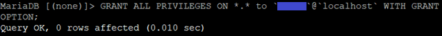

> [!IMPORTANT]
> Aceste privilegii le acordam acestui singur utilizator *root*<br>
> Este puternic recomandat ca sa acorzi privilegii pentru un utilizator limitandu-le la o singura baza de date (nu toate):
> ```sql
> GRANT ALL PRIVILEGES ON your_database_name.* TO 'your_app_user'@'localhost';
>```

**Step 5**<br>
Apoi iesim din interfata MariaDB

```
exit
```

**Step 6**<br>
Pentru a testa *php* cream un fisier de test

```
echo "<?php phpinfo(); ?>" > /var/www/html/test.php
```

**Step 7**<br>
de pe calculator, deschidem un *browser* si punem 

```
http://<ip_static_raspberry>/test.php
```
unde `<ip_static_raspberry>` este IP-ul static ales la ***Step 1.10*** - <a href="8.Conexiune ssh - externa prin duckDNS.md">8.Conexiune ssh - externa prin duckDNS</a>

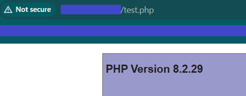

Daca apare o pagina info de PHP foarte lunga, atunci inseamna ca *PHP* functioneaza.

<br>

<h2 id="instalat-phpmyadmin">Cap. 4 - Instalare phpMyAdmin</h2>

*phpmyadmin* : este o interfață grafică (un site web) care îți permite să administrezi bazele de date ușor, dintr-un *browser*, în loc să scrii comenzi complicate în terminal.

**Step 1**<br>
Instalam *phpmyadmin*

```
sudo apt-get install phpmyadmin
```

si dam `y` urmat de `Enter` cand ne intreaba de instalat pachetele necesare.

**Step 2**<br>

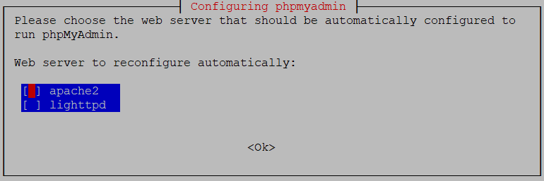

La aceasta setare selectam *apache2* prin `space`<br>
iar prin `tab` pentru *ok*.<br>
Iar apoi pentru continuare dam `Enter`.

**Step 3**<br>

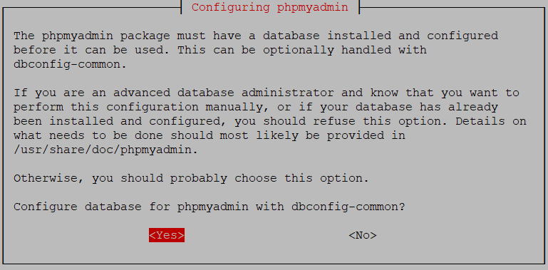

Te va întreba dacă vrei să configurezi baza de date automat.<br>
Selectam *Yes*, si dam `Enter`.

**Step 4**<br>

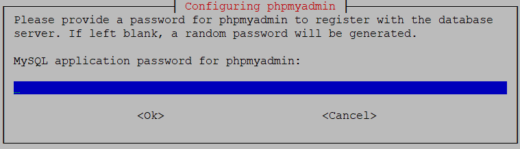

Aici dam skip pt ca am creat deja utilizatorul si parola<br>
De aceea lasam blank, si selectam *Ok* (prin `Tab` sau sageti), urmat de `Enter`.

**Step 5**<br>
Anunatam *Apache* ca exista si *phpMyadmin*<br>
Pentru asta deschidem fisierul de congigurare:

```
sudo nano /etc/apache2/apache2.conf
```

Mergem jos de tot (prin sageata jos) si adaugam:

```conf
#Include PHPMyAdmin
Include /etc/phpmyadmin/apache.conf
```

`Ctrl` + `o` urmat de `Enter` ca sa salvam.<br>
`Ctrl` + `x` pentru a iesi.

**Step 6**<br>
Restartam serverul Apache

```
sudo /etc/init.d/apache2 restart
```

Daca nu primim nici un mesaj de eroare inseamna ca este in regula.

**Step 7**<br>
Pentru a testa *phpMyAdmin*, de pe PC deschidem un browser si punem :

```
http://<ip_static_raspberry>/phpmyadmin
```

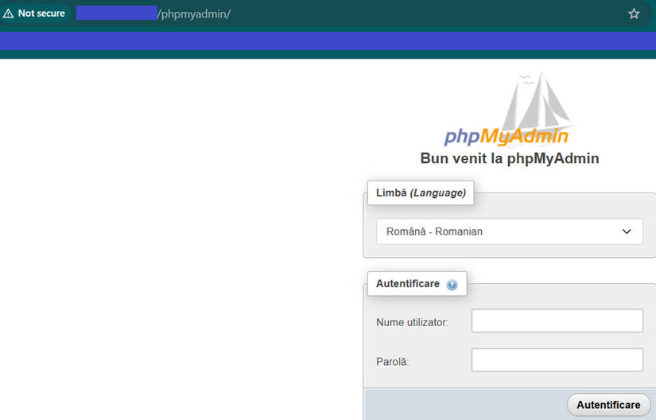

Ne logam cu user `admin` si parola `Password#3` (sau cele alese)

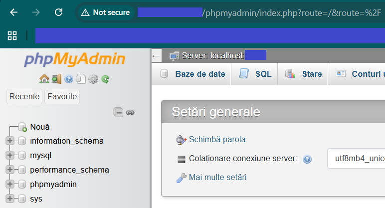

Am test cu succes si phpMyAdmin.

<br>

<h2 id="apache-virtual-host">Cap. 5 - Creat Apache Virtual Host</h2>

Aceasta este o parte crucială dacă vrei să îți accesezi site-ul prin intermediul unui domeniu (ex: siteultau.ro) și nu doar prin adresa IP locală a Raspberry Pi-ului.

**Step 1**<br>
Creat un nou fisier de configuratie pt domeniu<br>
Deschidem un nou fisier si in editam:

```
sudo nano /etc/apache2/sites-available/yourdomain.com.conf
```

> [!IMPORTANT]
> Modifica `yourdomain.com` cu domeniul tau

> [!NOTE]
> `sites-available`: Este "biblioteca" de configurații. Acolo scrii regulile, dar ele nu sunt încă active.

**Step 2**<br>
Inseram acest continut

```ini
<VirtualHost *:80>
  ServerName yourdomain.com
  ServerAlias www.yourdomain.com
  ServerAdmin webmaster@localhost
  DocumentRoot /var/www/html
  ErrorLog ${APACHE_LOG_DIR}/error.log
  CustomLog ${APACHE_LOG_DIR}/access.log combined
</VirtualHost>
```

`Ctrl` + `o` urmat de `Enter` ca sa salvam.<br>
`Ctrl` + `x` pentru a iesi.

> [!NOTE]
> - `<VirtualHost *:80>`: Îi spune serverului să asculte pe portul 80 (HTTP standard) pentru orice cerere care vine spre el.
> - `ServerName`: Este linia critică. Dacă browserul cere `yourdomain.com`, Apache se uită aici să vadă dacă se potrivește.
> 


**Step 3**<br>
Acum e timpul sa-i zici la *Apache* sa foloseasca aceasta noua configuratie, si sa o dezactiveze pe cea default, pt a prevenii conflictele.<br>
Activeaza noua configuratie:

```
sudo a2ensite yourdomain.com.conf
```

> [!IMPORTANT]
> Modifica `yourdomain.com` in domeniul tau

> [!NOTE]
> `a2ensite` (Apache 2 Enable Site): Aceasta este comanda care "activează" site-ul, creând o legătură între "bibliotecă" (sites-available) și folderul de site-uri active (sites-enabled).


**Step 4**<br>
Dezactiveaza configuratia default

```
sudo a2dissite 000-default.conf
```

> [!NOTE]
> `a2dissite 000-default.conf`: Aceasta dezactivează pagina standard de "It Works!" a *Apache*-ului ca să nu existe conflicte.


**Step 5**<br>
Testam daca sunt erori de sintaxa

```
sudo apachectl configtest
```

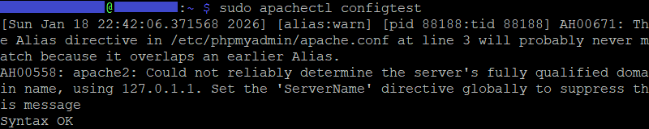

Eu am mai primit si niste warnings, dar este in regula pt ca se vor rezolva la activarea *Virtual host*.<br>
Insa returneaza *Syntax OK* (ce ne intereseaza)

**Step 6**<br>
Restartam serviciul Apache pentru a aplica schimbarile

```
sudo systemctl restart apache2
```

**Step 7**<br>
Verificam daca este in regula (pentru siguranta)

```
sudo systemctl status apache2
```

<br>

<h2 id="port-forward">Cap. 6 - Activat Port Forwarding</h2>

**Step 1**<br>
Ne logam in router, si mergem la *Forward Rules*

**Step 2**<br>
Apasam pe *New*, si il completam:

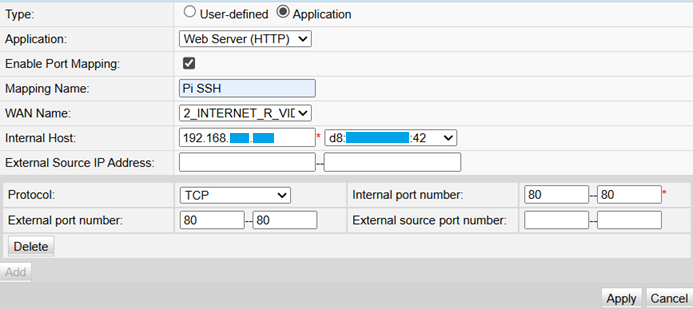

- *Type* - selectam **Application**, iar apoi la drop-down de la *Application* selectam **Web Server (HTTP)**
  
> [!NOTE]
> Aceasta obtiune va completa automat portul `80` de jos, specific acestui protocol

- *Mapping Name* - trecem `Pi HTTP`
- *Internal Host* (prima casuta inainte de Select) trecem IP-ul static ales pt Raspberry Pi (la <a href="">8. Conexiune ssh - duckDNS</a> Cap 1.10), sau selectam dispozitivul din drop-down-ul alaturat care completeaza automat si IP-ul static.

> [IMPORTANT]
> Noi am setat IP-ul privat static in interiorul la Raspberry Pi, iar Routerul dupa un timp il va uita: un timp hostname-ul *pi* va fi disponibil pt selectie, apoi *MAC*-ul acestuia, iar ulterior nu-l va mai vedea deloc.<br>
> De aceea am pus IP-ul, si nu l-am putut selecta.

Dam pe **Apply*.

**Step 3**<br>
Repetam procesul, numai ca de aceasta data selectam **Webserver (HTTPS) la *Application*

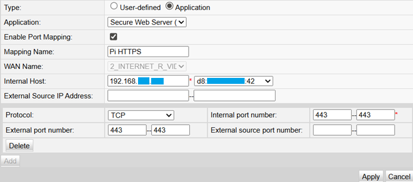

- *Port mapping* : `Pi HTTPS`
- *Internal Host* : punem manual IP-ul sau selectam dispozitivul din drop-down-ul alaturat.

Iar apoi dam **Apply**.

**Step 4**<br>
Dupa care mergem la *System Tools*, si dam un restart la Router,<br>
urmat de un restart la *Raspberry Pi, prin `sudo reboot`

**Step 5**<br>
Pentru a testa daca ai setat bine *port forwarding*, poti merge la <a href="https://canyouseeme.org/">canyouseeme.org</a><br>
IP-ul public ti-l detecteaza automat. Tot ce trebuie sa faci este sa completezi portul extern ales

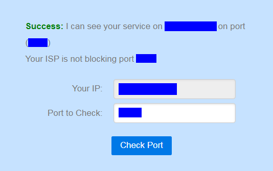

Alternativ:

Dupa ce ai instalat *Apache*, poti testa porturile deschise prin:

```
sudo netstat -plnt | grep -E ':80|:443'
```

Ar trebui sa vezi linii cu ambele porturi `80` si `443` cu statusul *LISTEN*, asociate cu procesul de *apache2*.

<h2 id="https-ssl">Cap 7 - Configurat SSL pentru HTTPS 🔒</h2>

Este nevoie sa setezi un certificat SSL pentru domeniul tau pe *Raspberry Pi*, si sa configurezi *Apache* sa-l foloseasca. Cea mai usoara metoda de a obtine un certificat de incredere si gratis, este cu *Certbot* de la Electronic Frontier Foundation (EFF).<br>
*Certbot* face configurarea automata pentru portul `443` deschis prin router.

**Step 1**<br>
Actualizam sistemul

```
sudo apt update
```

Instalam *Certbot*

```
sudo apt install certbot python3-certbot-apache
```

**Step 2**<br>
Rulam *Certbot*<br>
Va detecta automat *Apache Virtual Host*

```
sudo certbot --apache
```

Te va intreba:
  - adresa ta de email
  - daca esti de acord cu termenii si conditiile
  - te va intreba daca vrei sa redirectionezi traficul HTTP catre HTTPS

Va detecta automat domeniul tau din fisierul de configuratie *Apache*, si chiar va creea un cron job care sa reinoiasca automat certificatul la 90 de zile.

<h2 id="dezinstalare">Cap 8 - Dezisntalare totala</h2>

Acest pas reprezinta cu aproximatie pasii urmati de mine in a dezinstala vechiile servicii.

**Step 1**<br>
Oprim serviciile

```
sudo systemctl stop apache2 mariadb
```

**Step 2**<br>
Dezinstalam pachetele

```
sudo apt purge apache2 php* mariadb-server phpmyadmin -y
```

> [!NOTE]
> Am facut acestea doua pentru a elibera porturile `80` (*HTTP*), si `443` (*HTTPS*)

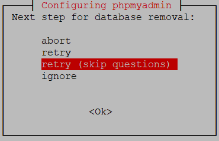

Mie mi-a dat aceasta eroare de stergere a bazei de date

**Step 3**<br>
Selectam *ignore* si apasam `Enter`.
Daca mai primim erori, alegem *abort*.

**Step 4**<br>

> [!NOTE]
> Aceste comenzi sunt pt curatare de fisiere reziduale

Fortam oprirea serviciilor daca inca ruleaza

```
sudo killall -9 apache2
```

```
sudo killall -9 mysqld
```

**Step 5**<br>
Stergem pachetele fara sa mai punem intrebari

```
sudo apt-get remove --purge -y apache2* mariadb* php* phpmyadmin*
```

```
sudo apt-get autoremove -y
```

```
sudo apt-get autoclean
```

**Step 6**<br>
Stergem folderele de configurare care raman de obicei in urma

```
sudo rm -rf /etc/apache2
```

```
sudo rm -rf /etc/mysql
```

```
sudo rm -rf /var/lib/mysql
```

```
sudo rm -rf /usr/share/phpmyadmin
```

**Step 7**<br>
Dupa ce ai rulat curatenia, verifica daca mai asculta cineva de aceste porturi:

```
sudo ss -tulpn | grep :80
```

```
sudo ss -tulpn | grep :3306
```

> [!NOTE]
> Daca nu ai primit nici un raspuns pana acum, inseamna ca totul este in regula. In Lumea Linux *no news is good news*.

**Step 8**<br>
Pentru a te asigura ca procesul de curatare este complet, trebuie sa elimini scripturile de reinoire automata. `Certbot`  foloseste de obicei doua metode pentru acest lucru: un **systemd timer** (sau un cron job in cron.d)

Verifica daca timerul exista

```
systemctl list-timers | grep certbot
```

**Step 9**<br>
Opreste si dezactiveaza timer-ul, daca mai apare in lista.

```
sudo systemctl stop certbot.timer
```

```
sudo systemctl disable certbot.timer
```

```
sudo systemctl mask certbot.timer
```

**Step 10**<br>
Stergem fisierul cron (de configurare) Certbot

```
sudo rm -f /etc/cron.d/certbot
```

**Step 11**<br>
Verifica daca exista referinte in crontab-ul general

```
sudo crontab -l | grep -v "certbot" | sudo crontab -
```

**Step 12**<br>
Verificam daca a mai ramas o urma activa in sistem

**Cautare fisiere ramase**

```
find /etc -name "*certbot*" 2>/dev/null
```

```
find /var -name "*letsencrypt*" 2>/dev/null
```

**Verificare servicii/timere**

```
systemctl list-units --all | grep certbot
```

**Verificare procese active

```
ps aux | grep certbot | grep -v grep
```

**Step 13**<br>
Rulam aceste verificari suplimentare:

```
sudo rm -rf /etc/letsencrypt
```

```
sudo apt-get purge certbot
```

> [!NOTE]
> Acestea sunt necesare doar pentru a preveni erori de tipul "File not found" in log-urile de sistem, care apar atunci cand un timer incearca sa execute un script care nu mai exista.

