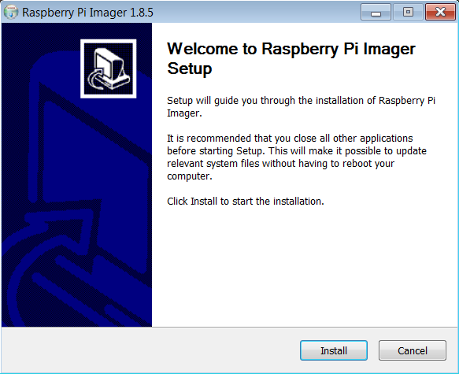

<h1>Descarcare & Instalare</h1>

<h2 id="top">Chapters</h2>
1. <a href="#RPI">Descarcare RPI Imager tool</a><br>
2. <a href="#install">Raspberry OS - Main installation</a><br>
3. <a href="#asamblare">Asamblare Raspberry Pi</a><br>

<h2 id="RPI">Descarcare RPI Imager tool</h2>

Pentru a instala sistemul de  operare pe Raspberry Pi, voi folosi <b>Raspberry Pi Imager</b>, dar se pot utiliza si alte aplicatii asemanatoare. 

**Step 1**<br>
Mergi pe siteul [Raspberry Pi Imager](https://www.raspberrypi.com/software/), si descarca <b>Raspberry Pi Imager</b> pt OS-ul folosit de computerul tau.<br>
Eu folosesc Windows, asa ca am sa apas pe <i>Download for Windows</i>, dupa care dai <i>Save</i>.<br>

**Step 2**<br>
Deschide fisierul tocmai descarcat, si dupa caz apesi pe <i>Run</i>

**Step 3**<br>
O sa apara o fereastra asemanatoare, la care exista doar butonul <i>Install</i>, pe care apasam pt a continua instalarea.



**Step 4**<br>
Instalarea <i>Raspberry Pi Imager</i> se va termina cu succes, cu urmatoarea fereastra.


Lasam bifata casuta <i>Run Raspberry Pi Imager</i>, pt ca urmeaza instalarea propriu-zisa, si apasam <i>finish</i>.


<h2 id="install">Instalare OS pe Raspberry Pi</h2>

Instalation or Flashing is the same thing for embedded boards.<br>

**Step 1**<br>
<i>Raspberry Pi 4</i> foloseste stocarea by default pe un card <i>MicroSD</i>.<br>
Si aici exista mai multe directii de abordat problema, insa eu o sa prezint cea mai usoara solutie, care a functionat pentru mine.<br>
Eu am achizitionat acest card de memorie de 32 GB, care vine la pachet si cu un adaptor SD, ce-l transforma in card SD la citire / scriere.<br>
Aveam oricum mai multe astfel de adaptoare SD, chiar si daca nu venea cu acesta.


Ca spatiu de stocare pe Raspberry Pi recomandat maxim este de 32 GB. Am citit ca poate sa duca si mai mult, si am vazut ca cineva a incercat cu 1 TB spatiu de stocare, insa eu n-am incercat. Deasemenea creste si pretul foarte mult, si practic nu se merita. Daca conteaza l-am achizitionat de [aici](https://www.emag.ro/card-de-memorie-sandisk-ultra-microsdhc-32gb-120mb-s-a1-class-10-uhs-i-sd-adapter-sdsqua4-032g-gn6ma/pd/D48YNDMBM/), dar nu sunt sponzorizat in vreun fel.<br>
Primul pas consta in intoducerea cardului MicroSD in adaptorul SD.


**Step 2**<br>
Introdu adaptorul SD, cu cardulMicroSD in cititorul de card SD, pe care il are laptopul incorporat.

> [!WARNING]
> Adaptorul SD are in partea din stanga sus, pe muchie, un mic slider.<br>
> Acesta trebuie sa ramana sus, precum in imagine.<br>
> Daca il tragi in jos, aceasta va bloca scrierea pe card. Iar noi vrem sa scriem sistemul de operare pe MicroSD.<br>

**Step 3**<br>
Daca apare aceasta fereastra, pur si simplu o ignori, apasand <i>Continue without scanning</i>


Iar la urmatoarea fereastra cu titlul <i>AutoPlay</i>, doar o inchideti apasand <i>X</i>.

**Step 4**<br>
Cand deschidem <i>Raspberry Pi Imager</i>, va arata cam asa.


Apasam pe <i>Choose Device</i> si selectam <i>Raspberry Pi 4</i>, intrucat aceasta este placa pe care o voi folosi.

**Step 5**<br>
Apasam pe <i>Choose OS</i>, si selectam  <i>Raspberry Pi OS (other)</i>, dupa care <i>Raspberry Pi OS Lite (64-bit)</i><br>, precum in imaginea de mai jos:


Daca e prima data cand descarcati imaginea, va descarca de pe internet automat 0.4GB. Acest lucru e necesar decat prima data.<br>
Alternativ puteti sa descarcati imaginea manual de pe [Operating system images](https://www.raspberrypi.com/software/operating-systems/) sau chiar Ubuntu.<br>
Recomand folosirea unei versiuni headless, fara GUI, intrucat imaginea OS, este mult mai mica, si la si spatiul ocupat dupa instalare OS. Astfel vom avea mai mult spatiu de stocare util pe placa Raspberry Pi 4.

**Step 6**<br>
Apasam pe <i>Choose Storage</i>, si selectam singura obtiune <i>SDHC Card - 31.9 GB</i>


**Step 7**<br>

> [!IMPORTANT]
> Inainte de a continua, apasam `CTRL + SHIFT + X`, pt a deschide setarile avansate.


La tabul Cu <i>General</i>, bifezi <i>Set hostname</i>, si alegi o denumire. Default este <i>raspberrypi</i>, dar poti alege o alta denumire. Acesta este un fel de identificator ca nume al placii RaspberryPi, si va fi util mai tarziu.

Alegerea unui <i>Username</i>, si a unei parole va fi utila exclusiv pentru a te loga in cont de pe placa. Deci asigura-te ca memorezi parola, caci vom avea nevoie mai tarziu.

Alternativ poti configura si conectarea prin Wi-fi de la Raspberry Pi placa la Router. Cand am instalat-o eu prima data, nu era si obtiunea de <i>Hidden SSID</i>, dar o recomand obligatoriu, pt ca sa nu ti se conecteze toti vecinii la Raspberry, ci doar cunoscatorii, adica tu.

Pentru consistenta am ales si <i>Time zone</i> la locatia mea. Pana in acest moment nu am observat vreo diferenta cu aceasta setare.

**Step 8**<br>
La tabul <i>Services</i> voi activa obtiunea de ssh, prin bifarea <i>Enable SSH</i>.<br>


Acest lucru ne va permite ulterior, sa ne logam remotely prin networking local la placa Raspberry Pi.<br>
Pentru o securitate imbunatatita, am folosit logarea prin cheie de securitate, bifand <i>Allow public-key authentification only</i>.

**Step 9**<br>
Pentru aceasta va trebui sa generam cheia.<br>
Eu am folosit o metoda mai lunga, asa ca o voi prezenta pe aceasta.<br>
Se porneste consola git bash, si apoi se tasteaza:

```
ssh-keygen -t ed25519 -f ~/.ssh/<ssh_fileName> -C "laptop@HP-home"
```

Aici am observat ca cel mai bine este fara `-b 4096`. Inlocuieste `<ssh_fileName>` cu `id_raspberry` sau ceva similar, iar la comentariul `-C`  ai putea pune orice comentariu, dar ceva similar descriptiv este recomandat.<br>


Apoi introduci o parola (care o poti memora) la <i>passphrase</i>, si apoi o retastezi ca verificare.


**Step 9**<br>
In acelasi terminal git tastam:

```
cat ~/.ssh/id_raspberry.pub
```

Iar apoi copiem aceea cheie in campul din <i>Raspberry Pi Imager</i> de la <b>Step 8</b>. (si o lasam deschisa fereastra)

**Step 10**<br>
Pentru a ne conecta ulterior prin ssh, tot ce trebuie sa mai facem este sa convertim cheia privata in format <i>ppk</i> pentru unealta PuTTY sau KiTTY.<br>
Eu prefer KiTTY, pentru conexiune, si o voi descarca de [aici](https://github.com/cyd01/KiTTY).<br>
Iar Putty pt convertit cheia. Pe acesta il voi descarca de [aici](https://www.chiark.greenend.org.uk/~sgtatham/putty/latest.html). Ne intereseaza tot pachetul.


**Step 11**<br>
Se ruleaza `puttygen`, si apoi mergem pe <i>Conversions/Import key</i>, si apoi se selecteaza cheia secreta. Spre exemplu `id_raspberry`. Dupa care introducem <i>passPhrase</i> care am introdus-o la generat cheia.<br>
Daca s-a incarcat corect va arata cam asa:


**Step 12**<br>
Apasam pe butonul <i>Save private key</i>, si salvam cheia ca `id_raspberry.ppk` sau ceva similar, si o pastram in acelasi folder `.ssh`.<br>
Iar apoi inchidem *Putty Key Generator*, apsand pe `X`.


**Step 13**<br>
In aceeasi fereastra <i>Raspberry Pi Imager</i>, schimbam pe tabul <i>Options</i>. Aici le-am bifat pe toate.<br>


De notat este ca la finalizare, va fi _eject_ automat.<br>
Apasam pe _Save_ de jos.

**Step 14**<br>
Si ajungem la meniul principal.<br>


Aici dam pe _Next_, iar la acest pop-up 


apasam pe _yes_.

**Step 15**<br>
Daca nu e prima data cand scrieti cardul MicroSD, e posibil sa intalniti si aceasta notificare:


Aici dati click pe _Yes_ din nou.

**Step 16**<br>


Dai click pe _Continue_, dupa care inchizi fereastra <i>Raspberry Pi Imager</i>, iar apoi scoti adaptorul SD.

<hr />

<h2 id="asamblare">Asamblare Raspberry Pi</h2>

Acum este timpul pentru asamblarea hardware.

**Step 1**<br>
Pentru aceasta se scoate cardul MicroSD din Adaptorul SD, si apoi se introduce in slotul de pe placa Raspberry Pi 4, de pe spatele acesteia. Se poate vedea prntr-o gaurica daca a ajuns la capat sau nu. 


Cam asa ar trebui sa arate:


**Step 2**<br>
Pentru carcasa am folosit Matic Box Neagra, pe care am achitizionat-o de [aici](https://ardushop.ro/ro/home/1718-carcasa-pentru-raspberry-pi4-maticbox-4.html?gclid=Cj0KCQiAj_CrBhD-ARIsAIiMxT8GwMeEv6fjQhiIcvJ-Lm-RWiHdfb9qq_MOXbtGhlTn1drHwOQvqmAaApITEALw_wcB#/423-culoare-negru_metalic).<br>
Mi se pare foarte versatile aceasta carcasa, putand fi adaptata la mai multe variante, din ce vrei sa experimentezi cu ea prima data ca beginner.<br>
Placa se aseaza pur si simplu pe carcasa inferioara, insa trebuie avut mare grija ca micro cardul SD sa treaca pe sub o bolta.


**Step 3**<br>
Se adauga carcasa de mijloc pe deasupra.


**Step 4**<br>
Se pozitioneaza ventilatorul pe centru.<br>
In cazul meu am folosit [acest tip de ventilator](https://thepihut.com/products/large-50mm-5v-fan-for-raspberry-pi). Este cel mai bun gasit pana acum pentru ca este si silentios, si asigura si o buna circulatie a aerului.<br>

Pentru aceasta l-am pozitionat cu fata in sus, conform cu poza de ma jos, iar firul de alimentare sa iasa prin dreapta-sus.<br>


**Step 5**<br>Apoi am profitat de ocazie, si am pus si [acest controller de ventilator](https://thepihut.com/products/fan-controller-for-raspberry-pi?variant=39578362577091), pentru posibilitatea de a porni ventilatorul doar in caz de nevoie.<br>

Pentru aceasta controllerul trebuie sa foloseasca acesti pini astfel.<br>


Am folosit 6 [fire mama-tata](https://www.optimusdigital.ro/ro/fire-fire-mufate/650-fire-colorate-mama-tata-10p.html) pt a conecta primii 6 pini (3 x 2) din stanga la GPIO, de controller, iar acesta direct la cele 2 fire de la ventilator.<br>Aici am pastrat firele nedeslipite cat am putut de mult, pt ca apoi sa pun firele pe o anumita strategie, conform pozei de mai jos<br>


**Step 6**<br>

Ai grija ca firele de la ventilator de pe spatele acestuia sa fie intinse, si sa nu fie iesite de la locul lor.


Iar apoi pui ventilatorul cu fata in sus.


**Step 7**<br>Dupa care pozitionezi mai intai controllerul pe colt, conform pozei de mai jos, iar apoi indoi incet firele din stanga astfel incat sa intre in gol. Iar cele din dreapta daca le lasi un pic mai labartate, se agata singure de pereti si totul sta fixat.


**Step 8**<br>
Se pune o placuta neagra in partea din stanga, iar apoi se pune capacul la final, cu mentiunea sa ai grija la fire, si sa auzi 4 click-uri de la cele 4 cleme din colturile carcasei superioare.

