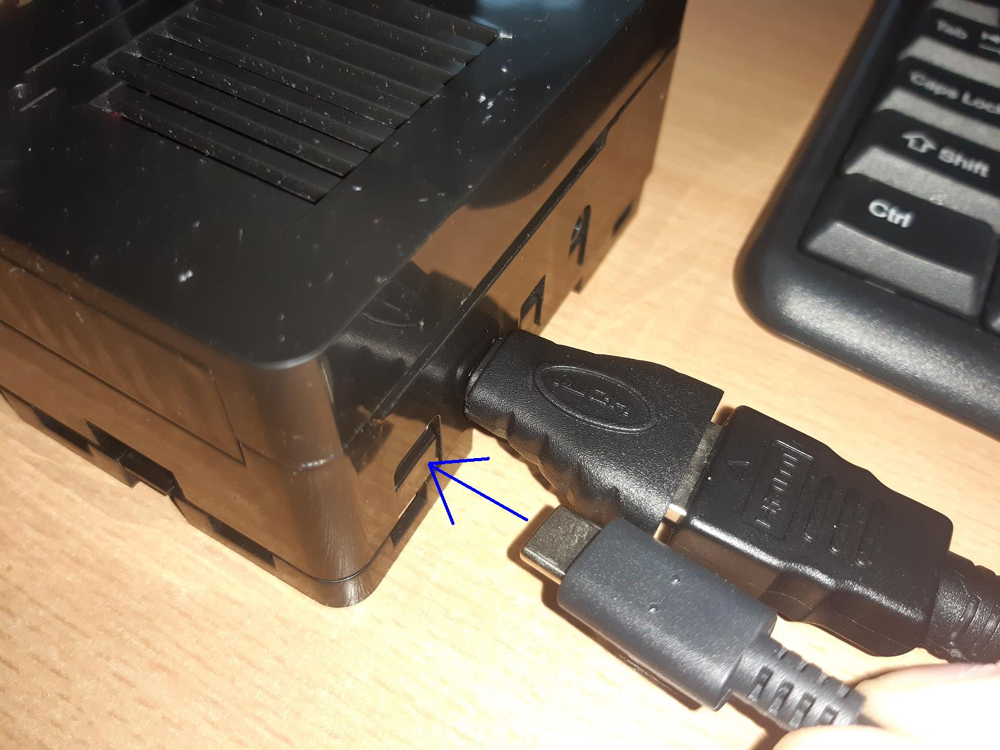

<h1>3.Conectat la monitor laptop</h1>

<h2 id="top">Chapters</h2>
1. <a href="#obs">Descarcare & Instalare OBS Studio</a> 
2. <a href="#hardware">Conexiuni hardware</a> 
3. <a href="#configurare">Configurare OBS Studio</a> 

<h2 id="obs">Descarcare & Instalare OBS Studio</h2>

De regula, tot ce este nevoie este de un monitor extern. Dar pt cei care nu au un monitor extern, ci doar un laptop, am sa va arat cum se procedeaza. 
Vom folosi OBS Studio, pt a afisa pe calculator ce afiseaza placa Raspberry Pi. De asta e nevoie doar la inceput pt a face niste modificari.

**Step 1** 
Pentru a descarca *OBS Studio* mergeti la [https://github.com/obsproject/obs-studio](https://github.com/obsproject/obs-studio), iar la *release* de regula ultima versiune ar trebui sa fie cea potrivita. 
Daca si voi folositi Windows 7, atunci vom descarca [OBS Studio - Versiunea 24.0.3](https://github.com/obsproject/obs-studio/releases/tag/24.0.3), fiind ultima versiune pentru Windows 7. 
Eu am 64biti, asa ca voi descarca *OBS-Studio-24.0.3-Full-Installer-x64.exe*.

**Step 2** 
Se porneste *OBS-Studio-24.0.3-Full-Installer-x64.exe*, iar la *Security Warning* window se da click pe *Run*.

**Step 3** 
In continuare se apasa pe *Next*.

**Step 4** 
Apoi pe *I agree* acceptand licenta.

**Step 5** 
In continuare se alege destinatia in care va fi instalat. 
Eu am ales pe diskul *D* intr-un folder sugestiv cat si a versiunii: *D:\obs-studio-24.0.3\* 
Daca folderul nu exista va fi creat.

**Step 6** 
De regula selectez toate plugin-urile, pt cazuri viitoare in care as avea nevoie de ceva. Dar verific si sa nu consume prea mult spatiu de stocare. 
Dupa care dam pe *Install*.

Eu am intampinat o eroare cu SSL certificat, dar am trecut mai departe apsand *OK*.

**Step 7** 
La finalizarea instalarii, lasam bifata casuta *Launch OBS Studio 24.0.3*, si apasam *Finish*.

<h2 id="hardware">Conexiuni hardware</h2>

Pentru acest pas vom avea nevoie de:
<ul>
  <li> HDMI video capture</li> 
  <li> cablu HDMI</li> 
  <li> adaptor micro-HDMI</li>
</ul>

Alternativ se poate folosi si un cablu HDMI catre micro-HDMI, insa pentru mine este mai avantajos acestea 3, intrucat in afara de Raspberry Pi, nu prea folosessc deloc micro-HDMI.

**Step 1** 
Se conecteaza *adaptorul HDMI* cu *cablu HDMI*.

**Step 2** 
Se conecteaza celalalt capat de la *cablu HDMI* la *HDMI Video Capture* modul.

**Step 3** 
Mai intai conectam ansamblu HDMI, iar apoi cuplam alimentarea de la Raspberry Pi. Prima data va dura ceva mai mult ca Raspberry Pi sa ruleze. In plus, astfel vom putea vedea toate modulele din el in timp ce se incarca. 
Mai intai conectam capatul USB de la *HDMI Video Capture* la laptop.

**Step 4** 
Se conecteaza si celalalt capat al ansamblului, micro-HDMI la mufa de la Raspberry Pi 4.

**Step 5** 
Se alimenteaza incarcatorul de la o priza, sau prelungitor.

**Step 6** 
Se conecteaza cu alimentare Raspberry Pi

<h2 id="configurare">Configurare OBS Studio</h2>

**Step 1** 
Dupa ce se deschide *OBS Studio*, pentru consistenta, urmeaza sa cream un nou profil. 
Mergem pe *Profile / New*, dupa care adaugam un nume. Eu am sa aleg `Pi`, si apoi dam *OK*.

**Step 2** 
In dreptul de jos, la *Scenes* alegem sa cream o noua Scena, sau o putem folosi si pe cea existenta. 
Pentru a creea o noua scena, apasam pe **+** din dreptul acestuia, si alegem un nou nume. Eu am sa folosesc `Rasp Pi`.

La final selectam noua scena, si eventual o stergem pe cea veche prin click-dreapta / remove, urmand de *Yes* ca suntem siguri.

**Step 3** 
Tot in partea de jos, in dreapta de la *Scenes*, avem *Sources*. De aici vom selecta sursa imagini afisata de Raspberry Pi, fiind cel mai important pas. 
Pentru aceasta apasam pe **+** din dreptul la *Sources*, iar apoi pe *Video Capture Device*.

Alegem un nume din nou. Eu am ales `RPi Video`. Lasam bifata casuta din dreptul de jos.

Se va deschide o noua fereastra *Properties*, iar tot ce trebuie sa facem aici este sa selectam de la *Device* ecranul pentru *Raspberry Pi*. 
Initial este selectat Web Cam-ul, iar apoi am selectat *USB Device*, care in preview imi arata liniile pe fundal negru de la Raspberry Pi Server.

 
 Iar la final dam *OK*. 
 Si cam asta este.
 
 **Step 4** 
La inceput o sa folosim full screen, intrucat textul e prea mic, dar apoi putem folosi si fara. 
Pentru full screen, apasam *click-dreapta* pe bucata de ecran neagra, apoi *Fullscreen Projector (Preview) / Display 1: 1920 x 1080* (sau ce display aveti voi). 

Pentru a iesi, se apasa *Esc*.