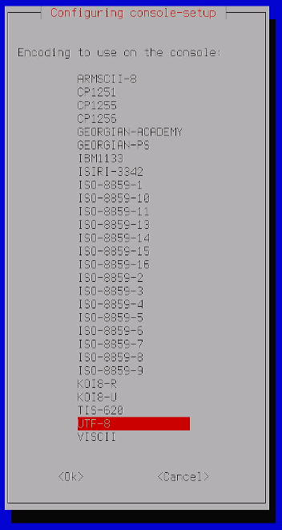
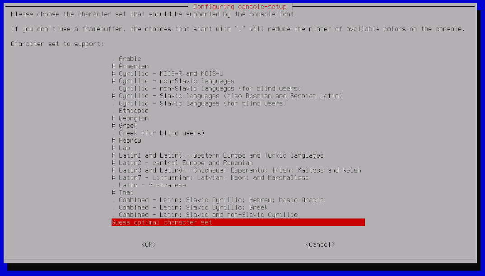
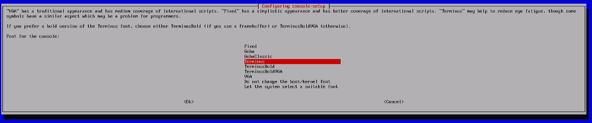
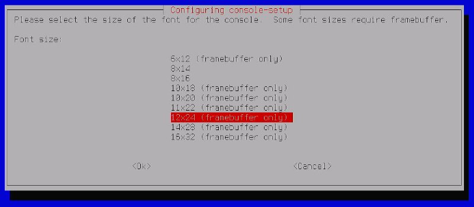

<h1>4. Schimbat font afisare consola</h1>

Pentru a vedea mai bine comenzile introduse, in aceasta etapa cand afisam ecranul direct din Raspberry Pi, voi explica cum se face aceasta configuratie.

**Step 1**<br>
Prima data se deschide OBS Studio, cu setarile mentionate anterior.<br>
Dupa care ne logam cu user si parola mentionate, atunci cand am instalat Raspian, pe cardul micro-SD.

> [!NOTE] 
> Nu uitati sa conectati o tastatura externa la unul dintre porturile USB ale Raspberry Pi.

**Step 2**<br>
Tastati :
```
	sudo dpkg-reconfigure console-setup
```

**Step 3**<br>
Din urmatorul meniu legeti *UTF-8*



**Step 4**<br>
Apasam *Enter* din nou, selectand *Guess optimal character set*.



**Step 5**<br>
Selectam font `Terminus`, si apasam *Enter*.



**Step 6**<br>
In tutorial recomanda marime font *12x24*, dar eu il voi alege pe cel mai mare posibil, adica *16x32*.<br>
Dupa care inca o data *Enter*.



**Step 7**<br>
La final, dati un `reboot`, pentru a reporni *Raspberry*.