<h1>5.Conexiune prin ssh</h1>

<h2 id="top">Chapters</h2>
1. <a href="#configurare">Configurare ssh</a><br>
2. <a href="#definitiv">Setare hardware definitiv</a><br>
A) <a href="#ip">Pt conectare prin IP</a><br>
B) <a href="#hostname">Pt conectare prin domeniu</a><br>

<h2 id="configurare">Configurare ssh</h2>

Acum ca am reusit sa configuram cat de cat consola, urmeaza sa trecem la adevarata putere: a te conecta la Rasperry Pi remotely, prin ssh.<br>
Deja am configurat o cheie la instalarea Rasberry OS, si am pregatit cheia pentru acest pas.

**Step 1**<br>
Primul pas ce trebuie sa-l mai facem este sa activam conexiunea prin SSH. Default aceasta este dezactivata.<br>
Pentru aceasta, dupa ce am deschis OBS Studio, si ne-am logat introducem:
```
	sudo raspi-config
```

**Step 2**<br>
De pe ecrn selectam *Interface Options*, apasnd *Enter*.

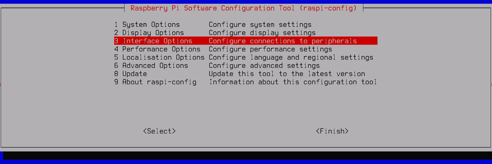

**Step 3**<br>
Apoi selectm *SSH*, apasand *Enter*.<br>
Sagetile sus si jos sunt pentru a naviga in meniu, iar stanga dreapta, pentru a selecta butoanele de jos.

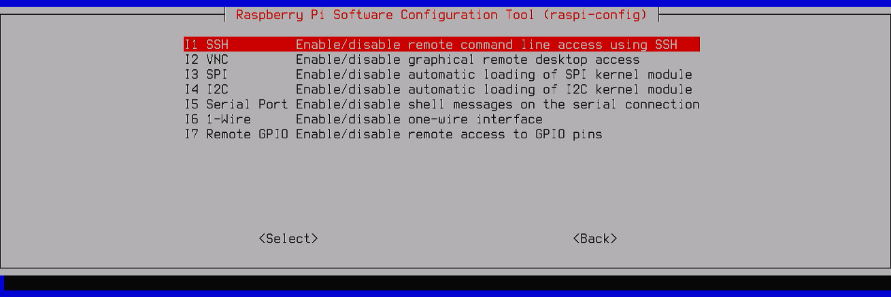

**Step 4**<br>
Apasam pe *Enter*, atunci cand apare acest prompt

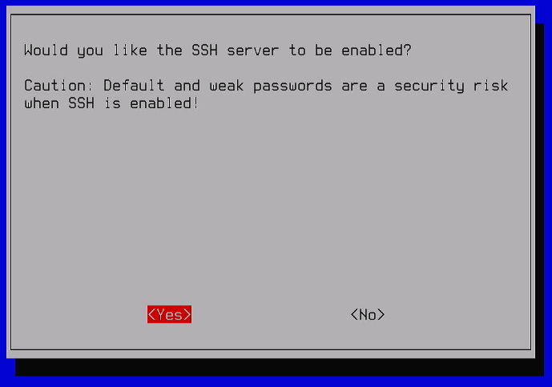

urmat de inca un *Enter* la notificarea ca ssh a fost activat.

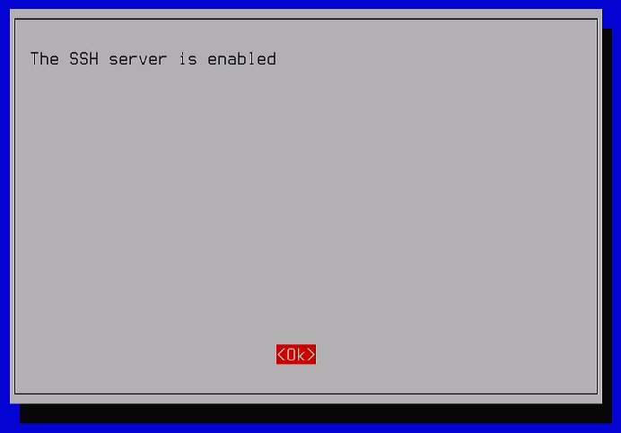

**Step 5**<br>
La final selectm *Finish*, si dam *Enter*.<br>
I-am dat si un `reboot` just in case, insa am deconectat Rasperry Pi, de la monitorul de laptop, si de la alimentare, intrucat urmeaza urmatorul pas.

<h2 id="definitiv">Setare hardware definitiv</h2>

Acum urmeaza sa facem setarea hardware finala.<br>
In cazul meu arata cam asa:

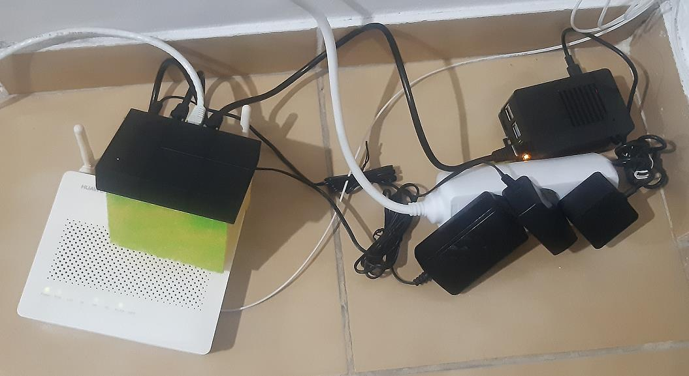

- un rooter
- un switch
- Raspberry Pi

Toate cu incarcatorul lor, si conectate cu cablu LAN.<br>Am folosit si un burete de vase pt a desparti si izolat termic switchul de router.<br>
Spre surprinderea mea cel mai incalzit dispozitiv este routerul.

<h3>Legatura cabluri de date</h3>

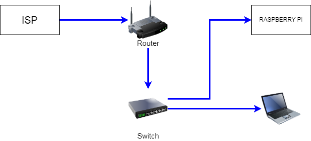

Internetul vine prin fibra optica la router. Routerul trimite internetul la Switch prin cablu LAN, iar de-acolo internetul pleaca mai departe la Raspberry Pi, sau la mine la Calculator.

<h2>Conexiune software la Raspberry Pi</h2>

Aici, eu voi folosi [KiTTY](https://github.com/cyd01/KiTTY), dar si [PuTTY](https://www.puttygen.com/download-putty) este ok. Diferenta intre acestea este ca cu *KiTTY* pot deschide mai multe sesiuni, si pot sa vad toate setarile salvate. 

<h3 id="ip">A) Pt conectare prin IP</h3>

Pentru aceasta obtiune avem nevoie de IP-ul care a fost atribuit la Raspberry Pi, de catre Router / switch.<br>
Voi alege varianta cea mai simpla, adica prin accesarea searilor de la router.

**Step 1**<br>
Ne uitam pe spatele routerului si vom gasi o adresa IP de forma `192.168.X.Y`

**Step 2**<br>
Cu aceasta intram pe `http://http://192.168.X.Y/` ca sa accesam routerul.

> [!NOTE]
> Aceasta poate fi accesata decat in local network


Eu am router de la **Huawei** ( *prin fibra optica* ), si asa arata interfata de logare.

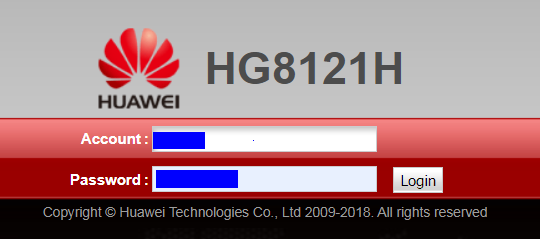


**Step 3**<br>
Introducem `Account` si `Password` (*user* si *parola* luate de la Internet Service Provider)<br>
Sau pt router Tenda, aveam **PPOE** si *parola* tot de la ISP.<br>
iar apoi dam *Login*.

**Step 4**<br>  
Dupa ce ne-am logat, ramanem pe tabul *Status*, si apoi mergem pe *DHCP Information*. Ni se va prezenta un tabel, iar dupa hostname-ul ales `raspberry`, avem adresa IP alocata de router, `192.168.X.Y`. 

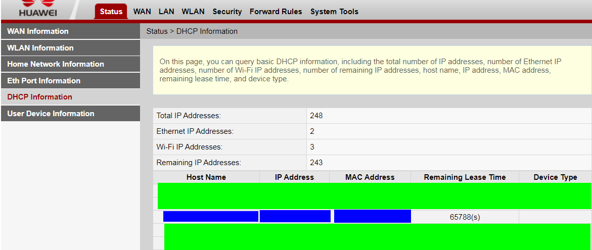

Il notam undeva, pentru pasul urmator.

**Step 5**<br>
Deschide aplicatia KiTTY.<br>
Iar la tabul *Session*, in casuta *Host Name*, introducem `user@IP`. Userul este cel de la instalare. default este `pi`. Iar la IP punem cel de la *Step 4*.<br>
La *Connection type* lasam *SSH*. Este important.<br>
Iar apoi introducem un nume sugestiv precum `Raspberry Pi`, urmat de apasat butonul *save* din dreapta.

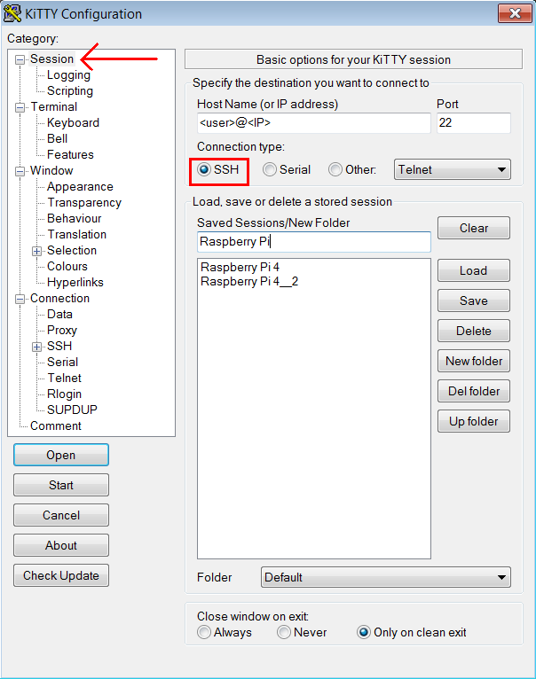

**Step 6**<br>
Din panneul din stanga la *Connection* deschidem *SSH*, si intram pe *Auth*.<br>
De aici apasam pe *Browse* si selectam cheia ssh, salvata ca *.ppk* mai devreme. Asigura-te ca este afisata cu tot cu extensie, sau e posibil sa intampini e eroare mai tarziu.

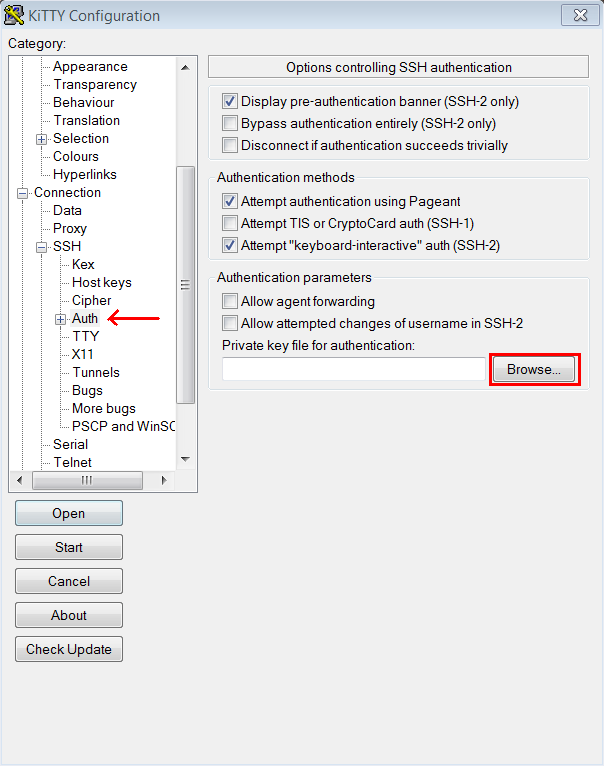

**Step 7**<br>
Pentru consistenta, recomand sa te intorci inapoi la tabul *Session*, si sa mai apesi o data pe *save*.

**Step 8**<br>
Acum e timpul pentru conectare.<br>
selectam conexiunea salvata de la *Saved Session* si apasam fie pe *Open*, fie pe *Start*. De regula la inceput, eu aleg *Start* pentru ca e posibil sa intampini o eroare, iar astfel nu va fi nevoie sa mai deschid inca o data Aplicatia.

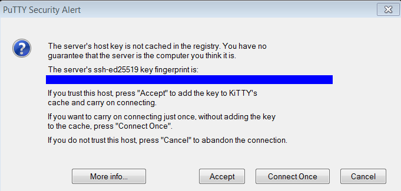

La prima conexiune vei intalni acest popup. Doar apasa pe*Accept*.<br>

**Step 9**<br>
Daca apare aceasta fereastra, este un semn bun.<br>
Introducem *pass phrase* folosita la generat cheia ssh.

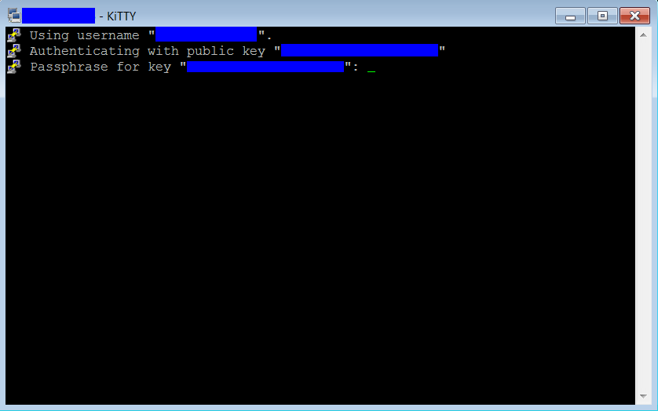

**Step 10**<br>
Si gata. Ne-am logat.

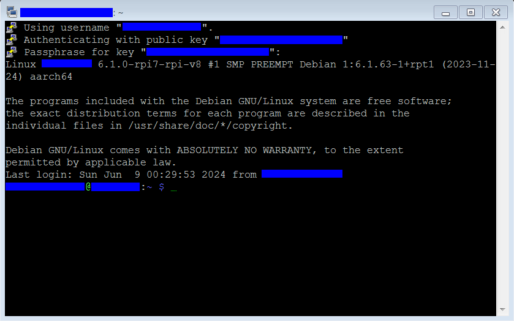

<h3 id="hostname">B) Pt conectare prin domeniu</h3>

Este recomandat sa folosim aceasta versiune, intrucat IPul se poate modifica peste timp. (Decat daca setam un IP static).

**Step 1**<br>
Pentru ca conectarea sa se poata face prin ssh, pentru Windows, este nevoie sa instalam aplicatia [Bonjour Printer Wizard](https://support.apple.com/en-us/106380), caci fara asta PCul nu recunoaste nici hostname, nici hostname.local.<br>
De aceea vom instala aceasta aplicatie.

> [!TIP]
> In caz ca nu e mai online cand citesti aceasta documentatie, poti il poti gasi in folderul *software* de sub cel principal *Raspberry Pi*.

> [!NOTE]
> Instalarea aplicatiei *Bonjour* este nevoie doar p Windows 7. Incepand cu Windows 10 este posibil sa mearga si fara.

**Step 2**<br>
Deschide aplicatia KiTTY.<br>
Iar la tabul *Session*, in casuta *Host Name*, introducem `user@hostname.local`. Userul este cel de la instalare. default este `pi`. Iar la host punem hostname-ul din instalare. Default este `raspberry.local`.<br>
La *Connection type* lasam *SSH*. Este important.<br>
Iar apoi introducem un nume sugestiv precum `Raspberry Pi 2`, urmat de apasat butonul *save* din dreapta.

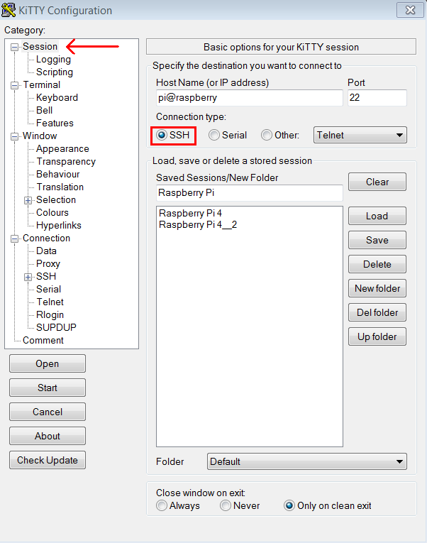


**Step 3**<br>
Din panneul din stanga la *Connection* deschidem *SSH*, si intram pe *Auth*.<br>
De aici apasam pe *Browse* si selectam cheia ssh, salvata ca *.ppk* mai devreme. Asigura-te ca este afisata cu tot cu extensie, sau e posibil sa intampini e eroare mai tarziu.


**Step 4**<br>
Pentru consistenta, recomand sa te intorci inapoi la tabul *Session*, si sa mai apesi o data pe *save*.

**Step 5**<br>
Acum e timpul pentru conectare.<br>
selectam conexiunea salvata de la *Saved Session* si apasam fie pe *Open*, fie pe *Start*. De regula la inceput, eu aleg *Start* pentru ca e posibil sa intampini o eroare, iar astfel nu va fi nevoie sa mai deschid inca o data Aplicatia.


La prima conexiune vei intalni acest popup. Doar apasa pe *Accept*. 

**Step 6**<br>
Daca apare aceasta fereastra, este un semn bun.<br>
Introducem *pass phrase* folosita la generat cheia ssh.

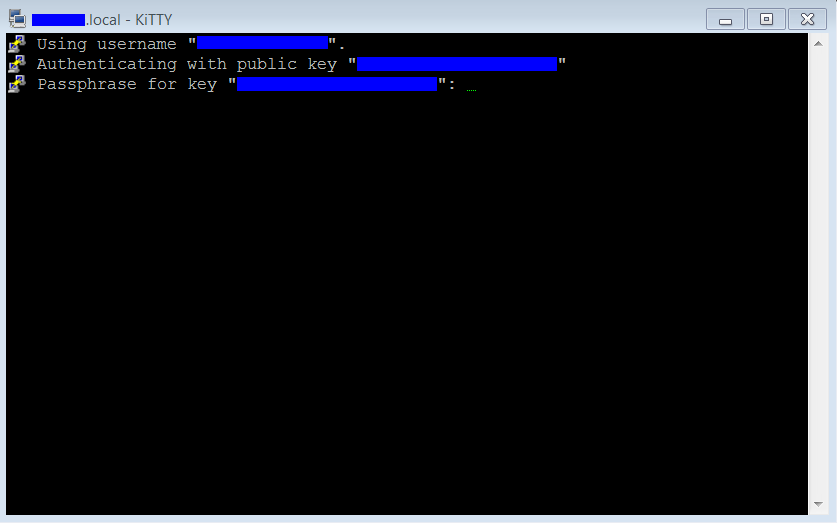

Ca diferenta vizibila punem vedea in titlu ferestrei hostname-ul `raspberry.local` sau ce ati ales, in loc de un IP. Deasemenea in cazul meu a aparut imediat aceasta fereastra de logare.

**Step 7**<br>
Si apoi, gata. Ne-am logat.


Dupa cum se vede, avem acum `<user>@<hostname>` si in partea de titlu a ferestrei, si jos ca comanda utilizator pe verde.