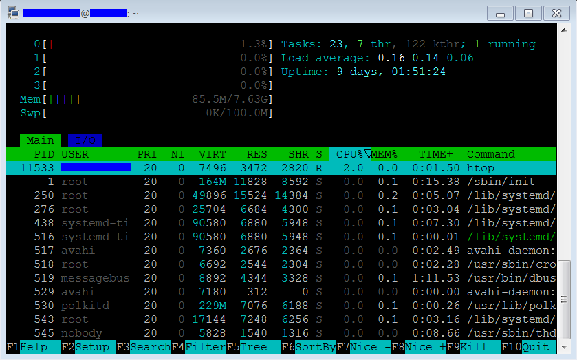

<h1>6.Comenzi utile</h1>

<details>
<summary><h2>Check utilizare RAM</h2></summary>

**Instalare**<br>
Rulam pe rand aceste simple comenzi:

```
sudo apt update
sudo apt install htop
```

In cazul meu, `htop` era deja instalat.


**Utilizare**<br>
Se ruleaza:

```
htop
```

iar apoi apare o fereastra similara cu aceasta:



</details>
<hr >

<details>
<summary><h2>Check temperatura</h2></summary>

**Utilizare 1**<br>
Pentru afisat temperatura o singura data, se ruleaza

```
vcgencmd measure_temp
```

**Utilizare 2**<br>
Pentru intrat intr-un fel de consola si afisat temperatura constant la interval de 1 sec:

```
watch -n 1 vcgencmd measure_temp
```

*Observatii*
- 60 de grade C - temperatura normala - la care porneste ventilatorul
- 80-90 de grade C - temperatura maxima - la care incepe sa se strice Raspberry

</details>
<hr >

<details>
<summary><h2>Check utilizare spatiu de stocare</h2></summary>


**Utilizare 1**<br>
Pentru afisare spatiu default exista comanda:

```
df
```


**Utilizare 2**<br>
Pentru afisat in functie de MB se ruleaza

```
df -Bm
```

</details>
<hr >

<details>
<summary><h2>Check porturi USB</h2></summary>

**Utilizare 1**<br>
Aceasta e cea mai utila, fiind simpluta si afiseaza denumirea.

```
lsusb
```

**Utilizare 2**<br>
Aceasta afiseaza mai multe valori, cea mai importanta fiind deasemenea denumirea.

```
usb-devices
```

</details>
<hr >