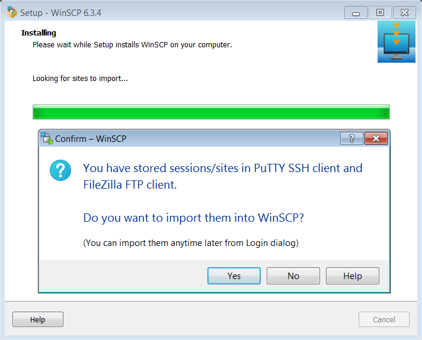

<h1>7.Schimb de fisiere prin WinSCP</h1>

<h2 id="top">Chapters</h2>
1. <a href="#descarcare-instalare">Descarcare & instalare</a> 
2. <a href="#ssh">Configurare prin ssh</a> 

<h2 id="descarcare-instalare">Descarcare & instalare</h2>

WinSCP il putem utiliza pentru a accesa fisierele din Raspberry Pi remotely. Alternativ se poate utiliza si *[FileZilla](https://filezilla-project.org/)*, dar o sa urmeaze si o documentatie mai avansata despre acesta, precum automatizari, ce nu se poate face by default in *Filezilla*.

**Step 1** 
Mergem si descarcam [WinSCP](https://winscp.net/eng/download.php). 
De regula ultima versiune merge cu toate sistemele de operare.

**Step 2** 
Dam dublu click pe fisierul de instalare *WinSCP*. 
Iar cand ajungem la aceasta fereastra, apasam pe *Install for all users*.

Eu cel putin, asa voi proceda.

**Step 3** 
Acceptam licenta, asa ca dam *Accept*.

**Step 4** 
Selectam *Custom installation*, iar apoi dam *Next*.

**Step 5** 
Acum folosim butonul *Browse...* pt a selecta locatia de instalare a aplicatiei. 
Eu o voi pune pe discul D. 
Dupa care se apasa pe *Next*.

**Step 6** 
La urmatorul pas, eu voi lasa toate componentele bifate., si apasam *Next*.

**Step 7** 
La acest pas, voi debifa casuta *Enable collecting anonymous usage statistics*. 
Si voi bifa ultima casuta *Add installation directory to search path*.

Dupa care continuam cu *Next*.

**Step 8** 
Aici selectam stilul de afisare. Eu voi selecta primul stil, *Commander*, intrucat e similar cu *FileZilla*. Este util cand ai de copiat fisiere din mai multe locatii, si navighezi mai cu usurinta. 
Ca deobicei continuam apasand pe *Next*.

**Step 9** 
Iar apoi dam pe *Install*.

**Step 9** 
Inainte de finalizarea instalarii, ar putea sa mai apara aceasta fereastra. Asta pentru ca prin *WinSCP* ne putem conecta si prin *ssh*, si prin *ftp*. 
In cazul meu mie imi convine, si voi apasa pe *Yes*.

Iar la urmatoarea fereastra, voi parcurge fiecare obtiune din Drop-down, si le voi selecta / deselecta pe rand. 
In cazul meu voi selecta doar cele din *KiTTY*, si din *FileZilla*.

**Step 10** 
La finalul instalarii debifam a doua casuta, *Open Getting started page*, si apasam *Finish*.

<h2 id="ssh">Configurare prin ssh</h2>

**Step 1** 
La pornire apare aceasta fereastra de Login. Putem selecta o conexiune, sau putem creea una noua. 
In caz ca nu ai importat sau nu s-a putut, urmatori pasi sunt pt tine. 
Apasam pe *New Site*, lasam selectat ca *File protocol: SFTP* (FTP securizat). 
La *Host name* punem hostul setat. Default este `raspberry.local`

> [!NOTE]
> Nu uita `.local` la final

La *Port number*, lasam default *22*. 
La *User name* pune userul de la instalare. Default este `pi`, iar la *Password* nu punem nimic, pt ca urmeaza sa setam cheia ssh, iar pentru asta o sa apasam pe *Advanced*.

**Step 2** 
Din a doua fereastra deschisa, mergem pe *SSH/Authentication*, iar la *private key file*, apasam pe `...`, si selectam fisierul `*.ppk`, salvat la pasii anteriori. 
Dupa care dam *OK*, pt a inchide a doua fereastra.

**Step 3** 
Dam *Save* de pe prima fereastra, si apare o mica a-3-a fereastra. 
Iar aici tot ce trebuie sa facem este sa introducem un nume sugestiv la *Site name*. Precum `Raspberry Pi`, iar apoi sa dam *OK*.

**Step 4** 
De-acum inainte, selectam *Raspberry Pi* din stanga, iar apoi apasam *Login*.

**Step 5** 
La prima conexiune, abia dupa ce am creat-o, e posibil sa-ti apara aceasta fereastra. 
Tot ce trebuie sa faci este sa apesi *Accept*.

Iar apoi introducem *Passphrase* setata la generat cheia ssh, dupa care apasam pe *OK*.

**Step 6** 
Daca fereastra principala, din dreapta arata cam asa, atunci inseamna ca te-ai logat cu succes in Raspberry Pi. 
Pe fondul bleu, arata ca momentan te afli in `home/pi/` sau ce username ai creat la instalare.

**Step 7** 
Pentru deconectare sesiune, *click-dreapta/Disconnect Session*,

iar apoi poti inchide fereastra principala *WinSCP*.
