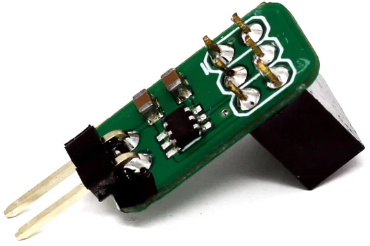
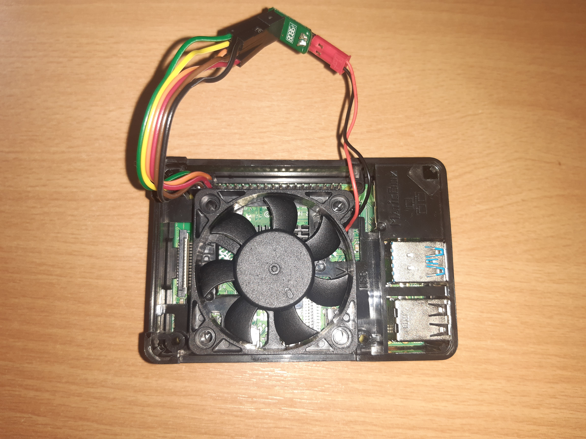

<h1>7. Setare controller ventilator</h1>




La <a href="2.Descarcare_si_Instalare.md">2.Descarcare_si_Instalare.md</a> la etapa 3 de Asamblare, am zis de acest <a href="https://thepihut.com/products/fan-controller-for-raspberry-pi?variant=39578362577091">controller de ventilator</a>.



Cu acesta se poate **seta temperatura la care porneste ventilatorul**.<br>

(Pentru a seta si viteza, se poate folosi un ventilator cu 4 fire, dintre care 2 dintre ele se conecteaza la GPIO, iar celelalte la VCC (cel mai probabil 5V) si GND ).

**Step 1**<br>
Deschide *Putty* sau *Kitty*, si conecteaza-te la raspberry Pi.

**Step 2**<br>
Deschide acest fisier

```
sudo nano /boot/config.txt
```

Si apare un mesaj sa nu-l modificam. Asta pt ca acesta este o scurtatura de la fisierul real.<br>
`Ctrl` + `x` pt iesire.<br>

Mergem si deschidem celalalt fisier

```
sudo nano /boot/firmware/config.txt
```

**Step 3**<br>
Introdu aceasta comanda la finalul fisierului, sub `[all]`

```
dtoverlay=gpio-fan,gpiopin=3,temp=45000
```

Astfel ventilatorul va porni la 45 grade C.<br>

Gemini zice ca temperatura default de functionare este de 60 deg C, nu 45. Dar nu prea sunt asa sigur asa ca mai bine stric ventilatorul decat placa.

**Step 4**<br>
Salvezi fisierul prin `Ctrl` + `o` si `Enter`, urmat de `Ctrl` + `e` pt iesire.

**Step 5**<br>
Dai restart la Raspberry Pi.

```
sudo reboot
```

**Step 6**<br>
Te conectezi din nou prin *Kitty*.<br>
Pentru verificare poti folosi aceasta comanda de verificare a temperaturii de la *6.Comenzi utile.md*

```
watch -n 1 vcgencmd measure_temp
```

`Ctrl` + `c` pt iesire.