<h1>8.Conexiune ssh - externa prin duckDNS</h1>

Pentru conectarea prin ssh in Local Network, am discutat la <a href="5.Conexiune prin ssh.md">5.Conexiune prin ssh.md</a>.<br>
De data aceasta vom vedea cum putem seta conectarea prin ssh, de oriunde din lume.

> [!IMPORTANT]
> Conexiunea externa prin ssh nu functioneaza si in *Local Network*, iar de aceea vom avea 2 / 3 tipuri de conexiune prin ssh, atat pt Local Network, cat si pt Public Network.

<h2>Cap. 1 - Setari router</h2>

**Step 1**<br>
Mers pe pagina de logare router, la `http://192.168.X.Y` (IP scris pe spatele de la router)

**Step 2**<br>
Intampinam o pagina asemanatoare cu aceasta,

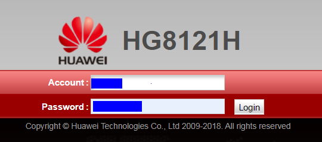

**Step 3**<br>
Introducem `Account` si `Password` (*user* si *parola* luate de la Internet Service Provider)<br>
iar apoi dam *Login*.

**Step 4**<br>
Urmeaza sa setam range-ul dhcp la router.<br>
Routerul are un range intre care aloca IP-uri. Intre `Y` = `1` si `254` (pe acelasi subnet `X`. Il vom face mai scurt, pt ca initial sa nu poata aloca IP-uri in tot intervalul.<br>
Scopul este sa aiba sa aiba un range de posibil IP-uri rezervate. (fie la inceput, fie la final)

De exemplu, eu voi alege limita intre `192.168.X.1` - `192.168.X.249`<br>
Primul IP fiind cel al routerului, si totusi trebuie inclus in range.

**Step 5**<br>
Dupa ce am ales range-ul, urmeaza sa-l setam la router.<br>
De aceea mergem la IP router, `192.168.X.1`, si introducem user si parola, si dam *login*.

**Step 6**<br>
Apoi mergem pe tabul *LAN*, si apoi selectam al doilea sub-tab din stanga, *DHCP Server Configuration*.

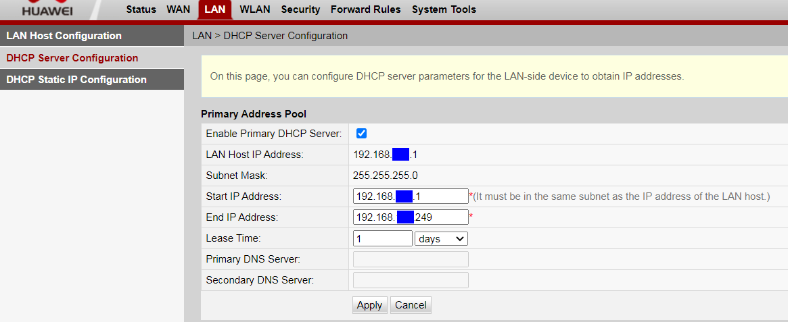

Aici setam rangeul de alocare, intre `1` si `249`.<br>
Chiar daca `X` este ascuns. este acelasi Sub-set, ca si IP-ul de la router.<br>
La *Lease Time* lasam 1 zi, intrucat acesta este timpul de expirare a unui IP, i corelatie cu *Subnet Mask* `255.255.255.0`. In rest lasam bifa de la *..Primary DHCP Server*.<br>
Iar la final dam *Apply*.

**Step 7**<br>
Dupa orice modificare la router, este bine sa-i dam un restart, pt ca modificarile sa fie luate in considerare.<br>
Pentru aceasta, mergem la ultimul tab *System Tools*, unde suntem deja pe primul tab *Reboot*.<br>
Apoi dam pe *Restart*, pt a reporni Routerul.

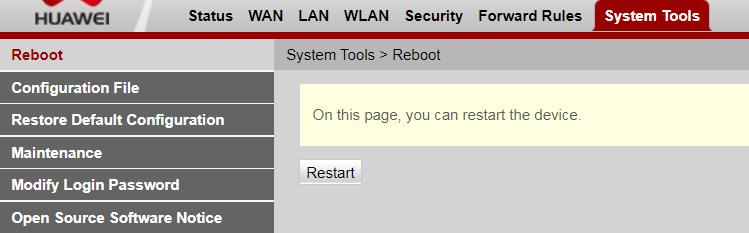

> [!CAUTION]
> Aceasta actiune va opri internetul in toata casa, si va fi nevoie din nou de relogare in interfata router.

**Step 8**<br>
Deschidem Kitty, si ne conectam la Raspberry Pi.

**Step 9**<br>
Urmeaza sa luam adresa fizica a dispozitivului Raspberry Pi, adica MAC-ul.<br>
Pentru aceasta, tastam:

```
ip a
```

si va afisa ceva similar:

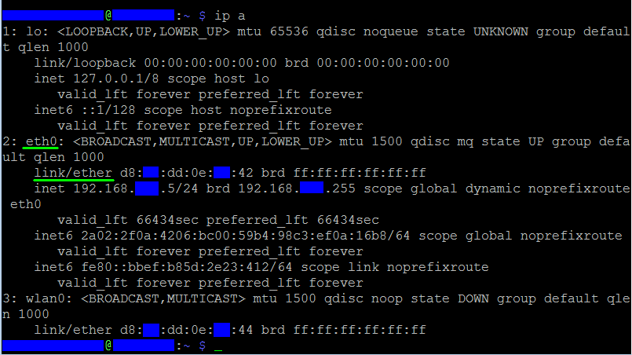

De aici ce ne intereseaza este in dreptul interfetei `eth0` (interfata conexiunii ethernet - prin cablu), ce scrie in dreptul de la **link/ether**. Si este o combinatie de cifre si litere, luate cate doua.<br>
Exemplu `d8:11:dd:0e:5b:42` (nu este asta a mea)<br>
Salvam aceasta adresa MAC undeva (poate in notepad).

**Step 10**<br>
Alegem o adresa IP privata care sa ramana statica (sa nu se schimbe), ce nu este in intervalul setat de la *Step 6*.<br>
In cazul meu, eu am ales `192.168.X.250.

**Step 11**<br>
Din nou ne logam pe pagina de la router.<br>
Dupa care mergem pe tabul *LAN* de sus, si apoi pe alt treilea tab din stanga, *DHCP Static IP Configuration*. Va aparea ceva similar:

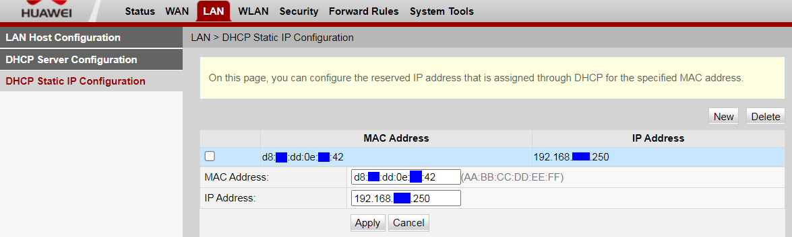

Aici apasam pe *New*, dupa care la *MAC Address* punem Adresa fizica de la Raspberry Pi de la ***Step 9***.<br>
Iar la *IP Address* punem IP-ul ales la ***Step 10***.<br>
Dupa care dam pe *Apply*.

**Step 12**<br>
Inca o data dam restart la router, pt ca modificarile sa se ia in considerare.<br>
Pentru aceasta, mergem la ultimul tab *System Tools*, unde suntem deja pe primul tab *Reboot*.<br>
Apoi dam pe *Restart*, pt a reporni Routerul.


> [!CAUTION]
> Aceasta actiune va opri internetul in toata casa, si va fi nevoie din nou de relogare in interfata router.

> [!NOTE]
> *Step 9*, *10*, *11*, *12* - sunt obtionali pentru ca in cazul meu, nu mi-a schimbat ip-ul static. Nu a fost suficient. Dar pt consisteenta si organizare, este bine sa stim ce IP am rezervat deja.

<br>
<h2>Cap. 2 - Configure Static IP using pe Raspberry Pi</h2>

Versiunea curenta de la Raspberry Pi este `Debian 12` (Bookworm). Pentru aceasta sunt doua tipuri de network management:<br>
- `NetworkManager` - default pt versiune Desktop (GUI)<br>
- `systemd-networkd` - pt linux headless (ce avem noi)


**Step 1**<br>
Ne conectam la raspberry Pi, prin *KiTTY*.

**Step 2**<br>
Dezactivam *Network Manager* tastand urmatoarele comenzi.

```
sudo systemctl stop NetworkManager
```

```
sudo systemctl disable NetworkManager
```


Astfel putem fi siguri ca nu vor exista conflicte intre doua network managers.

**Step 3**<br>
Fi sigur ca `systemd-networkd` este activ si ruleaza.<br>
Introdu aceste comenzi.

```
sudo systemctl enable systemd-networkd
```

```
sudo systemctl start systemd-networkd
```

**Step 4**<br>
Apoi vom creea fisierul de configuratie in folderul `/etc/systemd/network/`, cu denumirea `eth0-static.network`, desi denumirea nu prea conteaza asa mult.

```
sudo nano /etc/systemd/network/eth0-static.network
```

**Step 5**<br>
Copiaza acest continut.

```Ini, TOML
[Match]
Name=eth0

[Network]
Address=192.168.X.Y/24
Gateway=192.168.X.1
DNS=8.8.8.8
DNS=8.8.4.4
```

`Name=eth0` - se aplica interfetei *eth0* (prin cablu, asa cum am vazut si la pasul ***Step 1.9***)

`Address=192.168.X.Y/24` = IP-ul ales la ***Step 1.10***<br>
`Gateway=192.168.X.1` = IP-ul routerului (luat de la ***step 1.6***<br>
`DNS=8.8.8.8` = Google's DNS prymary<br>
`DNS=8.8.4.4` = Google DNS secondary

`/24` - este expirarea IP-ului / lease time.

> [!IMPORTANT] 
> Asigura-te ca in loc de `Address=192.168.X.Y` pui IP-ul ales de tine la Pasul ***Step 1.10***
> Deasemenea pastrand acel `/24` la final
> si la fel si la `Gateway=192.168.X.1` IP-ul de la router.

**Step 6**<br>
Salveaza fisierul prin `Ctrl` + `o`, apoi `enter`.<br>
iar apoi `Ctrl` + `x`, pentru a iesi.

**Step 7**<br>
Reload Raspberry Pi pentru a aplica schimbarile.

```
sudo systemctl restart systemd-networkd
```

> [!CAUTION]
> In caz de erori ai urmatoarele unelte:
> - [Angry IP Scanner](https://angryip.org/download/#windows) (Win, Mac, Linux) -> scanezi toate IP-urile in local network, fara acces la router)
> - `ping raspberrypi.local`
> - `systemctl status systemd-networkd` - statusul serviciului de network (`active (running)`, `failed`, `activating` )
> - `journalctl -u systemd-networkd -b` - recent logs privind serviciul de network

**Step 8**<br>
Dupa ultima comanda verifica din nou IP-ul, de la Raspberry Pi:

```
ip a
```

> [IMPORTANT]
> Noi am setat IP-ul privat static in interiorul la Raspberry Pi, iar Routerul dupa un timp il va uita: un timp hostname-ul *pi* va fi disponibil pt selectie, apoi *MAC*-ul acestuia, iar ulterior nu-l va mai vedea deloc.<br>
> De aceea am pus IP-ul, si nu l-am putut selecta.

<br>
<h2>Cap. 3 - Port Forwarding</h2>
Acest capitol este important, pentru ca fara el degeaba stim IP public, sau avem un hostname public.

**Step 1**<br>
Pentru a-ti afla IP-ul public, mergi la <a href="https://www.whatismyip.com/">whatismyip.com</a>, iar dupa ce treci de captcha, te intereseaza cifrele de la **IPv4**:

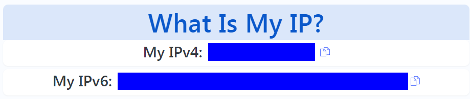

Copiezi si pastrezi undeva acest IP (ex. in notepad). Este IP-ul tau public.

**Step 2**<br>
Mergi si te loghezi in router.

**Step 3**<br>
Apoi mergi la *Forward Rules*, care are un singur tab lateral *Port Mapping Configuration*. 

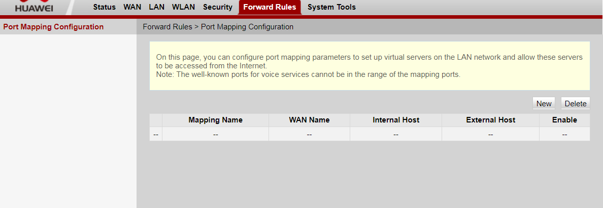

**Step 4**<br>
Apesi pe *New*, si se va deschide un formular pe care il vei completa cam asa:

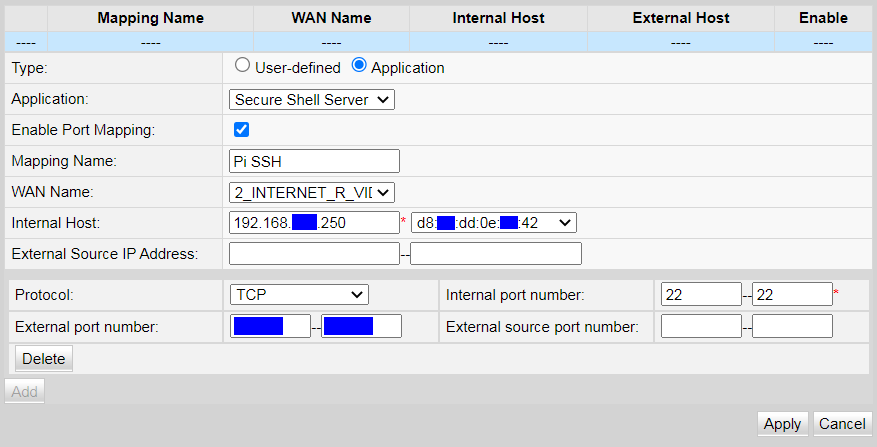

Mai intai selectam *Application*, apoi din drop-down *Application* selectam **Secure Shell Server (SSH)**.<br>
Lasam bifat *Enable port Mapping*.<br>
Alegem un nume scurt dar semnificativ. Eu am ales `Pi SSH`<br>
de la *WAN* este o singura sursa de internet de ales<br>
Apoi la *internal Host* selectam din dropdown dispozitivul. In general apare direct hostname-ul, dar la mine a aparut MAC-ul. 

> [!TIP]
> este posibil ca rezervarea IP-ului din router de la ***Step 1.11*** sa influenteze ca in loc de hostname, sa apara adresa MAC.

Iar dupa ce il selectezi se va completa automat si IP-ul din stanga.<br>
La *Protocol* lasam *TCP*, si la *Internal port number* lasam `22`. (este port default pt ssh)<br>
iar la *External port number* poti alege aproape orice port, dar sa nu fie din cele rezervate. Spre exemplu `2222`.<br>

> [!WARNING]  
> Nu alege port-uri rezervate altor servicii precum: 80 (HTTP), 443 (HTTPS), 21 (FTP), 23 (Telnet), 25 (SMTP), 110 (POP3), 3389 (RDP), etc.

iar la final dam *Apply*, si astemptam cateva momente ca routerul sa-si salveze setarile.

**Step 5**<br>
Ca deobicei, dupa ce am facut modificari la router, dam un restart la acesta.<br>
Pentru aceasta, mergem la ultimul tab *System Tools*, unde suntem deja pe primul tab *Reboot*.<br>
Apoi dam pe *Restart*, pt a reporni Routerul.


> [!CAUTION]
> Aceasta actiune va opri internetul in toata casa, si va fi nevoie din nou de relogare in interfata router.

**Step 6**<br>
Pentru a testa daca ai setat bine *port forwarding*, poti merge la <a href="https://canyouseeme.org/">canyouseeme.org</a><br>
IP-ul public ti-l detecteaza automat. Tot ce trebuie sa faci este sa completezi portul extern ales


Daca totul este in regula, atunci va arata cam asa.

<br>
<h2 id="ssh-ip-public">Cap. 4 - Testare SSH extern prin public IP</h2>

**Step 1**<br>
Mergem din nou la acest link <a href="https://canyouseeme.org/">canyouseeme.org</a>, pt a lua ip-ul public. (se poate schimba)

**Step 2**<br>
Deschidem din nou *KiTTY*

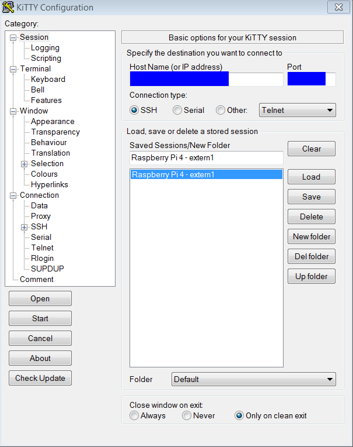

la *Hostname* se trece `<username>@<public_ip>`

adica username = `pi` ; si apoi ip-ul public de la pasul anterior.

La port trecem portul extern ales la ***Step  3.4***

ii dam un num sugestiv precum `Raspberry Pi 4 - extern1` si apoi dam *Save*

**Step 3**<br>
Mergem la *Connection/SSH/Auth*

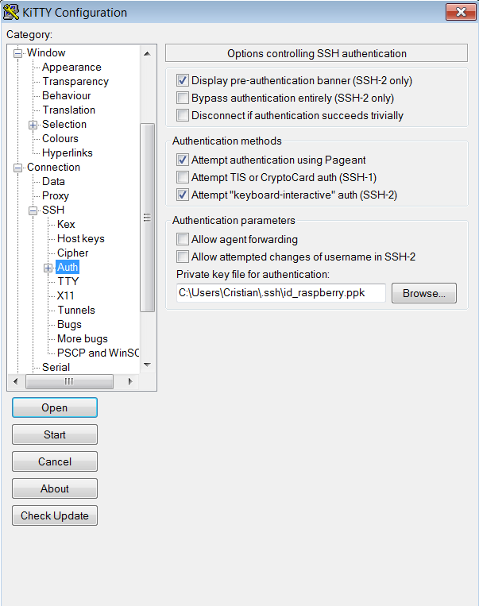

si apoi selectam cheia ssh (*.PPK*), dupa care ne intoarcem la categoria *session* si dam *Save*

> [!IMPORTANT] 
> daca incercam sa ne conectam direct ca si pana acum nu va functiona din cauza ca nu ne putem conecta din *Local Network*
> De aceea in continuare vom face hotspot / thetering de pe telefon.

**Step 4**<br>
Conectam telefonul la PC, cu un cablu de date (nu doar de incarcare)

**Step 5**<br>
Apoi ne intreaba daca vrem sa accesam datele de pe telefon. Eu am dat *Refuz* dar nu prea conteaza ce alegem la acest popup.

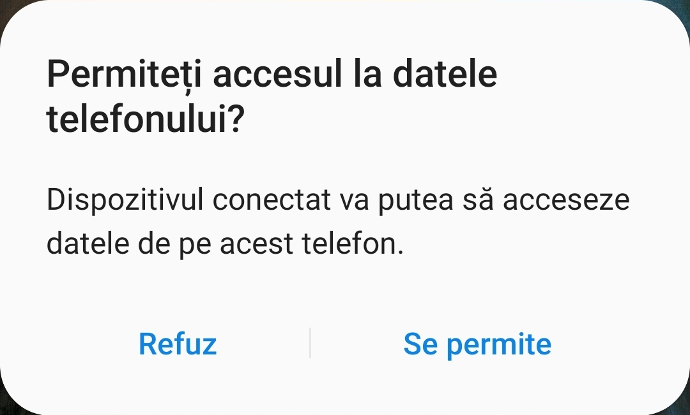

**Step 6**<br>
Apoi derulam de sus de la telefon, extindem ce scrie la *Sistem android*, si apoi apasam pe acesta.

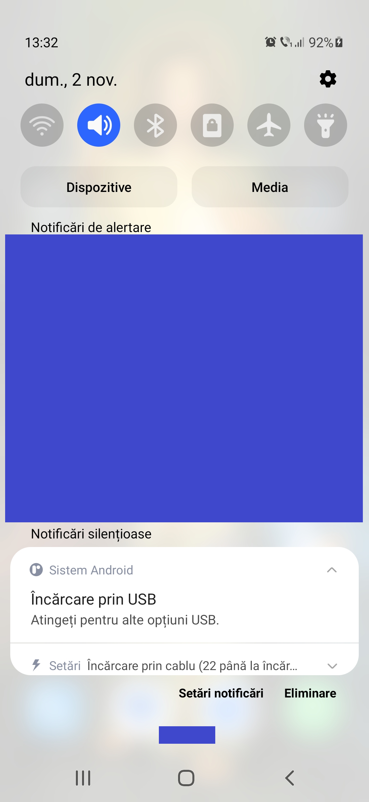

**Step 7**<br>
Se va deschide obtiunile de *Setari USB*

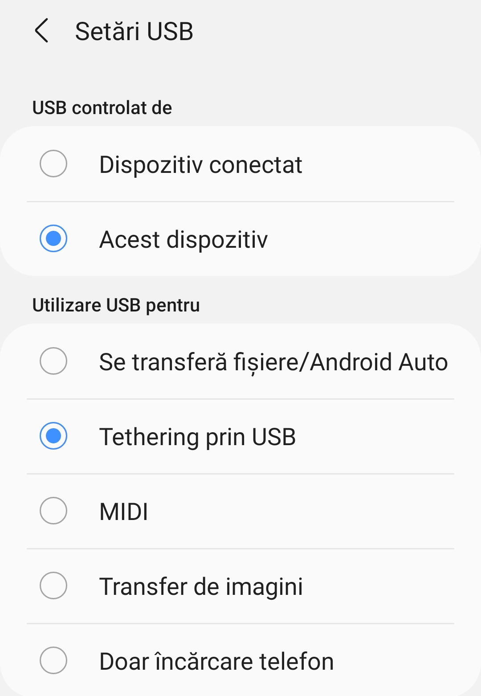

iar aici selectam **Tethering prin USB**, dupa care dam `<` (inapoi)

**Step 8**<br>
Ce mai ramane de facut este sa activam datele mobile din telefon, prin meniul rapid de deasupra.

**Step 9**<br>
E posibil sa apara o fereastra din-aceasta pe PC,

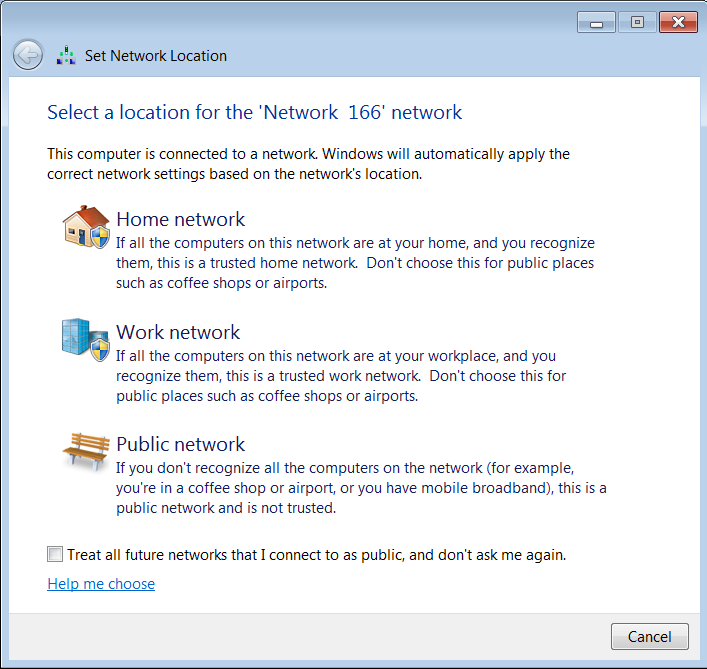

dar alegem *Home network*, dupa care *Close*.<br>
Inchidem deasemenea fereastra cu *Autoplay*. Nu ne intereseaza.

**Step 10**<br>
Ne deconectam de la cele 2 conexiuni active de internet (eu sunt conectam si cu Wifi si cu cablu, pe PC-ul meu vechi), prin deconectarea de la Wifi, plus scos cablu LAN.

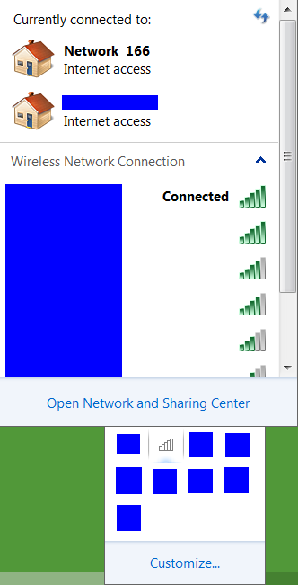

> [!NOTE]
> Eu am dat refresh la conexiune (coltul dreapta-sus din imagine) pana ce am ramas cu internetul de pe telefon

**Step 11**<br>
Din *KiTTY* dam acum pe *Start*<br>
Ni se va afisa un mesaj din-acesta, la care dam *Accept*

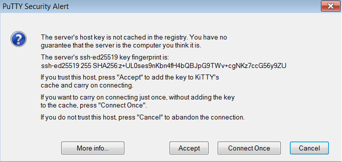

Introducem *passphrase* ... si ne-am logat cu succes in Raspberry Pi, de pe IP public (extern)

<br>
<h2>Cap. 5 - Setare hostname public prin duckDNS</h2>

Pana acum am reusit sa ne conectam extern de pe IP public, insa problema principala este ca se schimba automat, si ca nu putem sa-l controlam.
De aceea urmeaza sa setam un domeniu pt a-l putea accesa oricand, indiferent de ce ip public vom avea.

**Step 1**<br>
Intrat pe <a href="https://www.duckdns.org/">duckDNS.org</a> , si apoi logat cu contul de google (sau github)

**Step 2**<br>
Urmeaza sa inregistram un domeniu. Partea buna este ca este permanent gratis, iar partea proasta este ca nu poti sa-ti alegi alta terminatie decat `.duckdns.org`<br>
Pentru aceasta introducem o denumire in urmatorul formular:


In acest exemplu, eu am ales `vi1` insa poti alege orice doresti, sau este disponibil.<br>
Dupa care apesi pe butonul *add domain*

> [!IMPORTANT]
> Trebuie sa alegi o denumire unica, care sa nu fie folosita de alti utilizatori pe aceasta platforma *duckDNS*

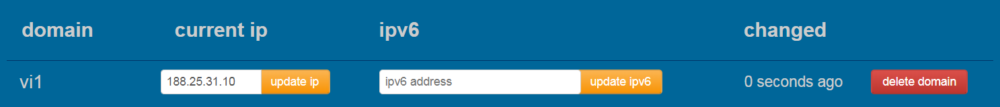
 
**Step 3**<br>
Mergem pe tabul de *install* de sus sau la [duckdns.org/install](https://www.duckdns.org/install.jsp)<br>
La *Operating Systems* alegi *pi*,

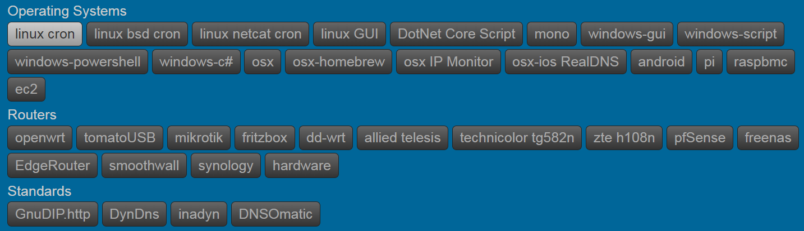

dupa care alegi domeniul

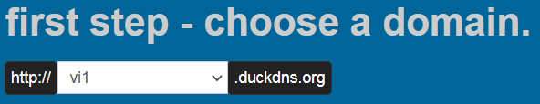

iar instructiunile vor fi desfasurate mai jos

**Step 4**<br>
Ne logam la Rasperry Pi prin *KiTTy* (prin ssh local cu hostname)

**Step 5**<br>
Creeaza un folder, intra in el, iar apoi creeaza un nou fisier de tip executabil linux si intra in acesta:

```
mkdir duckdns
cd duckdns
sudo nano duck.sh
```

**Step 6**<br>
Copiaza acesta linie in fisier

```
echo url="https://www.duckdns.org/update?domains=<domain>&token=<token>&ip=" | curl -k -o ~/duckdns/duck.log -K -
```

> [!CAUTION]
> Nu uita sa schimbi `<domain>` cu domeniul tau. Spre exemplu la mine este `vi1`
Iar la `<token>` cu tokenul contului, disponibil la pagina de [duckDNS home](https://www.duckdns.org/)

> [!NOTE]
> Daca ai ajuns aici, poti sa-l copiezi pur si simplu din instructiunile duckDNS. Este inclus si domeniul si tokenul automat.<br>
> Arata similar cu :<br>
> 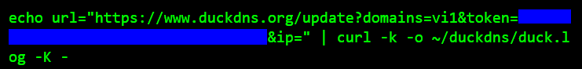

`Ctrl` + `o` si `enter` pt a salva. si `ctrl` + `x` pentru a iesi

**Step 7**<br>
Faci fisierul executabil

```
sudo chmod 700 duck.sh
```

**Step 8**<br>
Schimbam privilegiile, pt ca fisierul sa apartina de utilizatorul nostru *pi*, nu de *root*

```
sudo chown pi:pi ./duck.sh
```

> [!WARNING]
> daca ai al utilizator, va trebui sa schimbi ambele - **pi** : **pi**

**Step 9**<br>
Urmeaza sa accesam cron process pt a face scriptul sa ruleze la fiecare 5 minute.<br>
pentru aceasta deschidem cronjobul

```
crontab -e
```

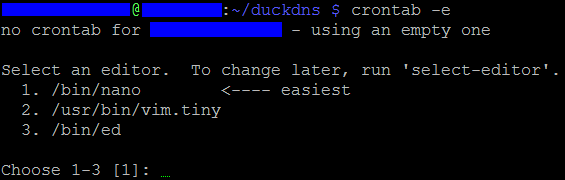

La inceput ne va pune sa selectam editorul default pt cron<br>
de aceea o sa alegem *nano* / obtiunea `1`, urmat de `enter`

**Step 10**<br>
mergem in partea de jos a fisierului (de configurare cron), folosind `sageata jos`<br>
si apoi copiem aceasta linie

```
*/5 * * * * ~/duckdns/duck.sh >/dev/null 2>&1
```

`Ctrl` + `o` si `enter` pt a salva. si `ctrl` + `x` pentru a iesi

**Step 11**<br>
testam scriptul prin:

```
./duck.sh
```

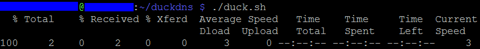

Pentru a vedea daca ultima incercare a fost cu succes (**OK** sau **KO**):

```
cat duck.log
```

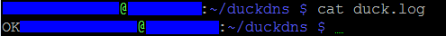

Daca este *OK* tokenul si domeniul sunt corecte in scriptul *duck.sh*

**Step 12**<br>
Rulam cronjobul pentru prima data:

```
sudo service cron start
```
Iar daca nu da nici o eroare / nici un rezultat, este in regula.

> [!NOTE]
> Pentru Raspberry Pi, nu este nevoie ca serviciul de Cron sa fie pornit la reboot, acest lucru facandu-se automat.

**Step 13**<br>
Ne conectam la internet cu telefonul prin tethering precum la <em><a href="#ssh-ip-public">Cap. 4</a></em>, numai ca la host o sa avem `<user>@<duck_domain>.duckdns.org` .<br>
in cazul nostru fiind `pi@vi1.duckdns.org`

 > [!IMPORTANT]
 > nu uita sa selectezi din nou cheia *.ppk*, portul extern de la ***Step 3.4***  si sa salvezi conexiunea sub o alta denumire.