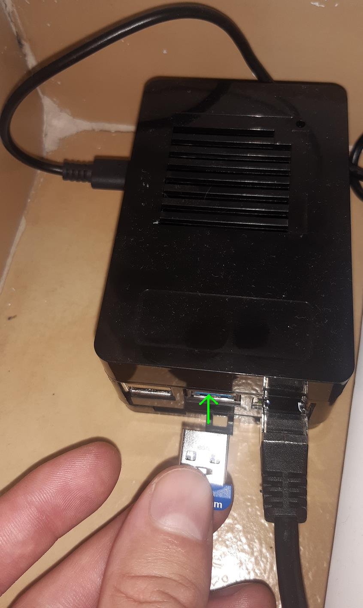
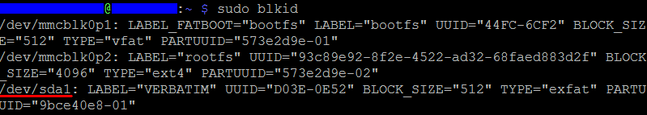

<h1>8.Montat stick USB</h1>

Spre deosebire de Windows, Linux, in mod special la Raspberry Pi Lite, are nevoie de un setup, pt a putea folosi un USB stick, sau un hard disk extern.


<h2 id="descarcare-instalare">Setare</h2>

**Step 1**<br>
Dupa ce te loghezi prin *ssh*, rulezi pe rand urmatoarele comenzi, pentru update.

```
sudo apt-get update
sudo apt-get upgrade
```

**Step 2**<br>
Apoi instalam suportul pentru formatul *exfat*.<br>

```
sudo apt install exfat-utils exfat-fuse
```

Am formatat USB-ul astfel pentru ca sa pot stoca fisiere mai mari de 4 GB. Altfel *FAT32* ar trebui sa fie suficient.

**Step 3**<br>
Inseram USB-stick in unul dintre porturile USB.<br>
Eu o sa folosesc unul dintre porturile USB 3.0, intrucat sunt mai rapide.



Dupa care dam reboot la Raspberry Pi.

```
reboot
```

**Step 4**<br>
Cream un nou folder unde urmeaza sa fie locatia reprezentativa USB-ului.

```
sudo mkdir /media/usbdrv
```

**Step 5**<br>
Se ruleaza urmatoarea comanda...

```
sudo blkid
```

care afiseaza ceva similar cu aceasta imagine de mai jos.



Dupa cum putem vedea avem 3 partitii, una este de bootare, a doua este root care este memoria interna. Iar a treia scrie la label *Verbatim*, si asa stiu ca aceasta este reprezentativa memoriei USB.<br>
De aici tot ce avem de retinut este `dev/sda1` care este locatia fizica stickului USB.

**Step 6**<br>
Modificam *file system table* prin comanda urmatoare.

```
sudo nano /etc/fstab
```

**Step 7**<br>
Ca sa facem legatura intre folderul fizic si folderul logic, adaugam aceasta linie la sfarsitul fisierului.

```
/dev/sda1	/media/usbdrv	exfat	uid=backup,gid=backup,umask=0022,sync,auto,nosuid,rw,nouser	0	0
```

unde:

- `/dev/sda1` este locatia fizica
- `/media/usbdrv` este locatia logica
- `uid` este user id
- `guid` este group id
- `sync` & `auto` cred ca inseamna montare automata a usb-ului
- `rw` ofera drept de citire si de scriere
- `nouser` nu atribuie folderul niciunui utilizator. adica nu vor fi conflicte la folosirea lui, iar in acelasi timp e si mai vulnerabil.

**Step 8**<br>
Inchidem si salvam prin `Ctrl + X`, iar apoy `y`, si `Enter`.<br>
Iar apoi dam un reboot:

```
reboot
```

**Step 9**<br>
Dupa ce se reporneste *Raspberry Pi* si dupa ce ne relogam, urmeaza sa testam daca functioneaza.<br>
Pentru aceasta vom creea un fisier de proba pe *USB stick*, ruland pe rand urmatoarele comenzi.

```
cd /media/usbdrv
sudo nano test.txt
```

iar apoi poti introduce orice text.<br>
Eu voi pune

```
Hello world, from USB Stick ! :)) LOL
```

iar apoi salvam prin `Ctrl + O`, si apoi `Enter`.<br>
iar apoi iesim prin `Ctrl + x`.

**Step 10**<br>
Petru a scoate *USB stick* mai intai e recomandat sa-i dam eject de pe *Raspberry PI* prin aceasta comanda.

```
sudo umount /media/usbdrv
```

Cand il punem inapoi la loc, il montam prin aceasta comanda:

```
sudo mount /dev/sda1
```

**Step 11**<br>
Pentru a ne fi mai usor pe viitor la montat si demontat USB-ul vom seta niste alias-uri.<br>
Petru aceasta vom deschide acest fisier de setari.

```
sudo nano ~/.bash_aliases
```

dupa care introducem aceste 2 randuri de setari

```
alias usb-in='sudo mount /dev/sda1'
alias usb-out='sudo umount /media/usbdrv'
```

iar apoi salvam prin `Ctrl + O`, si apoi `Enter`.<br>
iar apoi iesim prin `Ctrl + x`.

Explicatie:
`usb-in` este dupa ce il introducem.<br>
Iar `usb-out` inainte sa il scoatem.

**Step 12**<br>
Petru a le putea folosi, e nevoie sa dam un `reboot` si sa ne relogam din nou.