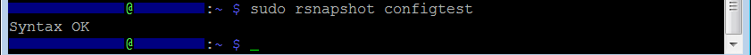
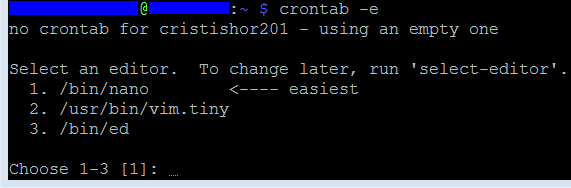

<h1>9.Back-up automat pe USB stick</h1>

Dupa ce am terminat cu pasii precedenti de *montat un USB stick*, acum putem pune in functiune ceva mai maret: a face backup regulat pentru *Raspberry Pi*. Desigur ca exista mai multe obtiuni, dar de aceasta data voi profita de faptul ca *Raspberry Pi* e un calculator, si sa-l programez, astfel incat sa-si faca singur backup.

<h2 id="top">Chapters</h2>
1. <a href="#instalare">Setare</a><br>
2. <a href="#manual">Backup manual</a><br>
3. <a href="#automat">Backup automat</a><br>


<h2 id="instalare">Setare</h2>

**Step 1**<br>
Pentru inceput vom rula aceasta comanda

```
sudo apt-get install rsnapshot
```

iar cand ne va intreba daca suntem siguri ca vrem sa instalam tastam `y` pentru a continua, urmat de `Enter`.

**Step 2**<br>
Deschidem fisierul de setari prin:

```
sudo nano /etc/rsnapshot.conf
```

**Step 3**<br>
<!---- nu merge sa copieze in /media/ chiar si cu sudo ----------->
Apoi in interiorul acelui fisier urmeaza sa facem niste modificari.<br>

```
snapshot_root		/media/usbdrv
```

Aceasta este locatia logica pentru *USB stick* pe care o am eu.<br>
La *Backup points / scripts*, comentan ultimele 2, si punem toate folderele care vrem sa le includem in backup.

```
backup	/home/		back_up/
```

> [!Warning]
> Acest fisier poate contine doar tab-uri. Daca incerci sa copiezi comenzile, va trebui sa tastezi cate un tab, respectiv doua tab-uri manual, ca sa te asiguri ca la *Step 5* nu-ti da eroare. 

Putem lasa si default `localhost`, dar `back_up` e mai sugestiv ca folder de destinatie. Momentan voi lasa doar folderul `home` si ce este inauntru acestuia, dar aici este locul de specificat si alte locatiii.

**Step 4**<br>
Acum urmeaza sa salvam fisierul prin `Ctrl + O`, urmat de `Enter`, si apoi `Ctrl + X`.

**Step 5**<br>
Ca sa fim siguri ca nu am stricat ceva in fisierul anterior, vom tasta urmatoarea comanda

```
sudo rsnapshot configtest
```

Ar trebui sa returneze *Syntax ok*, conform imaginii de mai jos.




<h2 id="manual">Backup manual</h2>

**Step 1**<br>
Pentru a rula un backup manual, introducem:

```
sudo rsnapshot alpha
```

**Observatie:**
De fiecare data cand e call aceasta comanda va creea cate un folder alpha, pana la 6 foldere, conform acestei imagini din fisierul de setari. Vechiul backup devine alpha1, si noul backup devine alpha0.



Partea interesanta e ca am folosit doar backup cu alpha, dar conform imaginii de ma sus, avem mai multe nivele si putem adauga oricand si mai multe.

Conform cu setarile de la *Backup points*, de la *Step 3*, in folderul `alpha0` va fi folderul `back_up` in care apoi va fi `home`, impreuna cu toate folderele si fisierele ce le contine.

<h2 id="automat">Backup automat</h2>

**Step 1**<br>
Pentru a folosi backup automat, vom utiliza *Contab*.<br>
Pentru aceasta vom rula aceasta comanda:

```
crontab -e
```

**Step 2**<br>
Prima data, ne va intreba ce editor vrem sa folosim.<br>
Eu am selectat `1` pentru *Nano*.


<!--  am ramas aici -->

va deschide fisierul de setari crontab
mergem la final

#Daily Backup (comentariu)
00 04 * * * /usr/bin/sudo rsnapshot alpha 
minutes hours ? ? ? comanda_program
(in fiecare dimineata la 4 dimineata = backup

ctrl + x, y, enter pt a iesi