<h1>9.Conexiune ssh - creare mai multe keys - PART 2</h1>

<h2>Cap. 1 - Generare key pt laptop servici</h2>

**Step 1**<br>
Deschidem **PuttyGen**, jos la *Parameters*, selectat *EdDSA*, urmat de setarea *Ed25519* mai jos.<br>
Aceasta este cea mai avansata criptare pt key.

Apoi dat pe *Generate*.

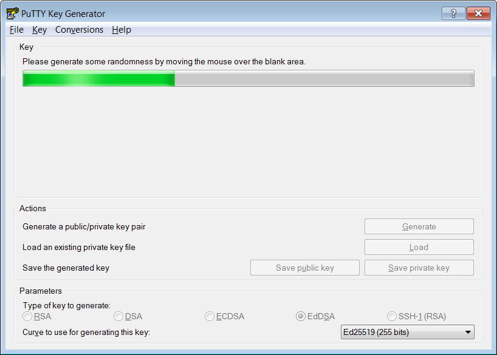

Apoi plimbam mouse-ul in zona unde se genereaza cheia, asa cum ne-a fost zis.

**Step 2**<br>
la *Key comment* punem `email@dispozitiv`.<br>
Acesta este doar un comentariu explicit ca sa stim de la ce este ssh key

Iar apoi alegem un *passphrase* (o parola suplimentara)

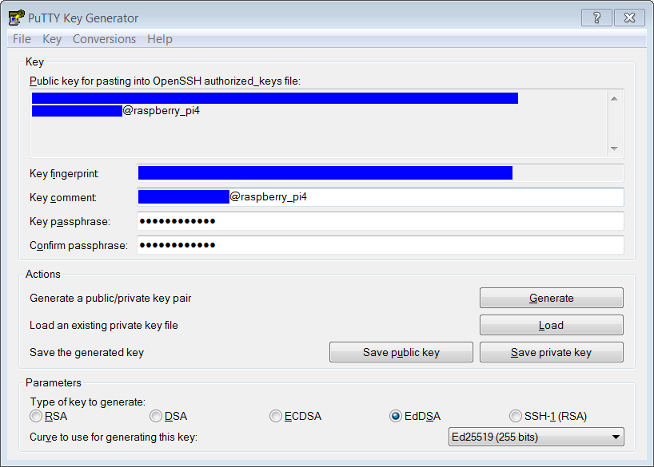

apoi dam pe *Save private key*, iar eu i-am pus denumirea de `dispozitiv_raspberry_Pi4` **.PPK**

**Step 3**<br>
Copiem textul de la *Public key - OpenSSH* (in clipboard)

 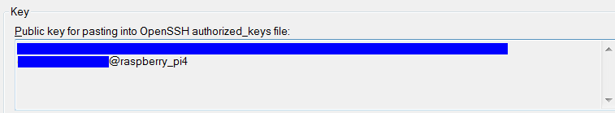

 Iar apoi putem inchide fereastra de la *PuttyGen*

 **Step 4**<br>
 Ne logam in Raspberry Pi prin *KiTTY*, pe calculatorul de-acasa, evident prin una dintre metode prin *Local Network* (IP local / local hostname)

 **Step 5**<br>
 Deschidem acest fisier:

 ```
 nano ~/.ssh/authorized_keys
 ```

 Iar inauntru vom vedea un rand, care contine de fapt cheia SSH publica la care ne-am conectat<br>
Vom tasta o data / de 2 ori `enter` , iar apoi vom introduce cheia publica din clipboard, prin *click-dreapta mouse*

`Ctrl` + `o` si `enter` pt a salva. si `ctrl` + `x` pentru a iesi<br>
Dupa care putem inchide conexiunea la Raspberry Pi.

> [!IMPORTANT]
> - cheia **privata** = client (expeditor)
> - cheia **publica** = server (destinatar)

 **Step 6**<br>
 Trimis un mail cu cheia privata *.ppk*, pt a o descarca pe laptopul de servici.

 > [!NOTE]
 > Din punct de vedere al securitatii nu este recomandat, dar este calea cea mai rapida si la indemna. In plus o voi sterge si de la trimise, si de la primite, imediat ce o descarc.
 > Alternativ se poate folosi un stick usb pt a duce cheia ssh privata pe un alt dispozitiv`

 **Step 7**<br>
 Incercat sa te conectezi la *Raspberry Pi 4* prin domeniul public de *DuckDNS* stabilit la <a href="8.Conexiune ssh - externa prin duckDNS.md">8.Conexiune ssh - externa prin duckDNS</a>

 <br>
 <h2>Cap. 2 - Generare key pt telefon Android</h2>

 **Step 1**<br>
  Instalat [RaspController](https://play.google.com/store/search?q=raspcontroller+free&c=apps&hl=en) pe telefon.

  > [!NOTE]
  > Din cate imi aduc aminte versiunea gratis este suficienta pentru conexiunea prin ssh.

 **Step 2**<br>
 Deschis aplicatia

 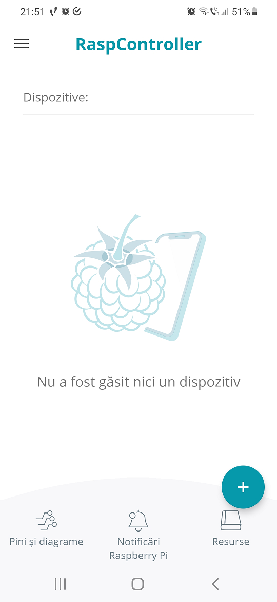

Apasat pe *plus*

 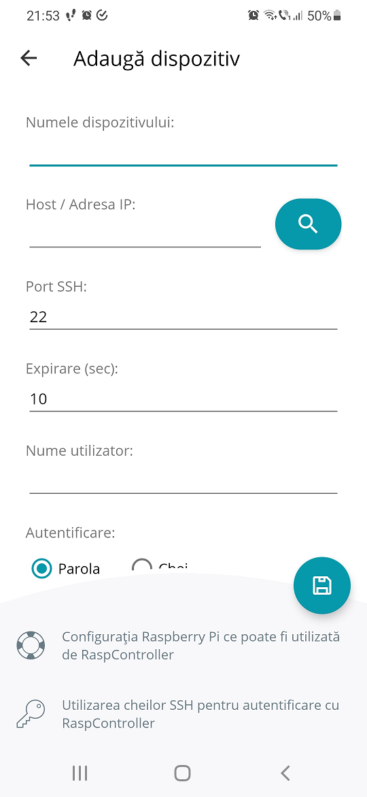

 **Step 3**<br>
La *Numele dispozitivului* vom trece `Raspberry Pi 4 (Local)`<br>
La *host* vrom trece IP-ul static ales in Local Network, de la Raspberry.<br>
*Port SSH* ramane `22` (Este portul local)<br>
*Nume utilizator* : `pi` (numele utilizatorului din Raspberry)<br>

 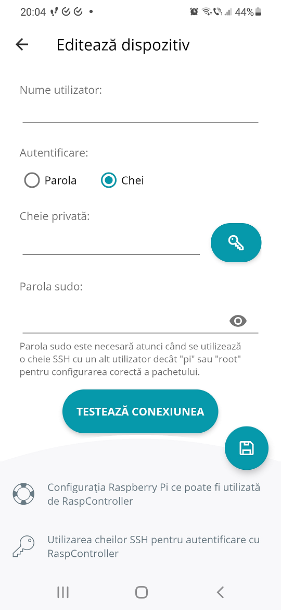
 
La *Autentificare* alegem **Chei**

> [!IMPORTANT]
> La *parola sudo* lasam necompletat.

 **Step 4**<br>
Apasam pe cheita pt a seta cheia SSH.

 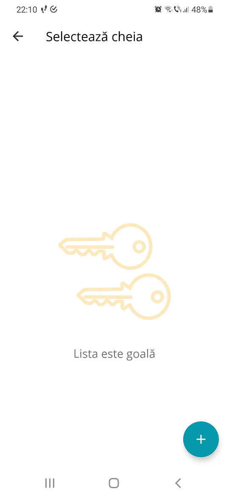

Dupa care dam pe *plus*

 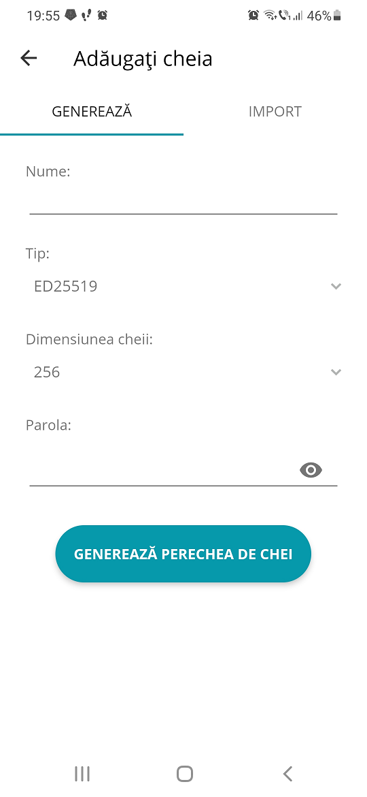

De pe tabul de *Genereaza*, la Nume dam un nume la cheie, precum `telefon_Raspberry Pi`<br>
La *Tip* lasam *ED25519*<br>
Iar la *Parola* punem una similara ca la "passphrase"

Dupa care apasam pe **Genereaza perechea de chei**

 **Step 5**<br>
Mergem pe cele 3 puncte, si apoi *Partajati cheia publica*,

 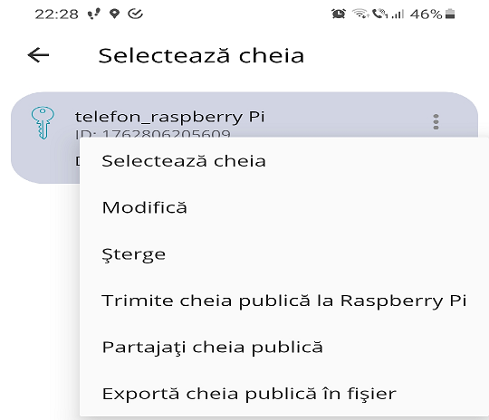

dupa care o trimitem pe email pe unul dintre calculatoare unde ne putem conecta la Raspberry Pi.

> [!IMPORTANT]
> Stergem mailul dupa ce am trimis / primit cheia publica.

 **Step 6**<br>
Deschidem fisierul la destinatie, iar la sfarsit vom adauga un comentariu.<br>
Si-anume ` telefon@raspberry_Pi_4` (este important sa fie legat)

 **Step 7**<br>
Ne conectam la Raspberry Pi, de pe calculatorul (de unde avem cheia publica modificata)<br>

 **Step 8**<br>
Deschidem fisierul unde sunt salvate cheile SSH publice

```
nano ~/.ssh/authorized_keys
```

apasam o data sau de 2 ori pe `enter` pt a creea un rand nou,<br>
iar apoi copiem continutul modificat (cu comentariu) din cheia publica de pe calculator, in fisierul de pe Raspberry, prin *click-dreapta*

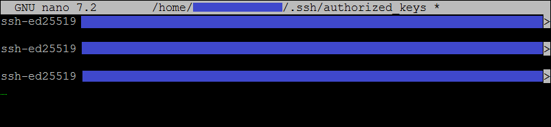

Ar trebui sa arate cam asa.<br>
`Ctrl` + `o` si apoi `enter` pt a salva. Si apoi `ctrl` + `x` pt a iesi.

Apoi putem inchide conexiunea activa la Raspberry prin:

```
exit
```

 **Step 6**<br>
	
Selectam cheia generata

 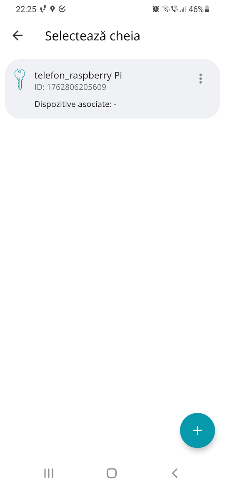

iar apoi dam pe *Testeaza conexiunea*

 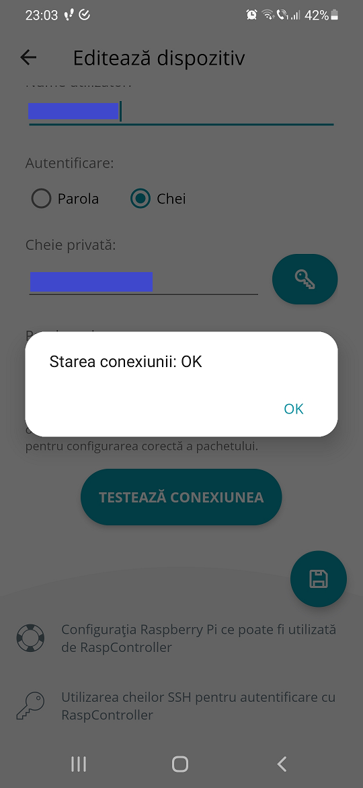

ar trebui sa primim un *OK*, la care apasam evident pe **OK**

Iar la final apasam pe *iconita de salveaza*

 > [!NOTE]
 > Daca dispozitivul apare online, apare o bulina verde in dreptul conexiunii
 > 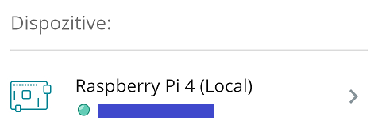

 **Step 7**<br>
 Repetam pasii de pana acum de la ***Steps 2.3*** - ***2.6***<br>
 - *Numele dispozitivului* - `Raspberry Pi 4 (Public)`<br>
 - *Host* - `vi1.duckDNS.org` (sau `<domeniu>.duckDNS.org`)<br>
 - *Port SSH* - portul public ( ex. 2222)<br>
 - *Nume utilizator* - `pi` (sau numele utilizatorului de Raspberry)<br>

 La *Autentificare* selectezi *chei*, iar apoi mergi pe *iconita cheie*,<br>
 si apoi selectam aceeasi cheie creata deja

 > [!IMPORTANT]
 > Inainte de a da **Testeaza conexiunea** este important sa fi conectat de pe telefon cu datele mobile. altfel nu va functiona

 **Step 8**<br>
 Apasam pe *Testeaza conexiunea*

 

 Iar apoi apasam pe *iconita de salveaza*

 **Step 9**<br>
 Oprim datele mobile si activam wi-fi-ul, iar apoi apasam pe conexiunea *Local*

 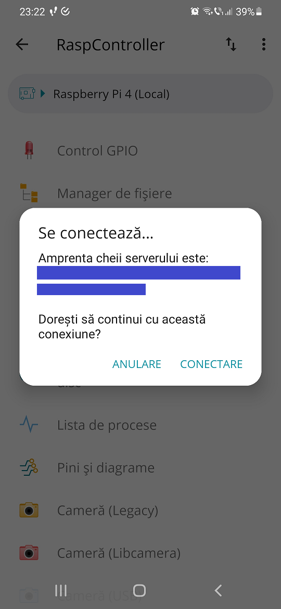
  
 > [!NOTE]
 > Acest mesaj informativ apare doar la prima conectare

 Dam **Conectare** ... si ne-am conectat.<br>
 Daca mergem pe *Terminal SSH* va fi similar cu ce aveam pe calculator.

 > [!NOTE]
 > Pentru 14 lei / an, ai acces la mai multe obtiuni precum: comenzi personalizate, monitorizare, pini si diagrame, instructiuni suplimentare. Pe scurt, la mai mult decat ai avea nevoie vreodata.