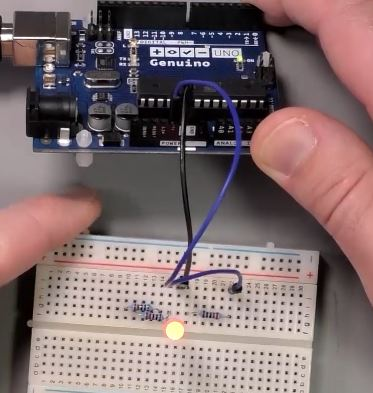

<h1>RGB LED</h1>


intr-un RGB Led - sunt 3 leduri, unul pt Rosu, unul pentru Green, si unul pt Blue


<b>Pini</b> - <i>Cathod comun LED</i>
- Red (stanga)
- GND
- Green
- Blue

Anod LED - unde Anod (+) este comun

pt ca LEDul RGB are 3 leduri incorporate, e nevoie de 3 rezistente !



facut proba pe rand cu cate un fir, pt a-ti da seama de la ce culoare este


fiecare fir la digital pin PWM (~).


<h2>Explicatii</h2>

`pinMode(LED_BUILDIN, OUTPUT);` // led_buildin este ledul din placa de care e unit de pinul 13

`#define RED_PIN  3` //<=> const int red_pin = 3;

> [!NOTE]
> `#define` e ca un placeholder care inlocuieste numele cu valoarea inainte de compile<br />
> `const` e o variabila constanta care ocupa spatiu din memorie, dar pot avea tip (ce e un avantaj cateodata)<br />

<hr />

<h2>Pt librarie noua:</h2>

Meniu:
<i>Sketch / include library / Manage Library</i>

iar apoi cauti <i>RGB</i> (alternativ cauti pe google )

in <i>Arduino / File / preferences</i> setezi locatia pt stocat sketchuri, iar langa e un folder <i>Libraries</i>, in care sunt toate librariile instalate

Incarci un exemplu....


<h2>Exemplu librarie ALA:</h2>

```
#include <AlaLedRgb.h>

#define REDPIN 3
#define GREENPIN 5
#define BLUEPIN 6

AlaLedRgb rgbLed; // new object de clasa AlaLedRgb

void setup()
{
  rgbLed.initPWM(REDPIN, GREENPIN, BLUEPIN);                 // initialize output pins
  rgbLed.setBrightness(0x66FF44);                            // calibrate white
  rgbLed.setAnimation(ALA_FADECOLORSLOOP, 5000, alaPalRgb);  // set the animation
}

void loop()
{
  rgbLed.runAnimation();  // run the animation indefinitely
}
```

Mai multe detalii:
- <a href="http://yaab-arduino.blogspot.com/p/ala-animations.html">animatie</a>

<b>Explicatii</b>

`rgbLed.setAnimation(ALA_GLOW, 2000, 0x0033FF);` // animatie, timp, culoare hexa / paleta