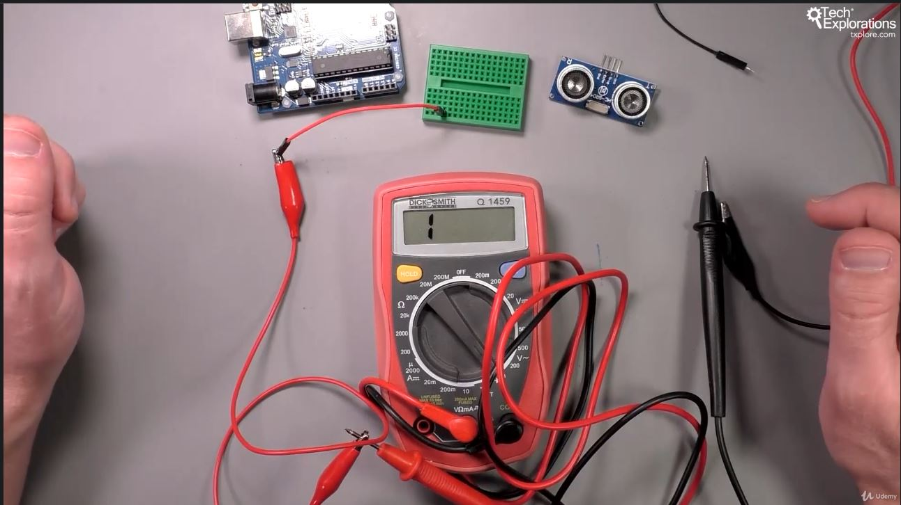
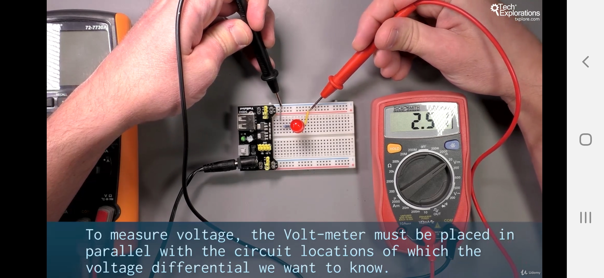
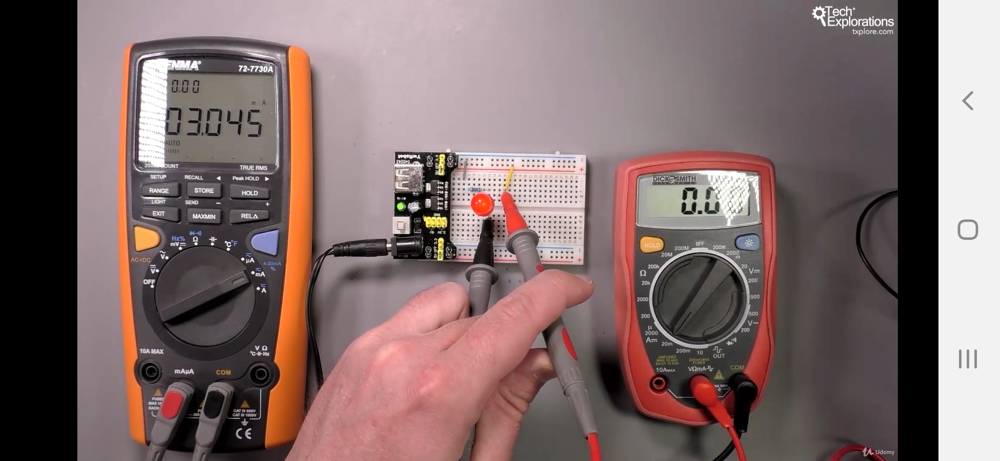
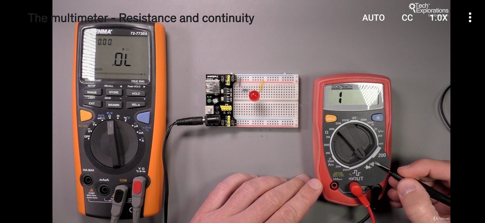
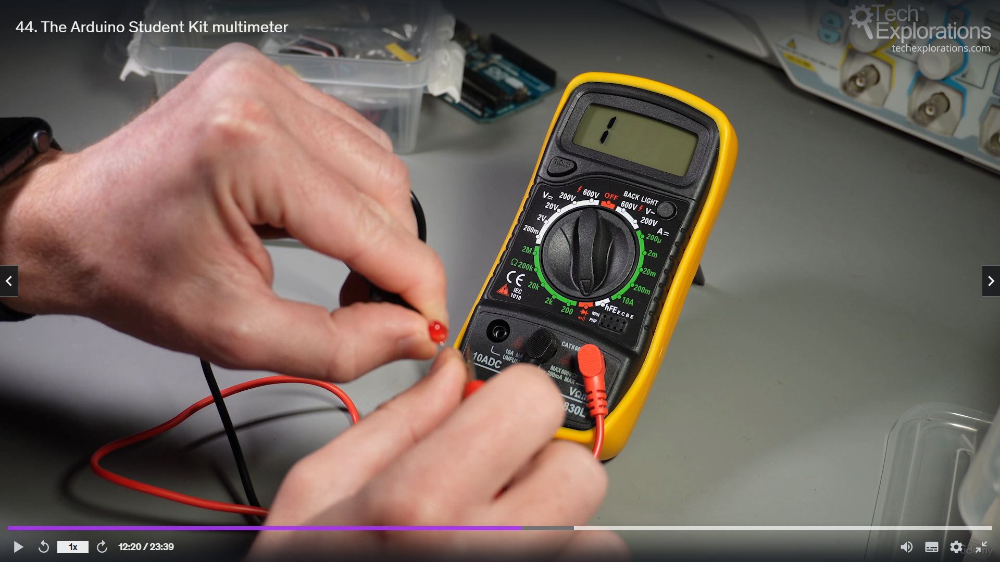

<h1>Multimetru</h1>

- crocodili pt masurat cu multimetru (strategie)

1. masurat tensiune

2. masurat intensitate (mutat ledul, si pus in serie)

3. masurat rezistenta
- nu conteaza ordinea capetelor de masurat

4. masurat continuitatea  -simbol precum wi-fi

- daca piuie e continuu
- si arata pe ecran ce rezistenta are

pe led nu e continuitate,pt ca are si ledul o rezistenta. pt rezistenta nu e continuitate.
insa pt fir si pt PCB este continuitate.

5. testat led

folosit functia de testat led (simbol led - triunghi-linie), si daca se pun <i>capetele de masura</i> corect,<b>rosu e plus</b> si <b>negru e minus</b> de la led.