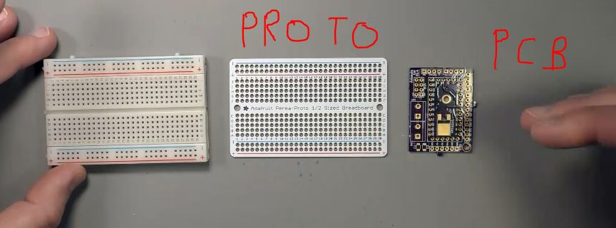
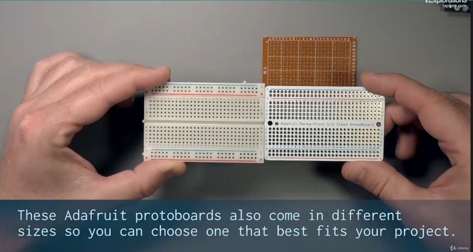
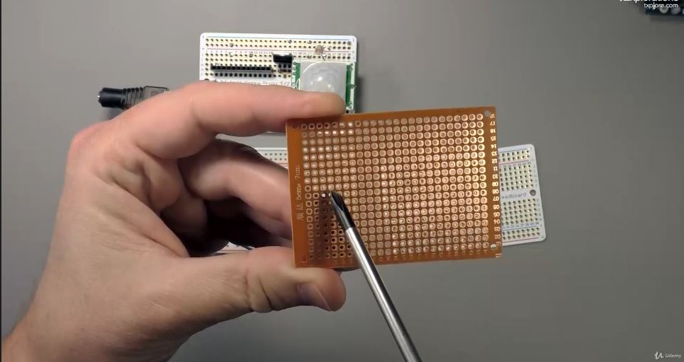
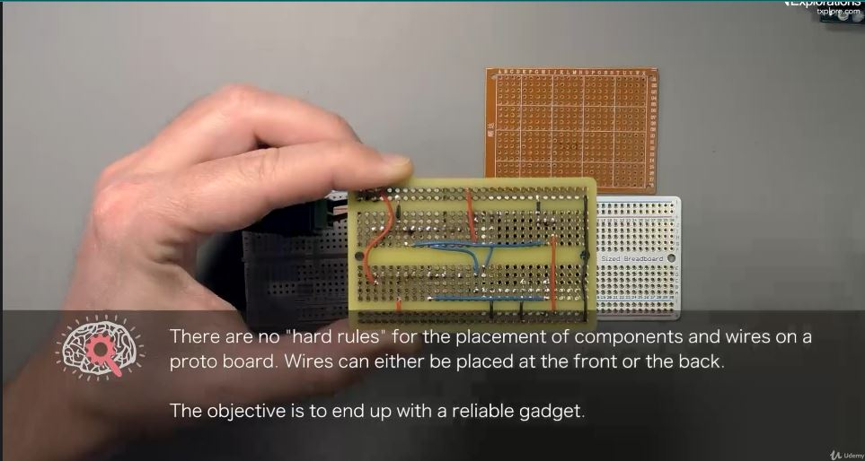
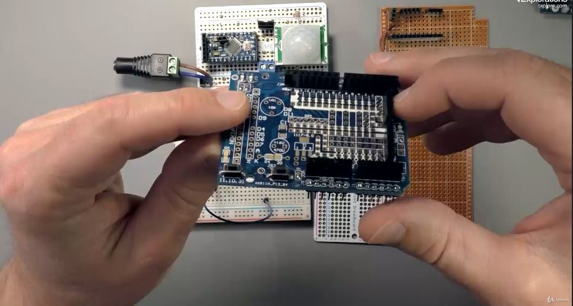
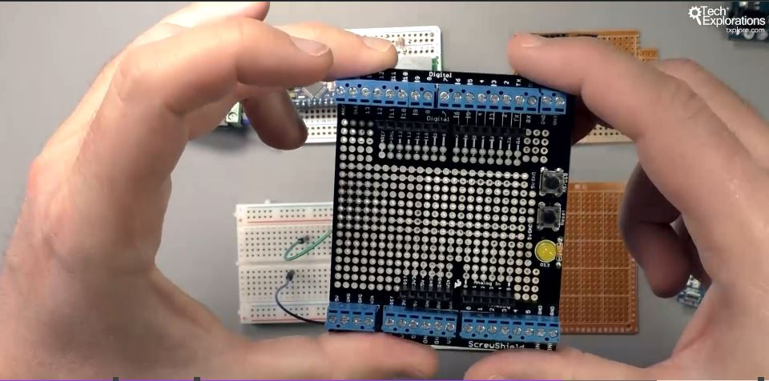

<h1>PROTOBOARDS / permaboards</h1>

o alta varianta pe langa protoboards este PCB-ul

adafruit protoboards sunt exact precum breadboards

protoboards simpla (perforata) fara conexiuni

arduino pro mini -> luminat on/off la scarile din casa

arduino protoboard (extensie arduino uno)

o extensie protoboard mai mare

8 Channel relay driver Shield (extensie ardunino uno)