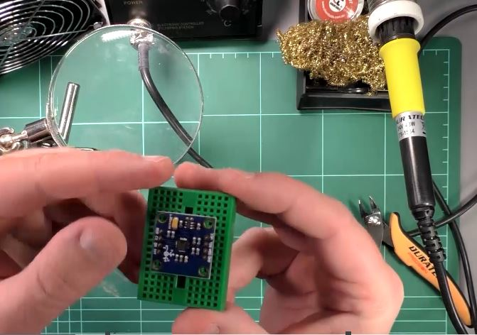
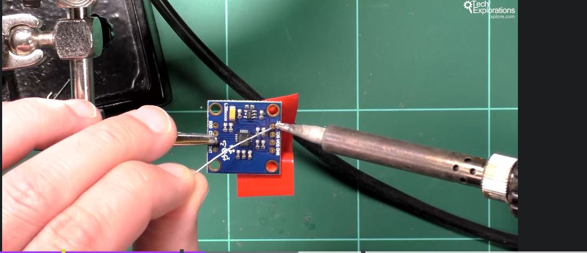
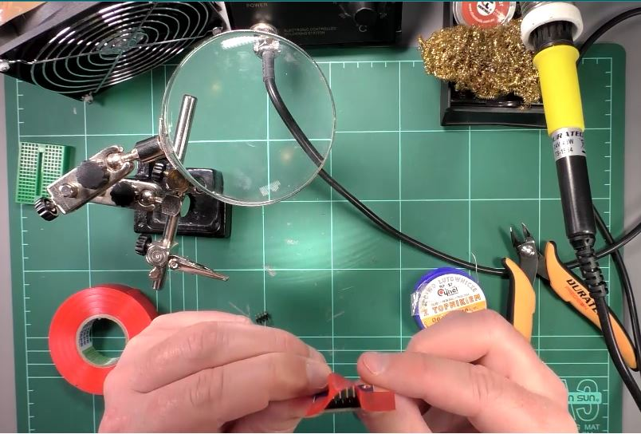
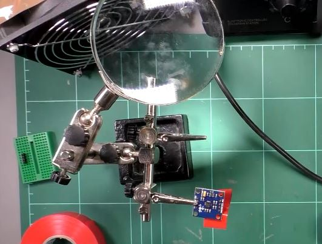

<h1>Tehnica lipire pini</h1>

<h2><u>Tehnica 1</u></h2>

pus pini in modul, si apoi inserat intr-un breadboard

si apoi incalzesti pinul, ca sa pui de jur imprejur fludor

<h2><u>Tehnica 2</u></h2>

cand lipesti pini - pui o banda izolanta (nu adeziva ca se topeste imediat), si apoi intr-un suport cu clestisori

si apoi incalzesti pinul, ca sa pui de jur imprejur fludor