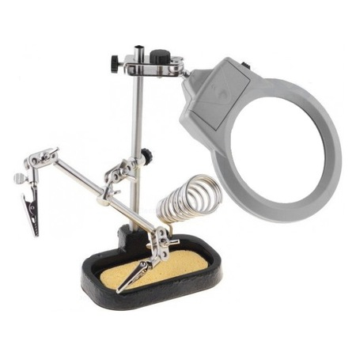
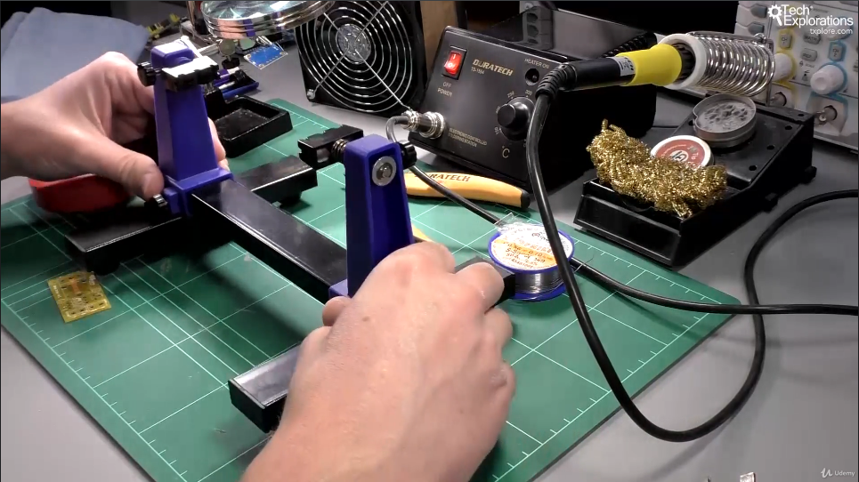

<h1>Suport PCB</h1>

A. Suport cu clestisori

> [!WARNING]
> Nu strangeti prea puternic suruburile ca vi se strica mult mai repede

B. Suport cu cleme

> [!TIP]
> Observatie:
> nu se poate lucra cu el la PCB-uri marunte, datorita spatiului mare din gheara clemei 