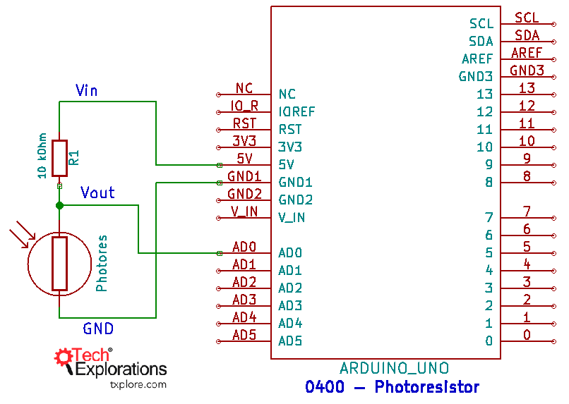
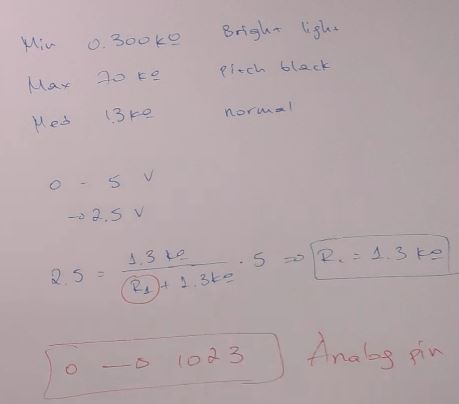
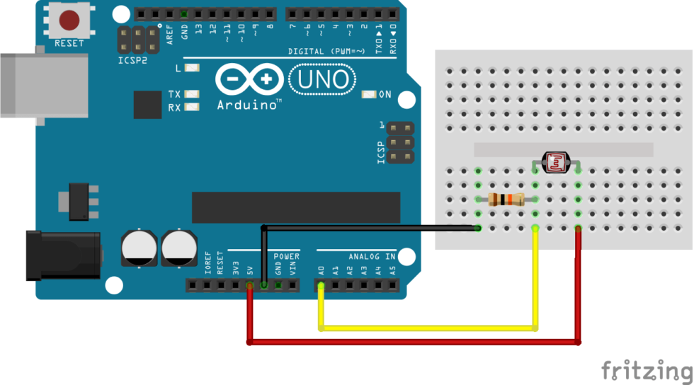

<h1>Fotorezistor</h1>

= o rezistenta dependenta de lumina
= sau o celula foto

- nu e polarizat

cu cat mai multa lumina este deasupra senzorului, cu atat are o rezistenta mai mica

fotorezistor -> la lampa ce se aprinde cand se face intuneric

<h2>Diagrama</h2>



<h2>Sketch</h2>

```
void setup() {
  // put your setup code here, to run once:
  Serial.begin(9600);
}

void loop() {
  // put your main code here, to run repeatedly:
  int sensorValue = analogRead(A0);
  Serial.println(sensorValue);
  delay(10);
}
```

<hr />

<h2>voltage divider</h2>



<i>Vout = (R2 * Vin) / (R1 + R2)</i>

=> daca alegem rezistenta de 1.3Kohmi, asemenea rezistentei a fotorezistorului in lumina ambientala, vom avea good range

analog output : 0 - 1023.

Alegem rezistenta ambientala a fotorezistorului, ca sa se incadreze la mijloc in intervalul Analog output al Arduino

min --- 0.320k bright light
max --- 1.400M pitch black
med --- 15.1M  normal 1.8 k

226
840
32

-> 2K rezistenta fixa aleasa (1.8 era ideala)

[voltage divider calculator](https://docs.google.com/spreadsheets/d/1U4fX1gv7U2Is3C7FE_dCmhFSCrBMLUqpa-CpYUxItxU/edit#gid=0)

<hr />

<h1>Fotorezistor - Masurare lumeni</h1>

<h2>Componente</h2>

- fotorezistor
- rezistor de 10kOhm
- Arduino Uno

<h2>Diagrama</h2>



<h2>Sketch</h2>

```
#define DELAY 500 // Delay between two measurements in ms
#define VIN 5 // V power voltage
#define R 10000 //ohm resistance value

// Parameters
const int sensorPin = A0; // Pin connected to sensor

//Variables
int sensorVal; // Analog value from the sensor
int lux; //Lux value

void setup(void) {
  Serial.begin(9600);
}

void loop(void) {
  sensorVal = analogRead(sensorPin);
  lux=sensorRawToPhys(sensorVal);
  Serial.print("Raw value from sensor= ");
  Serial.println(sensorVal); // the analog reading
  Serial.print("Physical value from sensor = ");
  Serial.print(lux); // the analog reading
  Serial.println(" lumen"); // the analog reading
  delay(DELAY);
}

int sensorRawToPhys(int raw){
  // Conversion rule
  float Vout = float(raw) * (VIN / float(1023));// Conversion analog to voltage
  float RLDR = (R * (VIN - Vout))/Vout; // Conversion voltage to resistance
  int phys=500/(RLDR/1000); // Conversion resitance to lumen
  return phys;
}
```