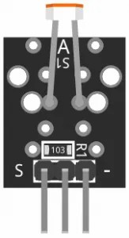

<h1>KY-018 - Fotorezistor - modul</h1>




- masora intensitatea luminoasa

> [!TIP]
> nu prea e asa bun<br />
> de regula e folosit pt diferenta de lumina<br />


foloseste 10KOhmi rezistenta (in loc de 1.3KOhmi)
-  Senzor Analog (3.3 V - 5V alimentare voltaj)

<h2>Pini</h2>


<h2>Diagrama</h2>


<h2>Sketch</h2>

```
int sensorPin = 2; //define analog pin 2
int value = 0; 
void setup() {
  Serial.begin(9600); 
}

void loop() {
  value = analogRead(sensorPin); 
  Serial.println(value, DEC); // light intensity
			     // high values for bright environment
			     // low values for dark environment
  delay(100); 
}
```