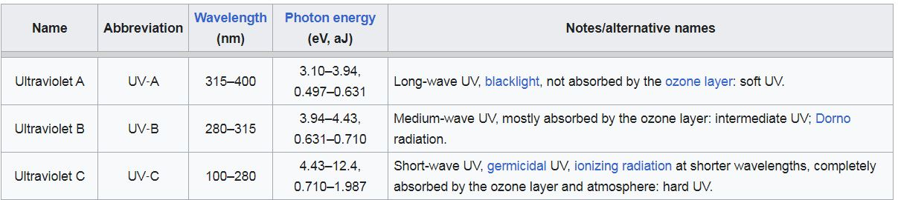
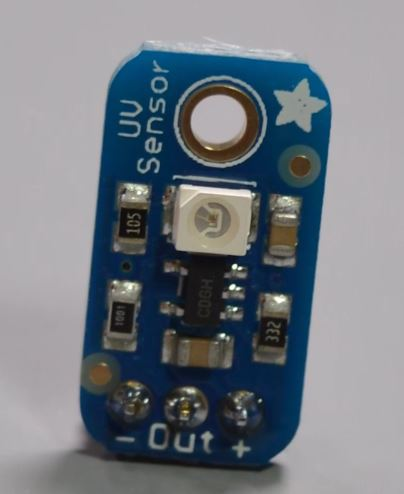
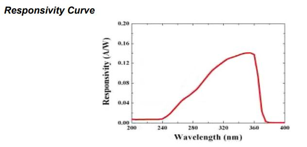
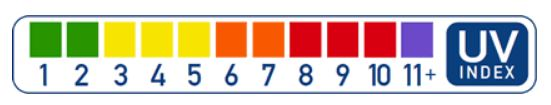

<h1>Senzor UV - GUVA-S12SD Adafruit</h1>

ultraviolete
- sunt si utile dar si daunatoare omului
- poate provoca cancer de piele



<h2>Poza</h2>





poate detecta radiatie UV intre 240 si 360 nm

Acest senzor poate detecta toate radiatiile Ultraviolete de tip B, si putin de tip A (cele de tip C sunt absorbite de complet atmosfera)

Pt ca valorile sa poata fi detectate de Arduino, se inmulteste valoarea masurata cu 10

<h2>UV Index</h2>



0 - 2 LOW
-> ochelari de soare
-> nisipul, apa, zapada reflecta razele UV, si amplifica expunerea

<h2>Pini</h2>


<h2>Sketch</h2>

```
/*
 * This sensor can detect UV light at 240-370nm.
 * This contains UVA and most of UVB.
 * For information on the UV index scale see https://www.epa.gov/sunsafety/uv-index-scale-1
 * Sensor datasheet: https://cdn-shop.adafruit.com/datasheets/1918guva.pdf
 */
void setup() {
  Serial.begin(9600);
}

void loop() {
  int sensorValue = analogRead(A0);

  // calculate actual voltage of sensor out
  float voltage = sensorValue * (5.0 / 1023.0); // sensorValue * voltageinput / resolutionRangeAnalog

  Serial.print(sensorValue);
  Serial.print(",");

  //Print the UV index value.
  //this is done by dividing the sensor output voltage by 0.1
  Serial.println(voltage/0.1);
  delay(100);
}
```