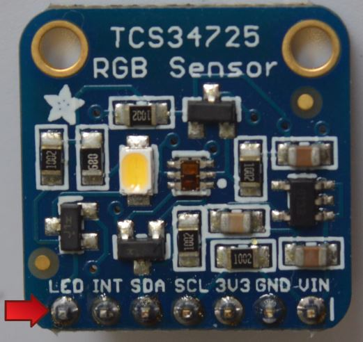
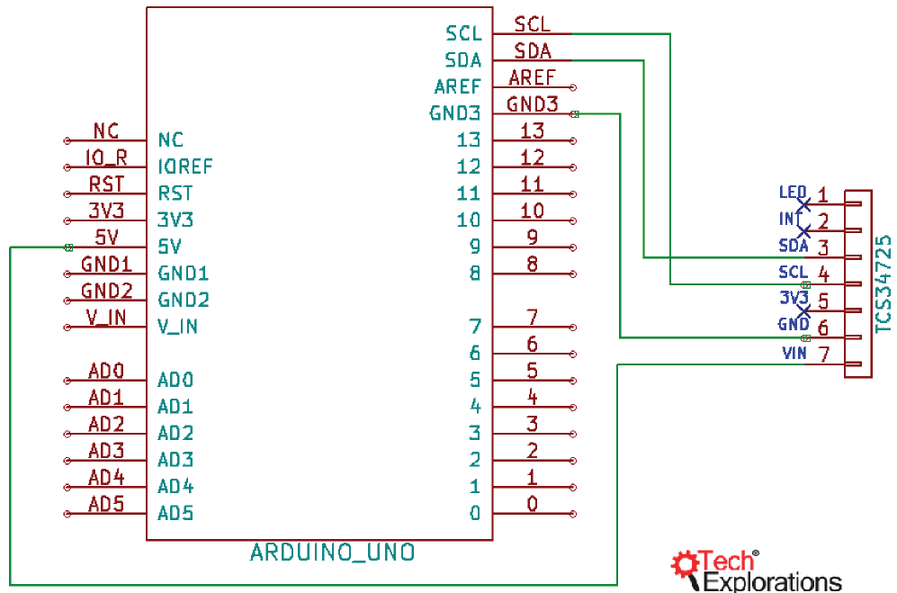

<h1>Senzor culoare RGB - TCS34725 Adafruit</h1>


- detecteaza culoarea din fata senzorului (la 2- 3mm distanta)

led e folosit pt clear lumina alba. se poate dezactiva



Senzorul contine foto-diode ce capteaza culoarea, cat si o foto-dioda ce capteaza intensitatea.
Au deasemenea un filtru IF (infrarosu)

are o matrita de 3x4 fotodiode RGB si alb, care fac o medie din masuratori, pt o precizie ridicata
Converteste curentul fotodiodelor in 16 bit digital

- poti conecta la 3.3V sau la 5V

[Datasheet](https://cdn-shop.adafruit.com/datasheets/TCS34725.pdf)

- comunicarea se face prin <a href="../Comunicatii Serial/I2C.md">I2C</a> (foarte rapid)

<b>Aplicatii</b>
- analize fluide in fotografie
- verificare si sortare mere, daca sunt bune de consum sau nu


<h2>Diagrama</h2>



<h2>Explicatii - sketch</h2>


`tcs.begin()` - porneste senzorul

`tcs.setInterrupt(false);` // interupts pt ca sa faca o noua masuratoare | il setezi ca false, pt a-i prelua datele

dureaza 50ms pt ca sa citeasca datele

instalat librarie tcs de la Adafruit


<h2>Sketch</h2>

```
#include <Wire.h>
#include "Adafruit_TCS34725.h"

Adafruit_TCS34725 tcs = Adafruit_TCS34725(TCS34725_INTEGRATIONTIME_50MS, TCS34725_GAIN_4X);

void setup() {
  Serial.begin(9600);
  Serial.println("Color View Test!");

  if (tcs.begin()) { // tcs.begin() - porneste senzorul
    Serial.println("Found sensor");
  } else {
    Serial.println("No TCS34725 found ... check your connections");
    while (1); // halt!
  }
  
}

void loop() {
  uint16_t clear, red, green, blue;

  tcs.setInterrupt(false);      // turn on LED

  delay(60);  // takes 50ms to read 
  
  tcs.getRawData(&red, &green, &blue, &clear);

  tcs.setInterrupt(true);  // turn off LED
  
  Serial.print("C:\t"); Serial.print(clear);
  Serial.print("\tR:\t"); Serial.print(red);
  Serial.print("\tG:\t"); Serial.print(green);
  Serial.print("\tB:\t"); Serial.println(blue);
}
```

pentru lumina ambientala se face scurt, unind cu inca un fir pinul LED de pinul GND. Si se schimba alimentarea senzorului la 3.3V de la Arduino

