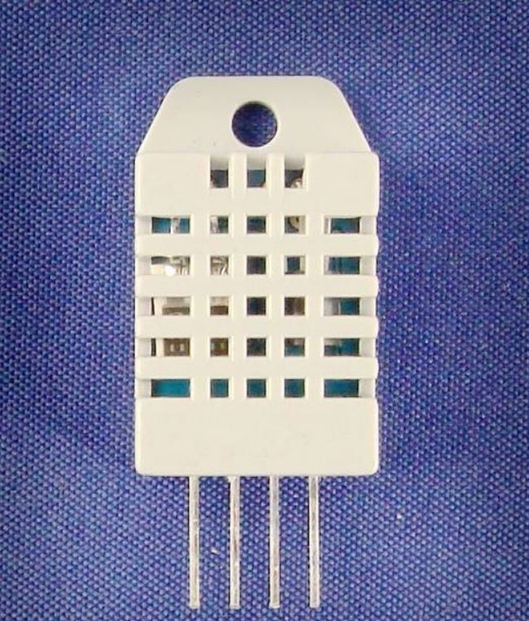
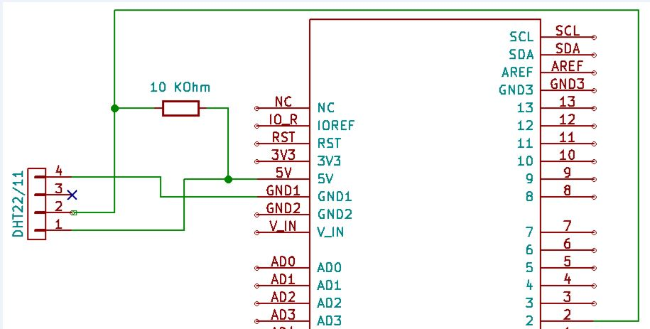

<h1>Senzor DHT 22/11 - Umiditate & temperatura</h1>



- masori tempertatura si umiditatea
       = senzor digital (fara conversie / calcul)
- Este un senzor uzual si ieftin. se poate folosi si la 3.3V, si la 5V. Nu e foarte precis. Si dureaza 2sec masurarea


[mai multe detalii senzor dht22](https://www.sparkfun.com/datasheets/Sensors/Temperature/DHT22.pdf)

Sunt cateva tipuri de masurat umiditatea. Cele mai uzuale sunt:
- Relative Humidity (Umiditate Relativa - RH)
- Absolute Humidity (Umiditate absoluta - AH)

[Mai multe detalii](https://en.wikipedia.org/wiki/Humidity#Relative_humidity)


<h2>Diagrama</h2>



<i>pull-up resistor de 10kohm</i> (intre 5V si data)


<h2>Sketch</h2>

```
#include "DHT.h"

#define DHTPIN 2     // what digital pin we're connected to

// Uncomment whatever type you're using!
//#define DHTTYPE DHT11   // DHT 11
#define DHTTYPE DHT22   // DHT 22  (AM2302), AM2321
//#define DHTTYPE DHT21   // DHT 21 (AM2301)

// Initialize DHT sensor.
// Note that older versions of this library took an optional third parameter to
// tweak the timings for faster processors.  This parameter is no longer needed
// as the current DHT reading algorithm adjusts itself to work on faster procs.
DHT dht(DHTPIN, DHTTYPE);

void setup() {
  Serial.begin(9600);
  Serial.println("DHTxx test!");

  dht.begin();
}

void loop() {
  // Wait a few seconds between measurements.
  delay(2000);

  // Reading temperature or humidity takes about 250 milliseconds!
  // Sensor readings may also be up to 2 seconds 'old' (its a very slow sensor)
  float h = dht.readHumidity();
  // Read temperature as Celsius (the default)
  float t = dht.readTemperature();
  // Read temperature as Fahrenheit (isFahrenheit = true)
  float f = dht.readTemperature(true);

  // Check if any reads failed and exit early (to try again).
  if (isnan(h) || isnan(t) || isnan(f)) {
    Serial.println("Failed to read from DHT sensor!");
    return;
  }

  // Compute heat index in Fahrenheit (the default)
  float hif = dht.computeHeatIndex(f, h);
  // Compute heat index in Celsius (isFahreheit = false)
  float hic = dht.computeHeatIndex(t, h, false);

  Serial.print("Humidity: ");
  Serial.print(h);
  Serial.print(" %\t");
  Serial.print("Temperature: ");
  Serial.print(t);
  Serial.print(" *C ");
  Serial.print(f);
  Serial.print(" *F\t");
  Serial.print("Heat index: ");
  Serial.print(hic);
  Serial.print(" *C ");
  Serial.print(hif);
  Serial.println(" *F");
}
```


<h2>Explicatii</h2>


foloseste `DHT.h` library al lui Adafruit

DHT 11 - e mai ieftin

`if (isnan(h) || isnan(t) || isnan(f))` - in caz ca valorile nu sunt numere, n/a, sau garbage

`isnan` = is not a number

<i>heat index</i> ~= real feel temperatura (in functie de temperatura si umiditate)


<i>(heat-index din SUA)</i>