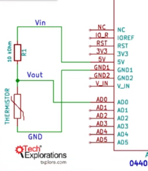

<h1>Termisor</h1>


- senzor analog
= rezistenta care se schimba in functie de temperatura
(nu e polarizat / nu conteaza cum il conectezi)


<h2>Tipuri</h2>

- NTC (negative temperature coeficient) - rezistenta scade cand temperatura creste
- PTC


<i>masurat termistorul ca rezistenta, iar apoi aplicat putina caldura ca sa vezi ce se intampla cu el (sa vezi de ce tip este)</i>

Alegem rezistenta de 10 KOhmi, pt ca rezistenta termistorului la temperatura camerei este aprox 10KOhmi


<h2>Diagrama</h2>




<h2>Sketch</h2>

```
// the value of the 'other' resistor. I am using a 10 KOhm resistor.
#define SERIESRESISTOR 9950 // masurata cu multimetru   
 
// What pin to connect the sensor to
#define THERMISTORPIN A0 
 
void setup(void) {
  Serial.begin(9600);
}
 
void loop(void) {
  float reading;
 
  reading = analogRead(THERMISTORPIN);
 
  Serial.print("Analog reading "); 
  Serial.println(reading);
 
  // convert the value to resistance
  reading = (1023 / reading)  - 1;
  reading = SERIESRESISTOR / reading;
  Serial.print("Thermistor resistance "); 
  Serial.println(reading);
 
  delay(1000);
}
```


<b>Observatie</b>

Arduino nu poate masura rezistenta, ci doar tensiunea la analog inputs pini


<i>calcul rezistenta</i>

<hr />

<h2>Diagrama 2 - modificare</h2>


<h2>Sketch2</h2>

```
#include "thermistor.h"

// Analog pin used to read the NTC
#define NTC_PIN               A0

// Thermistor object
THERMISTOR thermistor(NTC_PIN,        // Analog pin
                      10500,          // Nominal resistance at 25 ºC
                      3988,           // thermistor's beta coefficient
                      9880);         // Value of the series resistor

// Global temperature reading
uint16_t temp; // fara minus & 2^16, or 65535

void setup()
{
  Serial.begin(9600);
}

void loop()
{
  temp = thermistor.read();   // Read temperature

  Serial.print("Temp in 1/10 ºC : ");
  Serial.println(temp);

  delay(5000);
}
```

<h2>Observatii</h2>

Pentru a folosi aceasta librarie: instalam libraria Thermistor a lui <i>panStamp</i>

Solutie1:
se calibreaza valoarea de temperatura normala la 25 de grade, ca sa se potribeasca la temperatura inregistrata (de multimetru)


<b>modificare in caz de noise</b>
Pentru masuratori mai precize se poate folosi alimentarea de 3.3V care are nu doar regulator de voltaj, ci si filtru (cel de 5V vine direct din calculator, si are "noize")

Pentru asta se va schimba tensiunea de alimentare la 3.3V + facut scurt cu alimentare la AREF (se alimenteaza AREF cu 3.3V)
Astfel se imbunateste putin analog-to-digital conversie


<i>constanta de material Beta</i>