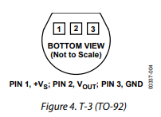
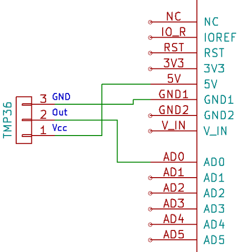
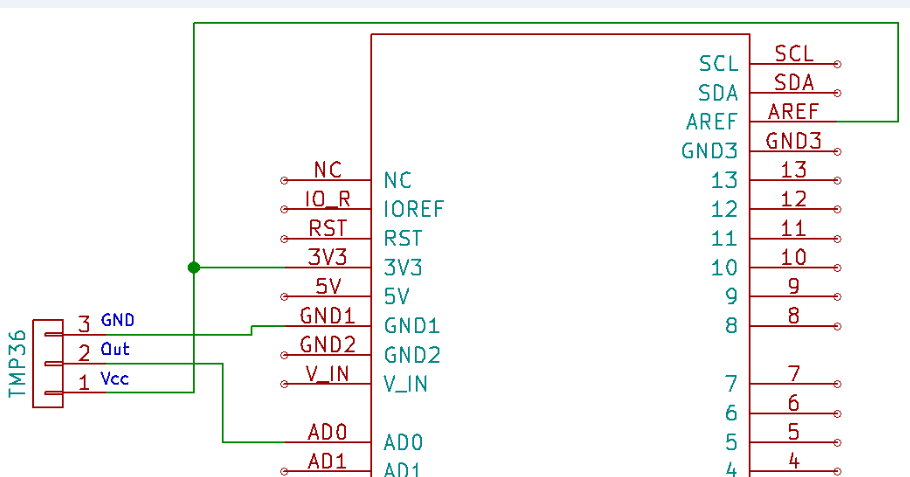

<h1>TMP36 - senzor temperatura</h1>


- senzor analog
- foarte ieftin

<h2>Pini</h2>



<i>(pinii sunt numerotati de la stanga la dreapta, privind la instructiunile de pe senzor)</i>

- tensiune de folosire : 2.7V -> 5.5V
- acuratete: +/- 2%
- acuratete: +/- 0.5 °C
- bun pentru industria auto
- factor scara: 10mV/ °C

(convertit valoarea dintre 0 - 1023 inregistrata de Arduino -> in Tensiune (V)(intre 0 si 5V)


<i>temperatura este liniara</i>

(0.5V e offset al senzorului)

<h2>Diagrama</h2>



<h2>Sketch</h2>

```
int sensorPin = 0; // The reading is obtained from analog pin 0 (A0)
float supply_voltage = 5; // 5V supply, use the value "5" here.
 
void setup(){
  Serial.begin(9600);
}
 
void loop(){
 //getting the voltage reading from the temperature sensor
 int reading = analogRead(sensorPin);  
 
 // converting that reading to voltage
 float voltage = reading * supply_voltage / 1024;
 
 // print out the voltage
 Serial.print(voltage);
 Serial.println(" volts");
 
 // now print out the temperature
 float temperatureC = (voltage - 0.5) * 100 ;  //converting from voltage in tempertatura
                                               //e inmultit cu 100 si nu 1000 pt ca factorul e 10mV, nu 1mV
 Serial.print(temperatureC);
 Serial.println(" degrees C");
 
 delay(1000);
}
```

<h2>Diagrama2</h2>



<i>(pentru a informa Arduino ca tensiunea folosita este 3.3V, folosim pinul AREF - Analog REF)</i>

`analogreference(EXTERNAL);` // Arduino foloseste tensiunea din AREF  | in setup()